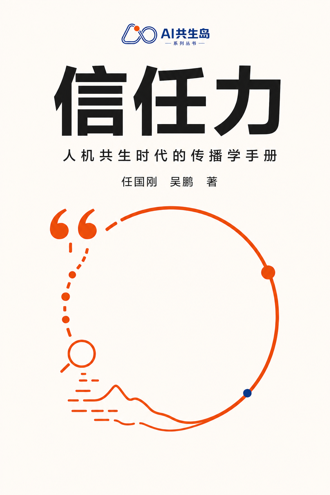

# 信任力

> 人机共生时代的传播学手册

当内容可以被生成、转述与重新组合，品牌传播不只要被看见，更要在事实、体验与承诺中经得起验证。

**始于表达，广于传递，立于事实，成于体验，终于承诺。**

## 当前版本

这是《信任力》现有完整书稿的 **V0.1 开放阅读版**。本版本优先保证书稿完整公开与阅读可达；内容正在持续审读和优化，尚不代表最终出版定稿。

作者：任国刚、吴鹏

## 三个入口

- [AI共生岛开源丛书](https://www.learn-together.cn/books/)
- [《信任力》专属页与站内阅读](https://www.learn-together.cn/books/power-of-trust/)
- GitHub：本仓库用于版本记录、问题反馈、案例补充与内容共建
- [课程与社群](https://appybdoup4a9525.h5.xiaoeknow.com/)

## 阅读

- [封面与全书目录](book/00-封面.md)
- [前言：信任缘起——AI时代品牌竞争新规则](book/01-前言%20信任缘起AI时代品牌竞争新规则.md)
- [全书核心术语释义](book/02-全书核心术语释义.md)
- [范式崩塌](book/03-范式崩塌.md)
- [信任之力](book/04-信任之力.md)
- [旅程重构](book/05-旅程重构.md)
- [GEO之战](book/06-GEO之战.md)
- [信任之基](book/07-信任之基.md)
- [飞轮效应：AI驱动的信任自增强系统](book/08-飞轮效应AI驱动的信任自增强系统.md)
- [度量之道](book/09-度量之道.md)
- [组织之力](book/10-组织之力.md)
- [生态之力](book/11-生态之力.md)
- [未来已来](book/12-未来已来.md)
- [结语：认知主权](book/13-结语%20认知主权.md)
- [附录：落地工具](book/14-附录%20落地工具.md)

## 共建边界

欢迎通过 Issue 提交勘误、证据补充、案例线索与工具改进建议。涉及观点调整、案例判断、数据更新和正文改写的内容，需要作者审核后合入。

本仓库暂未附加开源许可证。公开可读不等同于自动授权复制、改编或商业使用；具体许可方式待作者确认。

详见 [参与共建](CONTRIBUTING.md) 与 [版本记录](CHANGELOG.md)。
