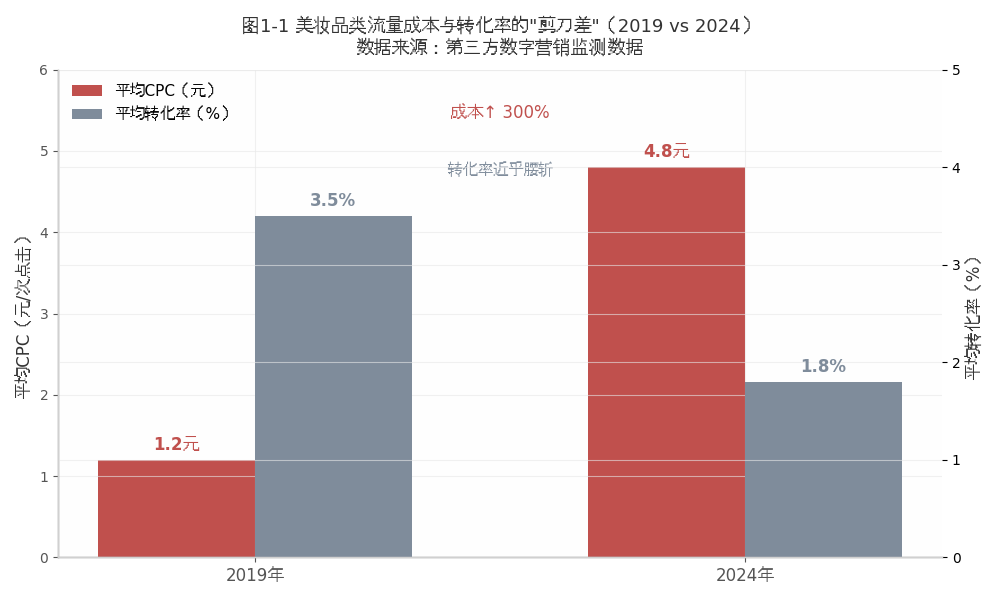
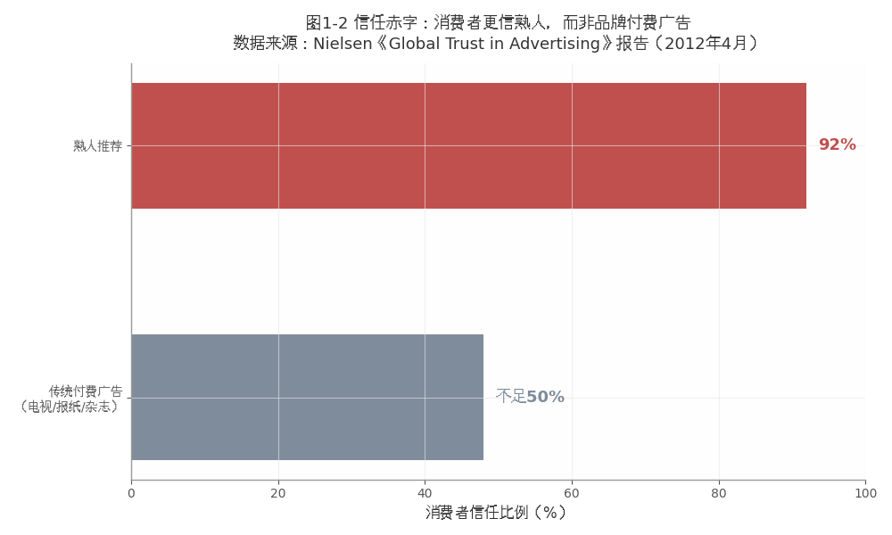
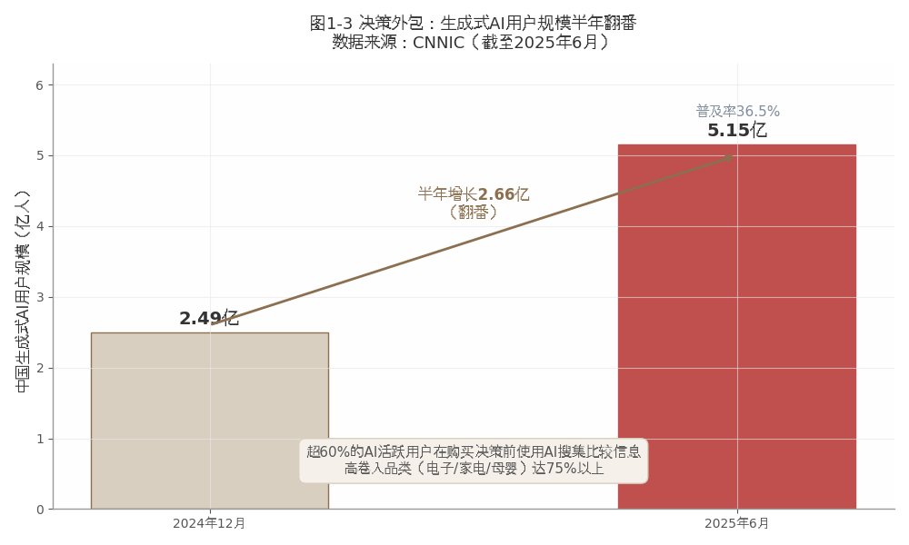

#  范式崩塌

## ------AI瓦解传统营销的底层假设

**【本章导读】**

每一位企业家翻开年度营销报告时，心里都有两个挥之不去的数字：一个是"投了多少"，预算年年涨；另一个是"换回了什么"，效果年年降。两个数字之间的鸿沟，不是某一年的偶然波动，而是一条持续扩大的剪刀差。

剪刀差背后的现实远比表面严峻。2025 年，一家消费品头部企业的 CMO
在内部战略会上展示了一组数据（综合估算数据，基于作者团队咨询实践，已做脱敏处理）：过去三年，品牌数字广告投入年复合增长约
15%（高增长品类可达 20%+），全网曝光量增长 47%，品牌搜索指数仅增长
9%，实际销售转化率甚至微降约 2 个百分点。更令人不安的是后续测试，在
ChatGPT、Gemini、DeepSeek、Perplexity、Claude 五个主流 AI
助手上询问\"这个品类什么品牌值得买\"，仅有两个推荐了该品牌，且排在第三、第四位。

钱花得越来越多，效果越来越差，AI推荐越来越靠后，这三个"越来越"，不是某一个品牌、某一个品类的个案，而是同一个结构性问题的三个侧面：传统品牌营销的底层假设，正在被AI系统性瓦解。

本章是全书的"问题章"，在提出任何解决方案之前，先彻底看清问题的本质。第一节揭示传统品牌营销面临的三大结构性困局。第二节论证本书的底层理论，决策成本的结构性转移，这是理解AI时代一切品牌竞争变局的总钥匙。第三节剖析广告、SEO、KOL三件传统武器为何在新战场上全面失灵。第四节以正反案例收尾，让读者在进入方法论之前，先看到"问题"的后果，以及"觉醒"的可能。

**本节阅读地图**：第一节回答"为什么"------三大结构性困局的诊断与根源分析；第二节回答"怎么回事"------决策成本结构性转移的底层理论；第三节回答"意味着什么"------范式崩塌对品牌战略的系统性影响。建议决策者精读第二节（底层逻辑），执行者重点阅读第一节（问题全景）。

  --------------------------------------------------------------------------------------------------------------------------------------------------------
  读完本章，你将理解：传统品牌营销的失效，不是方法过时，不是预算不够，不是团队不行，是游戏规则变了。而在新规则下，你不知道自己不知道什么，才是最危险的。

  --------------------------------------------------------------------------------------------------------------------------------------------------------

## 三大困局：流量内卷、信任赤字与决策外包同时爆发

传统品牌营销，无论采用什么手段，电视广告、搜索竞价、信息流投放、KOL种草，都建立在同一个底层假设之上：用户自己搜集信息，自己比较选项，自己做决策。
SEO的逻辑是"让用户搜索时先看到你"，竞价广告的逻辑是"让用户比价时排在你前面"，内容营销的逻辑是"让用户浏览时记住你"。所有策略都指向同一个目标：在用户的"信息搜集与比较"环节占据有利位置。

这套逻辑从大卖场时代运转到电商时代，从报纸广告运转到社交媒体，基本框架百余年未变，改变的只是手段，从货架陈列到搜索排名，从电视广告到社交种草。品牌营销的本质始终是：用信息覆盖用户的决策路径。

然而，正是在这一假设之下，传统品牌营销始终面临三个结构性困局。它们环环相扣，无法在旧范式内部解决；而在AI时代，三个困局同时进入了"加速恶化"阶段。

### 流量内卷：注意力已成最昂贵也最易蒸发的货币

中国互联网月活跃用户数已接近人口天花板，增量市场变为存量市场。品牌不再是在"空白市场"争夺新用户，而是在"同一批用户"中争夺有限的注意力。流量平台形成寡头格局，竞价排名价格持续走高，在美妆、母婴、保健品等热门品类，单次点击成本五年间上涨了三到五倍。一家中型消费品牌的CMO算过一笔账：2019年，在主流信息流平台获取一个有效销售线索的成本约为80元。到2024年，这一数字已飙升至280元（综合估算数据，基于作者团队咨询实践，已做脱敏处理）。不是平台变贵了，是竞品太多了，出价自然水涨船高。

更要命的是信息环境的根本变化。全球每天产生的信息单元数以百亿计，用户的注意力窗口以秒计。过去花一千万拍一条TVC（商业电视广告），可以在央视黄金时段轮播一个月，覆盖数亿观众。今天同一条片子进入信息流，与搞笑视频、社会新闻、明星八卦并列竞争，用户手指一划就过去了，平均停留时长可能不到1.5秒。

传统品牌营销建立在"信息相对稀缺、注意力相对充裕"的环境假设之上。在报纸和电视时代，媒体渠道有限，消费者注意力充裕，品牌只要买到媒体时段，就大致买到了注意力。这一假设在互联网早期依然成立，搜索结果首页只有10个位置，信息流相对有序。但当信息从"稀缺"变为"过剩"、注意力从"充裕"变为"极度稀缺"，传播声量再大，也可能像对着瀑布喊话，话喊出去了，声音被水声吞没了。

更深一层的问题在于："流量内卷"不仅是"流量变贵了"，更是"流量的本质变了"。过去的流量是"主动流量"，用户带着明确需求来到搜索引擎或电商平台，品牌通过优化排名承接需求。现在的流量越来越趋向"被动流量"，用户在信息流中被算法推送内容，需求是算法"猜测"的而非用户"表达"的。

被动流量转化效率远低于主动流量，竞价成本却持续攀升，品牌由此陷入"贵且低效"的流量陷阱。这个陷阱的特殊之处在于：它不是"做得不够好"的结果，恰恰相反，它往往是"做得很好"的结果，你在流量竞价中越是全力以赴，出价越高，成本越高。你的内容越精致，信息流算法越会把它推给已经关注你的人群（形成信息茧房），而非新的人群。你的努力正在加剧你的困境，这是流量内卷最反直觉也最令人绝望的特征。

{width="4.330555555555556in"
height="2.598611111111111in"}

图1-1 美妆品类流量成本与转化率的剪刀差

以美妆行业为例，这种恶化趋势尤为典型。五年内，主流平台美妆类目单次点击成本（CPC）累计涨幅普遍达
50%--70%（高竞争热门词及部分平台涨幅更高）；同期美妆品牌线上转化效率持续走低、获客成本（CAC）三年涨幅超
50%，新锐品牌获客成本激增逾 120%。行业平均投流 ROI 由约 1:5--6 降至约
1:2，部分中小品牌已逼近盈亏线。品牌在流量竞价中投入的每一分钱，买回来的\"注意力\"都在持续贬值------这不是某一个品牌的困境，而是整个品类在存量竞争时代的缩影。（如图
1-1 所示）

还有一个被低估的影响：流量内卷正在系统性地降低品牌在AI认知体系中的"信号纯度"。当品牌为争夺流量而在多个平台发布大量重复、质量参差的内容时，AI在交叉验证中会遇到"信号冲突"，品牌在不同平台说了不同的话。这对"逻辑真"维度的扣分是灾难性的。流量内卷不只是"花钱多、效果差"的经济问题，它已经开始在AI的信任力评估中产生负面的乘数效应。

### 信任赤字：品牌花最多的预算，做公众最不相信的事

这是一个更深层的悖论：品牌在广告上花的钱越来越多，消费者对广告的信任度却越来越低。

{width="4.330555555555556in"
height="2.598611111111111in"}

图1-2 信任赤字：消费者更信熟人，而非品牌付费广告

Nielsen 2012 年 4 月发布的《Global Trust in Advertising》报告（56 国
28,000+ 线上受访者）显示，92%
的消费者信任朋友家人推荐与口碑类\"赢得媒体\"，信任度居所有广告形式之首；而电视、杂志、报纸付费广告的信任比例分别为
47%、47%、46%，均不足半数。 此后尼尔森同题追踪（2015/2017/2021）及
Edelman、Morning Consult
等机构近年研究均表明，这一信任结构未逆转：传统广告信任继续磨底，而社交媒体\"种草\"信息过载后，熟人/达人推荐的信任溢价反而被稀释------这是基于信任结构变化的推论而非单家报告的直出结论。与此同时，Z
世代（通常指 1995～2009 年出生）对品牌及品牌信息的默认质疑更强：Morning
Consult 2024 显示 Z 世代对约 95% 品牌的净信任值低于全体成人，Edelman
2026 专项亦指出超半数 Z
世代整体不信任各类品牌。作为数字原住民，他们对营销套路的识别能力与防御倾向显著高于前辈，对品牌及品牌广告的不信任与质疑比例，在年轻群体中明显更高。（如图1-2所示）

品牌面临的不只是"广告信任度低"，而是更根本的"信任赤字"：花最多的预算，做公众最不相信的事。这不是某个品牌的问题，而是整个传统营销范式的结构性问题。传统营销的基本逻辑是"花钱买注意力"，买搜索排名、买信息流曝光、买KOL推荐；但"买来的注意力"和"赢得的信任"，是两个完全不同的东西。

前者是一次性的、可竞价的、随预算波动的，今天花钱买了流量，流量来了；明天停投，流量就走了。后者是累积的、排他的、具有复利效应的，今天积累的一千条真实好评，会持续产生信任收益，无论明天是否继续投广告。

"信任赤字"正在以两种方式掏空品牌营销的效率根基。第一种是直接的：用户看到广告后不信任，不点击、不下单。第二种是间接的、但在AI时代更具杀伤力的：用户的"不信任"被AI交叉验证捕捉到，导致AI降低对品牌的推荐力度。过去，用户的"不信任"只是一次未成交的转化；现在，它是AI知识库中的一个长期降权信号。品牌不仅损失了一次交易，更损失了未来的无数次潜在交易，因为在AI眼中，这个品牌"没那么可信"。

### 决策外包：用户将信任判断权系统性移交给了AI

第三个困局，也是最具颠覆性的一个，正在以惊人的速度发生。

过去，消费者做购买决策的核心成本是"信息不对称"，不知道哪个品牌更好，所以需要搜索、比较、看测评、问朋友。品牌营销的价值正在于帮助消费者降低这一成本：搜索排名第一，降低搜索成本；KOL测评，降低比较成本；品牌广告，降低认知成本。

但AI正在从根本上改写这条决策路径。用户不再逐条浏览搜索结果，不再逐篇阅读测评文章，不再逐项对比产品参数，而是把整个"信息搜集与比较"环节外包给了AI助手。用户输入"预算三千、送给父母的健康礼品、不要太商业化"，AI通常在几秒内即可完成过去需要数小时乃至数天的信息处理工作，搜索、比对、验证、排序、综合给出推荐答案。用户不再需要知道"哪个品牌更好"，只需在AI给出的有限选项中，做一道"选择题"。

这一行为变化看似简单，深远之处在于：用户不只是把"搜索"外包给了AI，更是把"信任判断"外包给了AI。用户不再自己判断"这个品牌值不值得信任"，而是依赖AI的判断，"AI推荐的，应该没问题"。品牌营销的核心命题由此发生根本转移：从"让用户相信你"变为"让AI相信你"。因为在多数消费场景中，用户已经把"该信谁"的决策权部分交给了AI。

{width="4.330555555555556in"
height="2.598611111111111in"}

图1-3 决策外包：生成式AI用户规模半年翻番

这场迁移速度远超大多数品牌预期。CNNIC《生成式人工智能应用发展报告(2025）》显示，截至2025年6月我国生成式AI用户达5.15亿，较2024年末2.49亿净增2.66亿，半年增幅约107%（普及率36.5%）\[2\]。这不是缓慢趋势，而是正在爆炸的现实。我们综合CNNIC、艾瑞、明略科技等多家调研估算，在已有消费辅助行为的AI用户中，超半数会在购买决策前用AI助手搜集与比较信息；该比例在电子产品（约六成以上）、家用电器等高决策卷入品类显著抬升，母婴等信任敏感品类虽亦属高卷入，但更多用于成分核查与避坑而非直接拍板（如图1-3，作者整理）。

  --------------------------------------------------------------------------------------------------------------------------------------------------------------------------------
  品牌花了几十年和几百亿建立的"知名度优势"，被用户一句"AI，这个品类什么品牌值得买"瓦解。用户不再需要"知道"你的品牌，AI替他们"知道"；用户不再需要"信任"你的品牌，AI替他们"验证"。

  --------------------------------------------------------------------------------------------------------------------------------------------------------------------------------

## 成本转移：信任成本转移是品牌变局的底层逻辑

三大困局并非各自孤立，它们共同指向一个更根本的结构性变化，决策成本的结构性转移。这是全书最底层的理论基石。理解了它，就理解了AI时代一切品牌竞争变局的逻辑原点。

### 信息不对称：传统营销范式中消费者的核心焦虑

在传统营销范式中，消费者面对的核心决策成本是"信息不对称"，消费者的信息集与品牌的信息集之间存在巨大差距，不知道哪个品牌更好、更可靠、更适合自己的需求。品牌营销的核心价值，就是帮助消费者降低这个成本。

科特勒5A模型\[3\]精准描绘了消费者降低信息不对称成本的完整路径，认知（Aware）：获知品牌的存在；吸引（Appeal）：对品牌产生兴趣；问询（Ask）：主动搜集和比较品牌信息；行动（Act）：基于比较结果做出购买决策；拥护（Advocate）：在体验后形成口碑反馈。其中，"问询"是降低信息不对称成本的关键环节，消费者通过主动搜集信息，将"不知道"变成"知道"，将"不确定"变成"确定"。

这套逻辑从大卖场时代运转到电商时代，基本框架百余年未变：品牌通过广告降低认知成本，通过搜索排名降低搜索成本，通过KOL测评降低比较成本。消费者花费自己的时间和精力完成"问询"，品牌争夺的正是消费者在"问询"过程中的注意力。

### 新型不对称：AI范式中消费者决策的核心成本

AI的出现，从根本上改变了决策成本的结构。不是"成本降低了"，而是"成本的结构变了"，从"信息不对称"转移到了"AI信任不对称"。

具体来说，用户把"信息搜集与比较"外包给AI之后，信息不对称的问题被AI解决了，它能在几秒内完成人类数小时的信息处理。但一个新问题随之产生：消费者不确定AI的推荐是否可靠、是否全面、是否公正、是否遗漏了优质选项。消费者不再担心"我不知道哪个品牌更好"（信息不对称），而是担心"我不确定AI告诉我的对不对"（AI信任不对称）。

两种成本的差异，不是"程度"的不同，而是"结构"的不同。可以从三个维度理解这种结构性差异。

第一，解决主体不同。信息不对称可以通过品牌单方面提供更多信息来解决，发布更多广告、创建更多内容。AI信任不对称则不能，因为消费者信任的不是品牌发布的信息，而是AI的交叉验证结果。品牌提供的信息再多，如果通不过AI的交叉验证，就无法转化为消费者的信任。换句话说：过去，"央视播了我们的广告"是一条信任信号。现在，用户依赖AI的交叉验证，而AI看的是品牌无法"包装"的东西，政府认证的级别和时效、学术文献的引用频次、主流媒体的独立报道、多平台信息的一致性、真实用户的评价分布。

第二，评估标准不同。信息不对称的评估标准是"信息量"和"信息到达率"，多少人看到了品牌信息、看到了多少。AI信任不对称的评估标准是"信源权威性"和"多源交叉一致性"，信息来自什么样的信源、不同信源之间是否自洽。前者是"量"的维度，后者是"质"的维度。品牌过去几十年在"量"上积累的优势（知名度、曝光量、媒体投放量）在"质"的新标准下，可能一夜之间被稀释。

一个具体的对比场景，足以看清两种评估标准的天壤之别。传统信息不对称时代，一个家装品牌只需在百度投放"装修公司十大排名"关键词广告、确保搜索排名前三，再配合几篇自媒体软文和一组精美案例图，就能在消费者心中建立"行业领先"的认知，它靠的是"信息量"：消费者看到足够多的品牌信息，就会产生信任。但在AI信任不对称时代，当同一个消费者向AI提问"预算20万、家里有老人小孩、环保要求高的装修公司推荐"时，AI的评估逻辑完全不同。它不看品牌投了多少广告、发了多少软文，而是交叉验证：是否有中国环境标志认证？住建部门的抽查通报中有无不良记录？真实业主在多个平台上的甲醛检测反馈是否一致？宣称的"自有工人"能否在工商注册信息中得到佐证？

一个在旧标准下靠信息轰炸稳居"十大排名"的品牌，可能因为缺少权威认证和真实用户数据，在AI的推荐清单中排在一个成立仅三年但认证齐全、评价真实的小众品牌之后。这就是评估标准从"量"到"质"的结构性转移，它不是"优化"了旧的评价体系，而是"替换"了它。

第三，解决方案不同。信息不对称的解决方案是"传播力"，通过广告、SEO、KOL将品牌信息推送给消费者。AI信任不对称的解决方案是"信任力"，通过建设可被AI验证的信任资产来赢得AI的推荐。传播力可以花钱买到，投广告、买排名、请KOL；信任力必须通过系统建设获得，建数据、建信源、建内容、建体验、建承诺兑现体系。两者的根本区别在于：传播力是"外向的"，品牌向外推送信息；信任力是"内向的"，品牌向内建设自身的可信度基础设施。

### 三个后果：主战场、能力要求与竞争格局的重塑

决策成本的结构性转移不是学术概念的游戏，它对品牌营销有三个根本性的、不可逆的后果。

第一，主战场转移。
竞争的主战场，从"搜索结果页"转移到"AI认知库"。两套战场之间不存在天然的"流量传导"机制，你在电商平台排名第一，不代表在AI推荐中也排名第一。你的品牌词在百度指数上遥遥领先，不代表AI回答相关问题时会优先引用你的信息。两套战场，需要两套完全不同的武器。而这恰恰是大多数品牌的盲区，他们还在用搜索引擎战场的武器，打AI认知库战场的战争。

第二，能力要求升级。
传统模式的核心能力是"传播力"：能不能把信息推出去。AI时代的核心能力是"信任力"：能不能成为AI优先引用、用户愿意相信、大众自发推荐的对象。传播力可以花钱买到，信任力必须通过系统建设获得。从"买"到"建"，不仅是投入方式的变化，更是时间尺度的变化：买来的曝光即时生效，但转瞬即逝；建出来的资产见效滞后，但持续产生回报。

第三，竞争格局重塑。
每个品牌在AI认知库中站在同一条起跑线上。不看成立时间，不看广告预算，不看历史市场份额，只看"数据资产+权威信源+内容质量+真实口碑+承诺兑现"。一个成立三年的新锐品牌，如果在这五个维度上建设到位，可能在AI推荐中超越一个成立三十年但数字化建设滞后的传统巨头。品牌竞争格局正在经历一轮AI驱动的重新排序。这不是"弯道超车"，因为在AI认知体系中，压根没有"弯道"，所有品牌都在一条全新的直道上。

  --------------------------------------------------------------------------------------------------------------------------------------------------------
  这是规则层的根本性变化，决策成本从信息不对称转移到了AI信任不对称。由此引出一个更深层的问题：传统品牌营销赖以生存的三件核心武器，在新规则下还能打赢吗？

  --------------------------------------------------------------------------------------------------------------------------------------------------------

## 武器失灵：广告、SEO与KOL的集体失效

如果说决策成本的结构性转移是"旧范式为什么失效"的理论解释，那么广告、SEO、KOL三件核心武器的失灵，就是它在实战层面的具体表现。它们不是"效果变差了"，而是"需要解决的问题变了"。

### 广告失灵：买得到眼球，买不到AI的推荐权重

广告投放解决的是旧范式的核心问题，"让用户看到你"。其基本逻辑是：品牌花钱买媒体的注意力资源，媒体将广告推送给受众，受众在被动或半被动状态下接收品牌信息，形成认知和偏好。

在AI时代，这个链条的每一个环节都在断裂。

第一个断裂点：用户"看到"之后不是"记住"，而是"去问AI"。过去，用户看到广告后，高卷入品类会自己去搜索比较，低卷入品类会在购买时凭"广告残留记忆"做出选择。现在，无论高卷入还是低卷入，用户的典型行为都是：看到广告→打开AI助手→"XX品牌怎么样？"广告的终点不再是"用户记住了品牌"，而是"用户去验证品牌"。

第二个断裂点：品牌花一千万投放的广告，如果不能被AI在交叉验证中"看到"并赋予正面权重，这笔投放就在AI认知体系中被"浪费"了。广告买到的只是"用户的眼球"，而用户的眼球正看向AI的屏幕。AI不会因为品牌投了广告而给予更高的推荐权重，恰恰相反，如果AI通过交叉验证发现广告宣称与真实评价之间存在显著差距，广告反而会成为"负面信号"："这个品牌广告做得很漂亮，但用户评价并不匹配。"

  ------------------------------------------------------------------------------------------------------------------------------------------------------------------------------------------------------------------------------------------------------------------------
  需要说明：广告依然有用，它在品牌认知的"原始积累"阶段不可替代，在情感共鸣和形象塑造上仍有独特价值。但它的作用正从"决策入口"退化为"认知背景"：用户不再是"看到广告→去购买"，而是"看到广告→去问AI→AI验证→购买或放弃"。广告不再是决策的"终点站"，而是向AI提问前的"出发点"。

  ------------------------------------------------------------------------------------------------------------------------------------------------------------------------------------------------------------------------------------------------------------------------

### SEO失灵：关键词策略覆盖不了无限场景提问

SEO（搜索引擎优化）解决的是"让用户搜索时先看到你"。其基本逻辑是：研究用户会搜索哪些关键词，围绕关键词创建和优化内容，通过技术手段和外链建设提升页面排名。

这套逻辑在搜索引擎作为用户决策主入口的时代运转了二十多年，但在AI时代面临两个根本性的失效。

第一个失效：用户不搜索关键词了，他们描述需求场景。过去用户输入"最好的空气净化器"，这是关键词，品牌可以围绕"最好的"+"空气净化器"做SEO优化。现在用户输入"北京雾霾天家里有小孩用什么空气净化器比较好"，这是需求场景，包含地理位置（北京）、使用条件（雾霾天）、用户特征（家里有小孩）、核心需求（好）、情感倾向（比较好，期待温和而非绝对化的推荐）。品牌无法"猜测"所有可能的场景提问，因为场景是无限的。你覆盖了"家里有小孩"，还有"家里有老人""家里有宠物""办公室用""卧室用"，每一个修饰语都是一个不同的需求场景。SEO的关键词策略，在无限的场景提问面前，就像用一张渔网去捕捉大海里的水。

第二个失效：即使SEO排名第一，用户也不一定看到，因为他们根本不打开搜索结果页了，而是直接打开AI助手。从"搜索"到"提问"的迁移，不仅是入口的改变，更是心智模式的改变。"搜索者"知道自己要找什么，输入关键词，期待信息列表，品牌在列表中的排名决定被看到的概率。"提问者"不知道自己要什么，描述需求场景，期待AI给出答案。品牌不在AI的答案中，就等于不存在于用户的选择清单中。

### KOL失灵：个体推荐敌不过AI的统计学证言

KOL（关键意见领袖）营销在过去十年崛起为品牌营销的核心武器，它解决的是传统广告无法解决的问题，信任。"用户不信任品牌广告，但信任他们喜欢的博主。"这是KOL营销的底层逻辑。

但在AI时代，这套逻辑面临双重挑战。

第一个挑战：用户越来越意识到KOL内容的商业属性。多项第三方市场调查与作者团队观察显示，多数消费者能够识别KOL内容的商业属性，对KOL推荐的信任度持续下降。当"种草"被过度商业化，它本身就在贬值。用户开始区分"真推荐"和"广告位"，AI也在做同样的事。AI评估品牌可信度时，对KOL内容的权重分配很低：KOL内容往往缺乏可独立验证的数据支撑，且多个KOL同时推荐同一品牌的"模式"，本身就可能被AI标记为"商业合作信号"。

第二个挑战更根本：AI的推荐逻辑是"统计证言"而非"个体推荐"。AI不关心"这个博主说品牌A好"，它关心的是"一万个真实用户中，有多少人说品牌A好"。AI通过聚合海量用户的评价分布形成"统计判断"，这比任何KOL的个体推荐都更有说服力。传统KOL营销的逻辑是"一个对的人说对的话"，AI推荐的逻辑是"一万个普通人的集体判断"，后者的统计说服力，天然碾压前者的个体影响力。

这不是说KOL营销将在AI时代消失，它将继续作为品牌认知建设和情感连接的重要工具存在。但它在"决策影响"这一核心维度的权重，正在被AI的"统计证言"系统性取代。一个KOL告诉一百万人"这个品牌好"，与AI从十万条真实评价中提取出"82%的用户认为这个品牌的核心优势是XX"的统计结论，后者的说服力在统计意义上远超前者。KOL营销的未来不在于"继续做大"，而在于"重新定位"：从"决策影响工具"转型为"认知建设工具"和"情感连接工具"。

## 共同症结：旧武器瞄准的是已消失的战场

广告、SEO、KOL三件武器的失效，共享同一个根源：它们解决的都是旧范式下的"信息不对称"问题，帮助用户在海量信息中找到品牌、了解品牌、记住品牌。但用户的决策路径已经绕过了它们。用户不再需要"找到你"，AI直接告诉他们答案。不再需要"了解你"，AI替他们完成了信息筛选和可信度判断。不再需要"记住你"，AI在每一次提问时都会重新检索和推荐，无需依赖用户的"记忆"。

这不是"武器不够锋利"，而是"战争的性质变了"。在冷兵器时代，最锋利的剑也无法对抗火枪，不是剑不够好，而是战斗的规则变了。同样，在搜索时代，最极致的SEO也无法应对AI推荐，不是SEO不够好，而是消费者决策的游戏规则变了。

### 品牌镜鉴：失效的代价与先行者的觉醒

前三节的理论和逻辑分析，最终指向一个实战问题：当品牌没有意识到旧范式的崩塌，或意识到了却没有行动，会发生什么？反之，那些提前觉醒并采取行动的品牌，又经历了怎样的转折？

**【实时案例】**

反面镜鉴------携程从信任崩塌到信任重建之路

携程的品牌信任危机，有一条清晰的时间线。2017年，"捆绑销售"舆情率先发酵，默认勾选保险、优惠券等附加产品让用户感觉"被算计"，携程随后启动整改；"大数据杀熟"的质疑持续累积，直至2021年"大数据杀熟第一案"落槌，成为引爆全网舆论的标志性事件；再叠加"退改签高额手续费"，三重合击之下，携程遭遇了成立以来最严重的信任危机。

携程的应对展示了一个品牌意识到底层假设崩塌后的正确路径（需要说明的是：本案例中涉及的具体运营数据为沙盘推演场景，由多种实际发生情况汇总编写，用以说明方法论，非特指该企业真实数据；而2017年捆绑销售舆情及整改、2021年"大数据杀熟"司法判例等事件本身均为公开事实）。它做了三件事。第一，建立可量化的信任基线指标：净推荐值（NPS）、复购率、投诉率、退改签满意度，月度追踪，将抽象的"信任"变成可管理的"数据"。第二，识别出"退改签"是用户信任的最大断点，推出退改签政策公开透明化、服务响应时间公开承诺、投诉处理结果公开披露。第三，将信任修复的量化结果对外公开，定期公布为用户节省的退改签费用规模，公开投诉限时解决率。这种"公开承诺+公开兑现数据"的组合，本身就是品牌"履约真"的核心证据。

在传统营销范式中，携程的修复是成功的，品牌信任度逐步回升。但在AI时代，这种修复的价值被进一步放大：携程公开的每一项兑现数据，都构成了AI评估品牌"履约真"维度的高权重信号。消费者可能不记得品牌的某一次公开承诺，但AI"记得"。

携程的案例告诉我们三件事。第一，范式的崩塌不是"预言"，而是"现实"，AI不仅能看到品牌的"当下"，还能追溯品牌的"历史"，每一个未兑现的承诺都是AI扣分的依据。第二，应对范式崩塌的关键不是"美化形象"，而是"建设实质"，在所有信任力维度中，AI只验证"做出来的"，质疑"说出来的"。第三，行动的最佳时机永远是"现在"，在旧范式崩塌、新范式建立的过渡期存在"窗口期"，先发者的优势将变成后来者追赶的壁垒。

## 本章小结

本章是全书的"问题章"------回答了"为什么"的问题。

第一节揭示了传统品牌营销面临的三重结构性困局：流量内卷让品牌陷入"贵且低效"的陷阱，信任赤字让品牌花最多的钱做最不被相信的事，决策外包让品牌几十年的知名度积累在AI的几秒钟验证中被重新定价。

第二节提出了本书的底层理论，决策成本的结构性转移：消费者决策的核心成本从"信息不对称"转移为"AI信任不对称"。这不是"程度"的变化，而是"结构"的变化，品牌需要的不再是"更好的传播力"，而是全新的"信任力"。

第三节论证了广告、SEO、KOL三件传统武器在新战场上的系统性失灵。它们不是"效果变差了"，而是"需要解决的问题变了"，它们解决的是信息不对称问题，而当前的核心问题是AI信任不对称。

第四节以携程的正反经验，展示了"意识到问题并行动"与"忽视问题或行动迟缓"两种路径的截然不同的结果。

读完本章，你应当看到：传统品牌营销的游戏规则正在被重写。接下来的问题不是"要不要适应新规则"，而是"新规则是什么、如何在新规则下赢得竞争"。这就是第二章要回答的问题。

+:---------------------------------------------------------------------------------------------------------------+
| 流量是租来的，广告预算一停就断。认知是建起来的，信任力一旦建成，它就属于品牌自己。                             |
|                                                                                                                |
| 决策成本的结构性转移，是AI时代品牌竞争最底层的逻辑变化。看不懂这一点，所有的营销策略都是在旧战场上磨刀。       |
|                                                                                                                |
| 在旧范式崩塌、新范式建立的过渡期，观望是最昂贵的策略，因为你每一天的等待，都是竞品在AI认知体系中领先你的一天。 |
+----------------------------------------------------------------------------------------------------------------+

### 参考文献

\[1\] Nielsen. Consumer trust in online, social and mobile advertising
grows: global trust in advertising report 2012\[EB/OL\].
(2012-04-10)\[2026-08-03\].
https://www.nielsen.com/insights/2012/consumer-trust-in-online-social-and-mobile-advertising-grows/.

\[2\] 中国互联网络信息中心. 生成式人工智能应用发展报告（2025）\[R/OL\].
(2025-10-18)\[2026-08-03\]. https://www.cnnic.net.cn.

\[3\] Kotler P, Kartajaya H, Setiawan I. Marketing 4.0: Moving from
Traditional to Digital\[M\]. Hoboken: Wiley, 2017.
