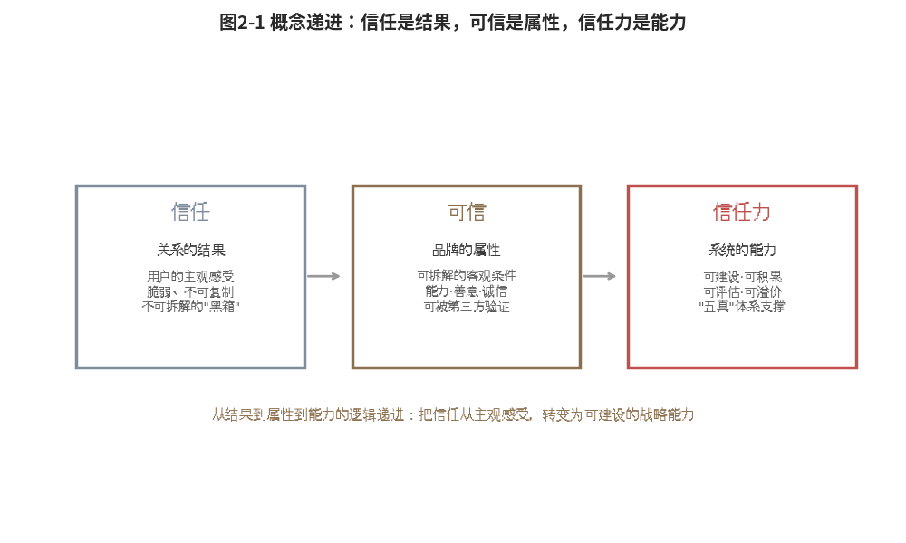
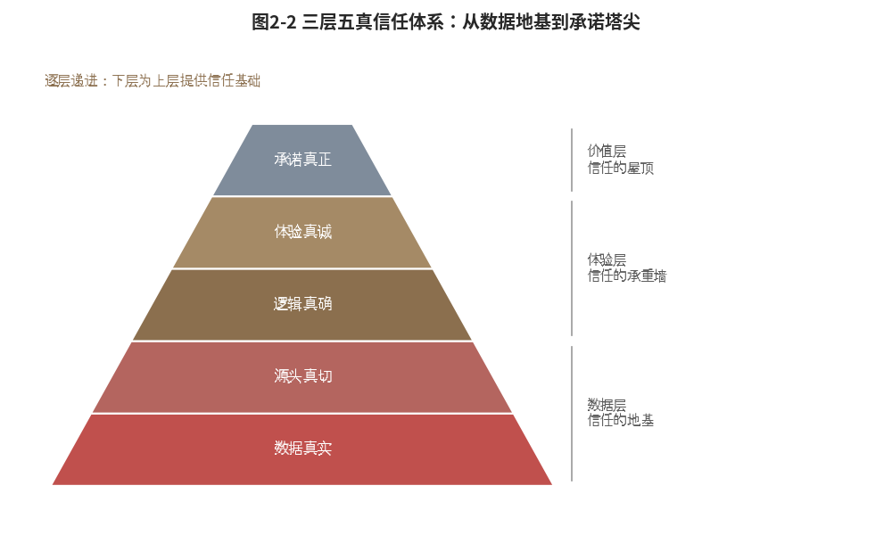
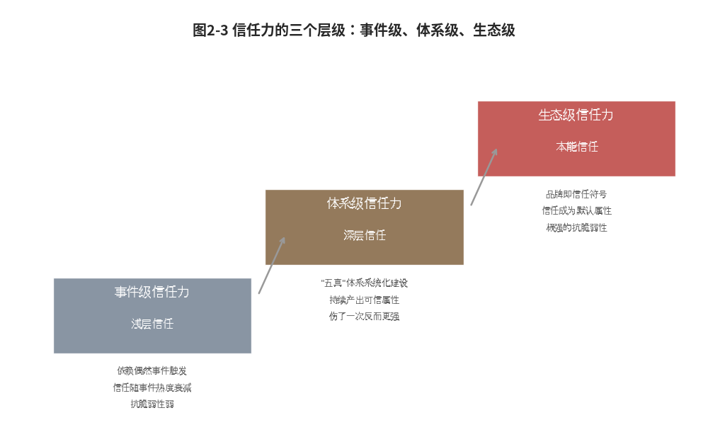

#  信任之力

## ------信任力是可拆解可验证可建设的能力

**【本章导读】**

第一章回答了"为什么"，为什么传统品牌营销在AI时代系统性失效。答案是决策成本的结构性转移：消费者的核心决策成本从"信息不对称"变成了"AI信任不对称"。旧范式解决前者，新范式必须解决后者。

本章要回答的是"是什么"：旧范式崩塌之后，替代它的新范式长什么样？品牌在AI时代最稀缺的战略资产究竟是什么？它的内核如何构成？它有层级之分吗？

答案就是"信任力"，它不是"口碑好"的同义反复，不是"品牌要讲诚信"的道德说教，而是一套可定义、可拆解、可建设、可评估、可迭代的系统能力。

本章是全书的"定义章"。第一节沿"信任→可信→信任力"的概念递进，澄清信任力是什么、不是什么。第二节拆解信任力的内核，"三层五真"体系，逐一展开每个"真"的含义。第三节揭示五真之间的系统协同关系，以及AI作为"实现者"而非"加持者"的时代前提。第四节划分信任力的三个层级（事件级、能力级、生态级）为不同阶段的品牌提供进阶地图。本章品牌验证以比亚迪为完整案例，验证信任力框架的解释力。

  --------------------------------------------------------------------------------------------------
  读完本章，你将获得理解AI时代品牌竞争的新框架：从"买认知"到"建信任"，从"注意力经济"到"认知主权"。

  --------------------------------------------------------------------------------------------------

## 概念递进：信任是结果，可信是属性，信任力是能力

理解"信任力"，先要区分三个层次完全不同的概念：信任、可信、信任力。三者之间不是"越来越高级"的线性递进，而是"从结果到属性到能力"的逻辑递进。（如图2-1所示）

{width="4.330555555555556in"
height="1.6256944444444446in"}

图2-1 概念递进：信任是结果，可信是属性，信任力是能力

### 信任本质：关系的结果，脆弱且不可复制

"信任"是一个描述性概念，指向一种关系的状态：用户对品牌持有积极预期，相信品牌会履行承诺。消费者信任海尔，是因为它的售后从不掉链子；信任胖东来，是因为它的退货从不推诿；信任华为，是因为它的技术实力经过了市场的反复验证。

信任是一个"达成了"的状态，但它本身既不解释"为什么达成"，也不回答"怎么复制"。多数品牌的信任是"熬出来的"，靠时间累积，靠一次次承诺兑现，靠偶然的口碑爆发。信任有了是结果，没了是损失。它像银行存款：存了三十年，一次重大事故就可能清零。

在传统营销范式中，"信任"是品牌的终极资产，一切营销动作（广告、公关、CRM、会员体系）最终都指向"赢得用户信任"。但问题在于：传统范式中的信任是一个不可拆解的"黑箱"。品牌知道信任很重要，却不知道它由哪些要素构成、如何量化评估、如何系统建设。品牌只能"经营"信任，无法"建设"信任。

### 可信属性：品牌的客观维度，可拆解也可验证

如果说信任是"用户的主观感受"，那么可信就是"品牌的客观属性"，品牌是否具备让用户产生信任的客观条件。

德国社会学家尼克拉斯·卢曼在《信任》一书中提出了一个经典区分：信任是一种"降低社会复杂性的机制"，而可信度是信任的客观基础\[1\]。社会心理学家罗杰·梅耶（Roger
C.
Mayer）等人进一步将可信度解构为三个维度：能力衡量品牌是否有能力兑现承诺；善意表达品牌是否真心为用户着想，而非仅仅追求利润；诚信则证明品牌是否言行一致、遵守其公开宣称的原则\[2\]。

可信回答的是"为什么值得信任"。比亚迪值得信任，不是因为它广告做得好，而是因为它有刀片电池的安全测试数据、垂直整合的供应链能力、新能源汽车销量全球第一（含插电混动）的市场验证。这些是"可信的客观证据"，只要消费者有时间有能力逐项核实，就能够验证。

以海尔为例。在中国家电行业，海尔有一个几乎成为"国民记忆"的信任标签：售后服务。这不是广告打出来的，而是一个个可验证的服务事件积累出来的，售后工程师上门服务自带鞋套、统一工装、完成后主动清扫现场。这些标准化动作，构成了梅耶信任模型中的"能力"维度：品牌是否有能力兑现服务承诺。

在AI时代，这些曾经存在于用户记忆中的服务体验，正转化为可检索的信任证据。用户在社交媒体上分享的服务体验帖、在电商平台留下的"售后响应快"评价、在家电论坛的维修体验对比，共同构成AI评估海尔"体验真"与"履约真"的原始数据。反过来看，那些宣称"服务好"却没有留下任何可检索证据的品牌，在AI的评估中等于"没有证据证明服务好"，无论它实际做得多好。这就是从"信任的感觉"到"可信的证据"的跃迁。

传统品牌营销的核心症结正在于此：它擅长制造"信任的感觉"，却不擅长建设"可信的事实"。一支感人的品牌宣传片可以让观众热泪盈眶，但在AI面前，它只是"品牌自述"，权威性评分很低，因为它来自品牌自身，缺乏独立第三方验证。AI不看你说了什么，AI看你有什么证据。

  ------------------------------------------------------------------------------------------------------------------------------------------------
  从"信任"到"可信"的递进，核心价值在于：它把信任从不可拆解的主观感受，转变为可拆解的客观属性。品牌不再只能"等待"信任，而是可以主动"建设"可信度。

  ------------------------------------------------------------------------------------------------------------------------------------------------

### 战略能力：内置于品牌系统的可建设战略资产

如果信任是关系的结果，可信是品牌的属性，那么信任力就是让品牌持续产生可信属性、持续赢得用户信任的内在系统能力。它不是某个能人的个人魅力，也不是某次爆款事件的余晖，而是一套内置于品牌系统之中、可反复调用、可持续升级的能力体系。

可以作一个类比。信任如同银行存款余额，赚了存进去，出了事取出来，健康的信任余额能帮品牌度过危机；可信如同稳定的收入来源，有持续现金流，就不怕偶尔的支出；一个可信的品牌即使偶尔出现负面事件，用户也更愿意给它"第二次机会"；信任力则如同整个财富管理系统，它不仅确保当下的收入和存款，更建立了一整套投资、风控、增长机制，让财富在复利效应下持续增长。

没有系统的人可能靠运气赚一笔钱，却无法保证明年还能赚；有系统的人，才真正具备"持续创造财富"的能力。

信任力有四个本质特征。它们把信任力与"口碑好""品牌强"等模糊概念区分开，把它确立为一个真正的"战略能力"概念。

可建设性。
信任力不是"天生有就有、没有就没有"的禀赋，而是一套可以系统建设的能力体系。正如ISO认证不是"天生合规"，而是通过体系化建设达成的，品牌也可以通过"五真"体系的逐层搭建构建信任力。可建设性意味着：信任力是方法论，不是天赋；它的高低取决于品牌"做了什么"，而不是"成立了多久"。一个成立三年但"五真"体系完备的品牌，信任力可以超越一个成立三十年但"五真"建设为零的品牌，在AI的评估中尤其如此。

可积累性。
信任力具有复利效应。每一次真实的用户好评、每一次权威信源的引用、每一次承诺的兑现，都在为品牌的"信任账户"存入本金。与广告不同，广告预算停了，效果就停了，信任力是"存入即计息"的资产：存入的每一条结构化数据、每一个权威认证、每一次真诚的用户互动，都构成AI推荐权重的长效因子，持续产生"被推荐"的回报。

可评估性。
信任力不是"我觉得我们品牌挺受信任的"这种主观判断，而是可量化诊断的能力指标，AI引用率、权威信源覆盖度、多平台信息一致性、用户评价分布、承诺兑现率，都可以量化、追踪、对标。可评估性意味着：信任力是可管理的战略资产，CMO可以像看财务报表一样看品牌的信任力指标。第七章将系统展开信任力的量化评估体系。

可溢价性。
这是信任力最终极的商业价值。在AI时代，信任力直接转化为三个商业成果：AI优先推荐（带来零成本的自然流量）、用户决策简化（缩短决策路径、提高转化率）、价格溢价能力（用户愿意为"可信"支付溢价）。三者叠加，构成信任力的"品牌复利"。一项关于品牌信任与消费者支付意愿的实证研究表明，品牌信任对溢价支付意愿具有显著的正向影响\[3\]。在AI时代，这一效应将被进一步放大。

## 五真内核：数据层、体验层与价值层的三层架构

信任力不是一个大而无当的概念。它由五个维度的"真"构成一座层层递进的信任金字塔，这就是"五真"信任体系：数据真、信源真、逻辑真、体验真、履约真。（如图2-2所示）

{width="4.330555555555556in"
height="2.7736111111111112in"}

图2-2 三层五真信任体系：从数据地基到承诺塔尖

需要先澄清一个关键点："五真"不是五个并列的"指标"，而是一个从客观事实到主观感受、从底层数据到顶层价值的逐层递进结构。它们是让品牌在AI认知体系中建立系统化可信度的五个关键维度，每一层对应一个特定的信任问题，每一层都在为上一层提供信任基础。

五个维度分属三个层级。数据真和信源真属于数据层，信任的"地基"；逻辑真和体验真属于体验层，信任的"承重墙"；履约真属于价值层，信任的"屋顶"。三层的完整性和稳定性，决定了信任力这座大厦能建多高、能抗多大的风暴。

需要区分的是，本书还有另外两套"三层"框架，组织三层架构（第八章）与生态三圈层（第九章），分别对应信任力建设的组织维度与生态维度，与"三层五真"的信任体系层级互不重叠。

### 数据真：AI可调用的结构化可验证事实

数据真回答的问题是：品牌是否有可以被AI验证的、标准化的、结构化的客观事实数据？

传统营销中的品牌信息是"叙述式"的，"我们是最好的""我们拥有先进的技术""我们深受消费者喜爱"。这些话AI无法验证。AI能验证的是结构化数据：产品参数、检测报告编号、认证标准与有效期、专利号与法律状态、市场份额的权威统计来源、生产流程的可追溯记录。

没有数据真的品牌，在AI认知体系中就是"透明的"，AI没有可引用的客观数据来支撑"推荐这个品牌"的判断。有数据真的品牌，则相当于为AI安装了一个"数据接口"，AI可以快速调取、交叉验证，并作为推荐依据。

数据真是"五真"体系的地基。没有它，后面四真都是空中楼阁，你连基本事实都无法让AI验证，凭什么让AI相信你的承诺真诚、体验真实？

数据真的建设核心是"结构化"。当前最主流的结构化数据标准是Schema.org，一个由Google、Microsoft、Yahoo等联合发起的开放标准。品牌在网页中嵌入Schema标记，相当于"用AI能听懂的语言"告诉AI：这是我的品牌名，这是我的产品参数，这是我的认证信息，这是我的用户评分。标记之后，AI从"费力阅读理解"变成"精准数据提取"，效率提升的不是几倍，而是从零到一。

### 信源真：权威第三方的独立认证矩阵

信源真回答的问题是：品牌的数据和主张，是否来自可靠的、独立的、权威的第三方信源？

AI评估可信度时，遵循的不是"谁说得更动人"，而是"谁说得更可信"，不同信源的权威性权重截然不同。政府监管部门发布的数据和认证，权重最高；国际/国家标准的认证次之；权威学术期刊的引用再次；主流媒体的独立报道有较高权重；品牌官网的自述权重较低；付费广告和软文权重极低，甚至可能被算法识别并降权。

由此产生一个反直觉的事实：同样一组产品参数，出现在品牌官网上，AI给它的可信度权重可能是20分（满分100）。出现在政府监管部门的抽检报告中，权重可能是90分。信息内容完全一样，但"来源"不同，在AI眼中的可信度就天差地别。

信源真要求品牌系统性地建设"权威信源矩阵"：不是被动等待媒体报道，而是主动把品牌信息嵌入高权重信源，参与行业标准制定、获得权威认证、发表经过同行评议的学术论文、接受主流媒体独立采访、进入政府推荐目录。这些不是"传播动作"，而是"信任基础设施建设"。

### 逻辑真：多平台信息的自洽与统一

逻辑真回答的问题是：品牌在不同平台、不同渠道上的信息，是否自洽、一致、不矛盾？

AI做交叉验证时会同时扫描多个信源。如果品牌在官网上说"行业排名第一"，在电商详情页说"市场占有率25%"，在媒体报道中又说"年增长率行业领先"，三组信息彼此并不矛盾，却是不同的"说法"，AI很难将它们关联为一个统一的"事实"。更糟糕的是参数不一致：官网标"续航500公里"，第三方测评显示"实测420公里"，AI会标记为"信息不一致"，可信度评分大幅下降。

逻辑真要求品牌建立"单一真相源"机制：核心数据在所有平台保持一致的表述、一致的数值、一致的时效。这看似简单，实则极具挑战，市场部管官网、电商团队管详情页、公关公司管媒体稿件、经销商管自己的宣传物料，信息天然分散，版本难免不同。

### 体验真：真实用户评价的统计分布健康度

体验真回答的问题是：品牌的实际体验，是否与它所宣称的一致？真实用户的评价分布，是否健康、自然、可信？

这是五真体系中最"软"但也最关键的一层。AI通过分析海量用户评价判断体验真度：不只看"评分高不高"，更看"评价分布是否自然"，是否有好评也有中评差评、差评集中在什么维度、品牌如何回应差评。

一个只有五星好评的品牌在AI眼中并不可信，这不符合真实的统计分布。反而是"4.3分、有褒有贬、差评集中在非核心维度、品牌对差评有真诚回应"的评价结构，会被AI判断为"更可信"。AI的逻辑很朴素：真实的体验不会是完美的，"完美"的评分在统计上反而不自然。

体验真的核心逻辑是：用户不相信"完美"的品牌，用户相信"真实"的品牌。在AI时代，这一逻辑是：AI不相信"完美"的数据，相信"真实"的数据。

### 履约真：品牌公开承诺的长期可兑现记录

履约真回答的是五真体系的终极问题：品牌说的话到底算不算数？承诺兑现了多少？

这是五真体系的"塔尖"，也是信任力的最终依归。前面四真（数据真、信源真、逻辑真、体验真）都在为"履约真"建基础。品牌最终无法兑现承诺，前四真的价值就大幅缩水。反之，一个品牌始终兑现承诺，退换货政策从未打折、售后响应从不超时、产品品质始终如一，即便它在某些维度上并不"完美"，信任力依然坚实。

在AI时代，"承诺兑现率"正成为可量化、可追踪、可公开验证的指标。社交媒体上的用户反馈、消费者投诉平台的处理记录、第三方测评机构的复测数据，都构成AI评估"履约真"的数据来源。一个经历过质量丑闻但迅速整改并持续保持的品牌，在AI信任评估中可能高于"从未出事但也从未被检验"的品牌，前者有"危机中兑现承诺"的实证数据，后者没有。

履约真的建设围绕三个核心机制展开。第一，承诺的"不可逆性"设计，承诺的可信度与"违诺的成本"成正比。比亚迪宣布停产燃油车就是一个不可逆承诺：它切断了自身退路，违诺成本极高，所以可信度极高。第二，承诺兑现的"可验证"机制，品牌需要为每一个重大承诺建立可公开验证的兑现记录。第三，危机中的"承诺验证"，品牌在危机中的表现，是AI评估"履约真"的最重要依据。品牌在危机中坦诚面对、积极整改、公开整改结果，并以此为契机升级整个体系，其"履约真"得分反而可能在危机后上升。

### 系统协同：五真闭环与AI的实现者角色

五个维度之间不是"并列"关系，而是"递进"关系，每一层为上一层提供基础，上一层为下一层赋予意义。

五真闭环是从数据地基到承诺塔尖的逐层增强

数据真是地基，没有可验证的结构化数据，信源真就失去了可以"认证"的对象。信源真是地基的另一半，数据被权威信源背书后，逻辑真才有了参照系。逻辑真是承重墙的一根主梁，各平台信息一致、自洽、不矛盾，AI的交叉验证才有可靠信号。体验真是承重墙的另一根主梁，前三真解决"品牌客观上是否值得信任"，体验真解决"用户主观上是否确实信任品牌"。履约真是屋顶，前四真是"立信"（让品牌值得被信任），履约真是"守信"（让品牌确实兑现了承诺）。

五真协同是逐层递进构建信任金字塔

五真之间的协同关系可以用一句话概括：数据真让AI"知道你是谁"，信源真让AI"相信你的数据"，逻辑真让AI"确认你言行一致"，体验真让AI"验证你说的和做的一样"，履约真让AI"放心推荐你"。
五真逐层递进，缺了任何一层，信任力的金字塔就会出现结构性缺陷。

AI实现者是信任力唯有在AI时代才成为系统工程

五真体系背后还有一个更深层的判断：信任力作为完整的系统能力，只有在AI时代才真正成为可能。

AI出现之前，品牌也可以拥有信任，"老字号""百年品牌""值得信赖"。但这些信任有三个根本局限：不可量化（"口碑好"只能感知，不能精确度量）、传播效率低（信任靠口口相传，社交网络限制了传播速度和规模）、无法复制（一个产品的信任不能自动转移给另一个产品）。

AI的出现改变了这一格局。在数据真维度，AI让品牌的结构化数据第一次可以系统性地采集、标记和调用；在信源真维度，AI的交叉验证能力将权威信源的价值指数级放大；在逻辑真维度，AI的多源比对能力让信息一致性第一次可以大规模自动化检验；在体验真维度，AI的自然语言处理能力让海量用户评价的"真实性分布"第一次可以客观评估；在履约真维度，AI的追踪和归因能力让"承诺兑现率"第一次变成可验证的数据。

由此可以理解，为什么本书将信任力界定为AI时代的品牌核心能力，不是AI"加持"了信任力，而是AI"实现"了信任力。正如显微镜之于生物学，显微镜出现之前，人们也在"观察生物"，但那不是现代意义上的生物学。AI之于信任力，实现的正是从"经验判断"到"系统工程"的跃迁。

## 信任力分层：事件级、能力级与生态级

理解了信任力的内核，一个新问题随之而来：所有拥有信任力的品牌，都在同一水平线上吗？显然不是。胖东来的信任力和一个新消费品牌的信任力，是同一个东西吗？

答案在于：信任力存在层级之分。理解层级差异，品牌才能清醒评估自身所处的阶段，找准下一步的方向。三个层级分别是：事件级信任力、能力级信任力、生态级信任力。（如图2-3所示）

{width="4.330555555555556in"
height="2.598611111111111in"}

图2-3 信任力的三个层级：事件级、能力级、生态级

### 事件级信任：借力偶然事件积累的浅层信任

事件级信任力是信任力的初级形态，核心特征是品牌信任主要依赖少数标志性事件的积累，一次出色的危机应对、一个现象级的产品爆款、一位魅力型创始人的公开言行。需要强调的是，事件级不等于"没有信任力"。很多品牌连事件级都不具备：危机来了应对失当，爆款来了供应链断裂。能达到事件级，已经需要一定的感知能力和组织响应能力作为支撑。

事件级信任力有四个特征：依赖外部事件的偶然触发。核心能力是"临危不乱+快速响应"，而非"持续建设"。信任水平与事件热度强相关，事件退潮后信任随之衰减。每次信任积累都是一次"重新启动"，经验难以系统沉淀。

### 能力级信任：系统化建设持续产出的深层信任

能力级信任力是信任力的中级形态，核心特征是不再依赖单次事件的偶然触发，而是通过"五真"体系的系统化建设，使品牌具备持续产出可信属性、持续赢得AI推荐和用户信任的能力。从事件级到能力级，是从"等待证明自己的机会"到"主动构建证明自己的体系"的质的飞跃。

能力级信任力有四个特征：不依赖单一事件的偶然触发。"五真"体系中至少三个维度达到系统化建设水平。主动积累信任资产，而非被动应对信任危机；每一次信任互动都在为下一次铺路。

### 生态级信任：品牌本身就是信任符号的本能信任

生态级信任力是信任力的高级形态，核心特征是信任力已超越"品牌的某种能力"，内化为"品牌的DNA"，用户和AI不是"判断这个品牌是否值得信任"，而是"默认这个品牌就是值得信任的"。品牌在用户心智和AI认知体系中，已经成为一个固有的"信任符号"。胖东来、华为、老干妈，在各自领域内，这些品牌接近或不完全地达到了这个层级。

生态级信任力有四个特征：不需要刻意"证明"自己值得信任，信任已成为品牌的默认属性。消费者、合作伙伴、媒体、监管机构形成了"信任共识"的生态网络。单一负面事件的冲击不足以动摇整体信任力；信任力不再是需要"建设"的能力，而是品牌生命的一部分。

## 跃迁逻辑：信任深度与抗脆弱性的阶梯式进化

信任力的三个层级（事件级、能力级、生态级）不是并列的三种形态，而是一条阶梯式的进化路径。每一次跃迁都伴随两个深层变化：信任深度的增加，系统抗脆弱性\[1\]的增强。五真体系在每一层级中扮演的角色，也截然不同。

### 信任分层与五真的关系

事件级：浅层信任，五真零散偶发。
事件级对应\"浅层信任\"，用户信任的是品牌这一次的表现。在这个层级上，五真的要素是零散的。一份真实的数据、一次真诚的回应，可能偶然出现，但没有机制保障它们持续出现。因此事件级非常脆弱。一次负面事件、一次公关失误，就可能让多年积累归零。原因在于，用户的信任建立在\"这一次\"之上，而不是\"每一套\"之上。

能力级：深层信任，五真系统运转。
能力级对应\"深层信任\"，用户信任的是品牌的运作体系，因为每一次承诺都有系统性机制保障兑现。这正是五真体系全面建成的状态：数据真实可验证，信源真切有背书，逻辑真确全一致，体验真诚可感知，承诺真正有记录。能力级由此获得一定的抗脆弱性。某次危机中的信任受损，不会动摇整个体系的根基。系统通过五真机制记录问题、修复漏洞、升级体系，结果往往是伤了一次，反而更强。

生态级：本能信任，五真外溢为共识。
生态级对应\"本能信任\"，用户不需要思考该不该信任，就像不需要思考太阳会不会升起来。三种深度背后，是信任从认知判断到情感认同再到价值内化的进化。在这个层级上，五真不再是品牌自己的资产，而是外溢为产业链的通用标准、用户社区的集体记忆、社会层面的公共共识。生态级具有极强的抗脆弱性。即使发生重大危机，用户和AI的信任惯性也会为品牌赢得修复的时间窗口。

### AI在信任跃迁的角色

AI在两次跃迁中扮演着完全不同的角色。
从事件级到能力级，AI是加速器，它把信任力差距迅速显影并放大。当品牌A还在一次次危机中依赖临场发挥时，品牌B已经通过五真体系的系统化建设，在AI推荐位次中稳步上升。这个差距会在AI的评估数据中以数据形态清晰呈现（度量方法详见第七章）。AI没有降低跃迁的难度，但大幅缩短了品牌意识到必须跃迁的时间。在传统时代，这种觉醒可能要等一次刻骨铭心的教训，甚至数十年。

从能力级到生态级，AI是显影剂加连接剂，却唯独不是加速器。这一跃迁要求信任力溢出组织边界。品牌能建设的部分越来越少，最终能拥有的只有一样：足够长的时间里始终如一的兑现记录。这就是海尔用了四十年、胖东来用了三十年的原因（详见第六章、第九章）。生态级信任力没有工期，只有生长期。AI能做两件事。一是让生态级信任可显影，产业链评价、社区讨论、媒体引用全部被汇聚成可观测的仪表盘。二是让生态级信任可连接，卡奥斯让海尔的信任背书沿产业链分发，胖东来的用户口碑让三十年积累成为可检索的数字资产。但必须清醒：AI可以记录三十年的兑现，无法压缩那三十年。品牌可以借助AI让每一次兑现都被看见，兑现本身，一次都不能少。

三级跃迁的全貌，可以由一张对照表完整呈现（如表2-1所示）。

表2-1 信任力三级跃迁对照表

  ---------- -------------- -------------- ------------------------ ---------------- --------------
   **层级**   **信任深度**   **五真状态**        **抗脆弱性**         **AI的角色**    **建设抓手**

    事件级      浅层信任       零散偶发     脆弱，一次危机可能归零       加速器         应对求快

    能力级      深层信任       系统运转            伤后更强          显影并放大差距     建设求实

    生态级      本能信任      外溢为共识     信任惯性赢得修复窗口    显影剂加连接剂     经营求久
  ---------- -------------- -------------- ------------------------ ---------------- --------------

因此，三级跃迁的正确姿势是分层施策：事件级靠应对，能力级靠建设，生态级靠经营。应对求快，建设求实，经营求久。

这个框架的实践意义，在于帮助品牌回答三个最根本的问题：我在哪里，我要去哪里，那里是什么样的。大多数中国品牌正处于从事件级向能力级跃迁的关键窗口期，这是当下最紧迫、也最能被AI赋能的一层。本书中篇的核心使命（第四至六章），就是为这次跃迁提供一幅可操作的战略地图。

理解了这套框架，比亚迪的逆袭就不再是奇迹，而是可拆解、可复制的系统工程。生态级则是建设到位之后，时间给予的奖赏，它的每一步都会被记住。

## 【案例】品牌验证：比亚迪能力级信任力的完整样本

前三节建立了信任力的理论框架，本节用比亚迪的完整案例验证它的解释力。选择比亚迪，是因为它提供了一个罕见的观察窗口：一个品牌如何在短短几年内，完成从"廉价代名词"到"全球新能源头部品牌"的信任力跃迁。

二十年前，"比亚迪"三个字在国际市场几乎等同于"廉价中国制造"。此后比亚迪开始了一场静悄悄的信任力觉醒：刀片电池的"针刺实验"公开演示，2022
年 3
月宣布停止燃油整车生产的"禁燃宣言"，向竞争对手开放刀片电池供应的"开放信任"策略，ATTO
3 获得欧洲 E-NCAP
五星安全评级。每一个动作都不是"营销"，而是"用不可逆的行动证明承诺"。这些举措指向同一个目标：不是"让更多人知道比亚迪"，而是"让所有知道比亚迪的人（包括
AI）有更多的理由相信比亚迪"。

用五真体系逐一映射，比亚迪的实践几乎逐项命中。数据真：刀片电池能量密度、DM-i
热效率、e 平台 3.0 CTB 技术参数，全部以结构化方式公开，形成 AI
可调用的"技术知识库"。信源真：E-NCAP 五星、C-NCAP 五星、中保研 C-IASI
全优，构成安全维度的权威背书矩阵。逻辑真：全球统一的技术参数和品牌主张，海外版与国内版信息一致。体验真：2024
年 11 月 18 日，比亚迪第 1000 万辆新能源汽车（腾势
Z9）正式下线，海量用户构成不可造假的"真实评价池"。履约真："禁燃"宣言以不可逆的战略选择切断自身退路，违诺成本极高，承诺的可信度因此极高。

比亚迪的实践表明：信任力不是天赋或运气，而是一套可以系统建设的能力体系。它不是一个"只能被拥有"的天赋，而是一个"可以建设"的系统。

## 本章小结

本章完成了全书最重要的一项工作：定义信任力。

第一节沿"信任→可信→信任力"的概念递进，澄清了三者的逻辑关系，并确立了信任力的四个本质特征，可建设、可积累、可评估、可溢价。

第二节拆解了信任力的内核，"三层五真"体系。数据层是地基（数据真、信源真），体验层是承重墙（逻辑真、体验真），价值层是屋顶（履约真），五真逐层递进，构成品牌在AI认知体系中建立可信度的完整结构。

第三节揭示了五真之间的系统协同关系，缺了任何一层，信任力的金字塔都会出现结构性缺陷。并论证了AI不是信任力的"加持者"，而是"实现者"，前AI时代的品牌也有信任，但那靠的是时间积累和运气。AI时代第一次让信任变成了可建设的系统工程。

第四节划分了信任力的三个层级（事件级、能力级、生态级）为不同发展阶段的品牌提供了清晰的进阶地图。

品牌验证以比亚迪为完整案例，验证了五真体系和三级框架的解释力。

读完本章，读者应当能够回答三个问题：信任力是什么？它的内核是什么？我的品牌在哪个层级？

接下来，第三章将回答另一个根本问题：AI时代的品牌营销，用户旅程发生了怎样的重构？传统科特勒5A模型在AI时代如何重新定义？

+:-----------------------------------------------------------------------------------------------------------------------------------------+
| 信任力不是"品牌要讲诚信"的道德说教，而是品牌在AI时代最核心的战略资产。它不是"应该做的事"，而是"必须做的事"。                             |
|                                                                                                                                          |
| 数据真让AI"知道你是谁"，信源真让AI"相信你的数据"，逻辑真让AI"确认你言行一致"，体验真让AI"验证你说的和做的一样"，履约真让AI"放心推荐你"。 |
|                                                                                                                                          |
| 信任力的建设不是"让品牌变成大家喜欢的样子"，而是"让品牌的实力，以可验证的方式呈现"。                                                     |
+------------------------------------------------------------------------------------------------------------------------------------------+

### 参考文献

\[1\] Luhmann N. Vertrauen: Ein Mechanismus der Reduktion sozialer
Komplexität\[M\]. Stuttgart: Enke, 1968.

\[2\] Mayer R C, Davis J H, Schoorman F D. An integrative model of
organizational trust\[J\]. Academy of Management Review, 1995, 20(3):
709-734.

\[3\] Delgado-Ballester E, Munuera-Alemán J L. Does brand trust matter
to brand equity?\[J\]. Journal of Product & Brand Management, 2005,
14(3): 187-196.

**中篇导论**

上篇回答了"传统营销为什么失效"和"信任力是什么"。现在进入本书的核心，怎么建。信任力建设如同盖楼：勘测在先、许可在前、地基在底、动力在内，四道工序一道都不能省，顺序也不能乱。

第三章（旅程重构）是"测绘图"，动工之前，先勘测地形。科特勒的5A模型运行了几十年，却从未把"信任力"纳入核心议程，因为它有一个隐含假设：问询（Ask）环节由消费者自己完成。AI瓦解了这个假设，当AI接管问询，品牌的竞争战场从"争夺消费者的注意力"迁移到"赢得AI的信任"。不懂这张新地图，后面所有的建设都是在错误的战场上投入兵力。

第四章（GEO之战）是"入场许可"，让AI看到你、准许你进入它的答案。当用户向AI提问"预算三千、送给父母的健康礼品"，品牌出现在答案里还是被排除在外，决定生死。GEO不是SEO的"AI版本"，而是一套全新的技术范式。

第五章（信任之基）是"地基"，被看到、被推荐，不等于被信任。当用户追问"这个品牌真的靠谱吗"，AI交叉验证的结果才是决定性信号。"三层五真"信任体系就是地基的深度：它决定了信任力这栋楼能盖多高。

第六章（飞轮效应）是"动力系统"，让每一次信任积累都为下一次蓄能。信任力不是一栋"建好就完工"的房子，而是一台"越用越转越快"的发动机。这个判断决定了你的投入究竟是一次性建设成本，还是持续复利的战略投资。

贯穿中篇的问题链是：战场在哪→如何入场→凭什么被信任→怎样越建越强。任何一环的短板，都会让前面的投入前功尽弃。读完中篇，你将拥有一套完整的信任力建设方法论。
