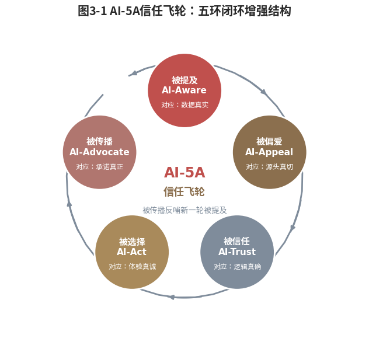
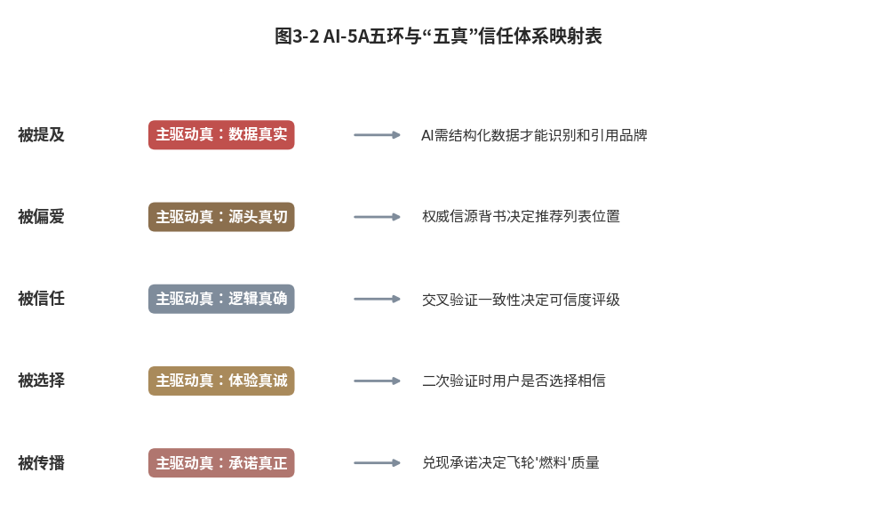
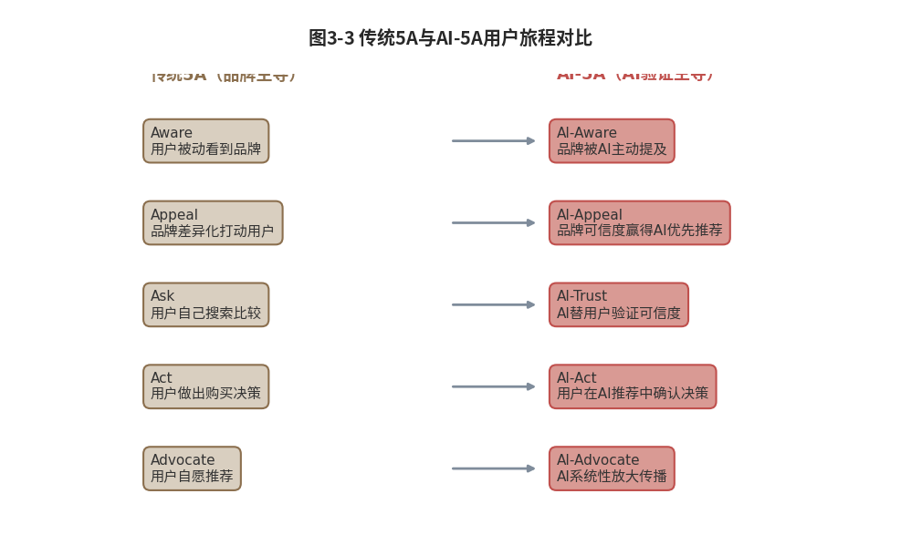

#  旅程重构

## ------AI接管问询引发消费旅程的全链条重构

**【本章导读】**

第一、二章定义了信任力，它是由"五真"体系构成的系统能力复合体。但一个更根本的问题随之而来：如果信任力如此重要，为什么直到AI时代我们才开始严肃地谈论它？为什么在前AI时代，品牌营销最重要的理论框架（科特勒的5A模型）运行了几十年，却从未将"信任力"纳入核心议程？

答案藏在用户旅程的底层结构中。菲利普·科特勒在《营销革命4.0》中提出的5A用户旅程模型，认知（Aware）、吸引（Appeal）、问询（Ask）、行动（Act）、拥护（Advocate），是数字时代品牌营销最经典的理论框架之一\[1\]。它精准描绘了消费者从"知道一个品牌"到"成为品牌拥护者"的完整路径。但5A模型中暗含着一个今天看来堪称脆弱的假设：用户自己完成问询，自己搜索、自己比较、自己判断该信谁。

这个假设，正在被AI瓦解。当用户不再"自己问"，而是把"问"这个动作外包给AI，5A模型的地基就动摇了。

本章要回答的核心问题是：AI如何重构了用户决策的五个环节？这种重构对品牌意味着什么？适配AI时代的"新5A"（被提及、被偏爱、被信任、被选择、被传播）与传统5A之间，究竟是什么关系？

接下来，本章将从科特勒5A模型的经典结构出发，剖析其前AI时代的隐含假设与三重盲区，再逐一展开AI如何在五个环节上实现范式跃迁。章末以伊利集团的AI营销实践为完整案例，验证**AI-5A**框架的解释力。

  ----------------------------------------------------------------------------------------------------------------------------------
  读完本章，读者将获得一个理解AI时代用户决策旅程的新框架：品牌不是在与竞品竞争用户的注意力，而是在与所有品牌竞争AI的"信任推荐位"。

  ----------------------------------------------------------------------------------------------------------------------------------

## 经典迷思：5A模型的三个前AI时代隐含假设

2017年，菲利普·科特勒出版《营销革命4.0》，敏锐捕捉到数字时代消费者决策路径的根本变化，从线性的"认知→购买"变为非线性的"认知→吸引→问询→行动→拥护"。这个模型迅速成为全球品牌营销从业者的共同语言，被写入无数营销方案与战略PPT。但其中一个隐藏的假设，要等到六年后的2023年，才被AI的爆发式应用彻底暴露。

### 5A精髓：从企业推送到用户主动的范式转移

先看5A模型为什么伟大。在科特勒之前，营销界通行的是"漏斗模型"，AIDA（注意Attention→兴趣Interest→欲望Desire→行动Action）。这是典型的"企业视角"模型：品牌通过广告"推"给用户，用户被动接收，按漏斗逐层筛选。

科特勒的5A完成了关键的范式转移：从"企业视角"转向"用户视角"。他不再问"品牌怎么把东西卖给用户"，而是问"用户怎么一步步做出购买决策"。五个阶段，对应用户决策心智的五个转折点：

认知（Aware）：
用户被动接触到品牌信息，刷到一条广告、看到朋友转发、路过一家门店。这是用户旅程的起点，用户对品牌有了最初步的印象。

吸引（Appeal）：
用户从"被动知道"变为"主动关注"，这个品牌有点意思，和我的需求相关。品牌开始进入用户的"考虑集"。

问询（Ask）：
用户主动搜集信息，搜评价、看测评、问朋友、比价格。这是整个5A模型中最关键的一环：它是用户从"感兴趣"到"决定买"的桥梁。

行动（Act）：
用户做出购买决策并完成交易。不只是"买了"，还包括使用过程中的体验。

拥护（Advocate）：
用户成为品牌的主动传播者，写好评、推荐给朋友、在社交媒体上自发种草。这是品牌营销的终极目标：让用户替你"卖"。

科特勒在《营销革命4.0》中的关键推进，是把传统 AIDA 模型重写为 5A
路径，并突出"问询（Ask）"环节的分量：数字时代用户不再是被动接收信息的受众，而是主动搜索、比对、找亲友验证的研究者，品牌信任往往在
Ask 阶段被集体决策重塑。

书中同时提出"F
因素"（朋友、家人、粉丝、关注者）与权力从企业向用户社群的水平转移，指出他人口碑在用户决策中的权重已超过品牌单向广告。在此基础上，5A
最后一环"拥护（Advocate）"的留存、复购与主动推荐，被视为数字时代品牌增长的关键杠杆，原书也以此引出品牌拥护比率（BAR）这一指标。

但他没有预料到的是，"问询"这个环节本身，会被AI彻底重构。

### 三重假设：搜索者、比较者与品牌直接干预的崩塌

5A模型诞生于2017年，彼时最前沿的营销技术是社交媒体精准投放和搜索引擎优化（SEO）。它完美解释了那个时代的消费者行为，却也内置了三重"前AI时代"的隐含假设。这些假设在当时是不证自明的共识，在今天则变成需要重新审视的前提。

第一重假设：用户是"搜索者"。

5A模型的"Ask"环节，默认用户通过搜索引擎、社交媒体、电商平台"主动搜索"信息。品牌在这一环节的策略是SEO、SEM（搜索引擎营销）、内容营销，让用户在搜索时先看到你。这套逻辑的根基是"关键词匹配"：用户输入关键词，搜索引擎返回结果，品牌争夺排名。

但AI时代的用户不是"搜索者"，而是"提问者"。两者的区别不是用词不同，而是心智模式的根本差异。"搜索者"知道自己要找什么，输入"最好的空气净化器"，期待的是"信息列表"；"提问者"不知道自己要什么，输入"北京雾霾天家里有小孩用什么空气净化器比较好"，期待的是"答案"。搜索是"人找信息"，提问是"人为需求找答案"。5A模型覆盖了前者，覆盖不了后者。

第二重假设：用户是"比较者"。

5A模型的"Ask→Act"路径，默认用户搜集多个品牌信息后，会自己比较、自己权衡、自己决策。品牌在这一环节的策略是"差异化定位"，让你的品牌在比较中胜出。但前提是：用户真的会"比较"。

AI时代的用户把"比较"外包了。逐项对比参数，AI替他们做了；看几十条测评再综合判断，AI也替他们做了。用户从"比较者"变成了"选择者"，只在AI给出的有限选项中做最后的确认。品牌的竞争不再发生在用户的"比较心智"中，而是发生在AI的"排序算法"中。5A模型假设品牌在用户心智中竞争，新范式下品牌首先在AI算法中竞争。

第三重假设：品牌可以在"问询"环节直接干预。

5A模型的营销逻辑是：在Ask阶段，品牌通过内容营销、口碑管理、KOL种草直接影响用户的问询结果。品牌可以"管理"用户看到的评价、"引导"用户搜索的方向、"控制"信息呈现的顺序。这套逻辑在搜索引擎时代运转有效，品牌可以通过SEO和SEM影响搜索结果的排序。

但在AI时代，品牌无法"管理"AI的推荐逻辑。AI不看你的SEO排名，不看你的SEM竞价，不看你的KOL合作，AI看的是结构化数据、权威信源、多源交叉一致性和真实评价分布。品牌在"问询"环节的直接干预能力，被AI的交叉验证机制大幅削弱。你可以在搜索结果中"买"到第一名的位置，但无法在AI回答中"买"到第一名的推荐。

三重假设的暴露，集中在一个时间节点上：当用户开始把"问询"大规模外包给AI。这不是1%到5%的渐进变化，而是从0到5亿用户的指数级跃迁，截至2025年6月，中国生成式AI用户已达5.15亿\[2\]。当数亿用户把"该买什么"的询问环节交给AI作答时，5A模型中原本由品牌广告与搜索承接的
Ask 阶段地基，就不再稳固了。

### 结构冲击：Ask被AI接管引发的全链条重构

三重假设的崩塌，集中体现在5A模型的"Ask"环节。但Ask的瓦解不是孤立的，它引发了整个5A链条的结构性冲击。

在传统5A中，Aware（认知）是入口，Appeal（吸引）是筛选，Ask（问询）是决策的关键环节，Act（行动）是落地，Advocate（拥护）是反馈。五个环节构成一个线性递进、层层转化的"用户决策漏斗"。

AI时代，这个漏斗的底部被捅穿了。

用户完成Aware（看到广告或内容）和Appeal（产生兴趣）之后，不再进入Ask（自己搜索比较），而是直接问AI。AI在几秒内完成了过去需要数小时乃至数天的信息搜集、比较、验证工作，返回一个"带有信源和理由的推荐答案"。用户跳过Ask直达Act之前，进入一个全新的阶段，我称之为"AI验证"阶段。

这个跳跃，带来三个连锁反应：

第一，品牌从"被搜索"变为"被提及"。
用户不再"搜索"品牌，而是在AI回答中"看到"品牌。品牌出现在AI答案中的位置和方式，替代了传统搜索结果的排序。不在AI知识库中的品牌，等于不存在于新一代消费者的认知中。

第二，品牌从"被比较"变为"被信任"。
用户不再自己比较品牌，而是依赖AI的比较结果。AI比较的不是广告语、不是包装、不是代言人，而是结构化数据、权威信源、真实评价分布。品牌竞争的核心，从"差异化的广告语"变为"可信化的数据资产"。

第三，品牌从"被选择"变为"被推荐"。
用户不再主动"选择"品牌，而是在AI推荐的选项中做最后的"确认"。这不是品牌失去了主动性，而是用户决策的"入口"从搜索引擎转移到了AI助手。品牌营销的目标，从"让用户在搜索时选择你"变为"让AI在回答时推荐你"。

这三个连锁反应，勾勒出一个全新的用户决策旅程。它不是对5A模型的"微调"，而是一次根本性的范式跃迁。接下来，逐一展开这个新旅程的五个环节。

## 五环重构：从被提及到被传播的AI时代新旅程

如果传统5A建立在"用户自己搜索和比较"的假设之上，那么当这个假设被AI瓦解之后，新的用户决策旅程应该是什么样子？本节系统展开一个适配AI时代的"新5A"框架：被提及（AI-Aware）、被偏爱（AI-Appeal）、被信任（AI-Trust）、被选择（AI-Act）、被传播（AI-Advocate）。

这个框架不是对科特勒5A的否定，而是在其基础上的范式跃迁。科特勒5A揭示了"用户决策的五个心智转折点"，这个底层逻辑没有变，用户仍然从"不知道"到"知道"到"喜欢"到"信任"到"购买"到"推荐"。变的是实现这五个转折的方式。传统5A回答"用户自己怎么走过这五步"，AI-5A回答"AI如何帮助用户走过这五步，以及品牌如何在这个过程中赢得AI的推荐"。

### 被提及环：从用户搜索发现到AI答案引用

在传统5A中，认知（Aware）阶段的逻辑链是：品牌投放广告→用户被动看到→用户记住品牌→用户下次搜索时输入品牌名。品牌在这一阶段的核心KPI是"曝光量"和"品牌回想率"，多少人看到了、多少人记住了。

在AI-5A中，这个逻辑链发生了断裂和重组。用户仍然会看到广告，仍然会记住品牌，但从"记住"到"搜索"之间，插入了一个全新的环节：AI验证。

用户看到某品牌的广告后，不是直接去电商平台搜索下单，而是打开AI助手问一句"XX品牌怎么样"。此时，AI是否"提及"这个品牌、以什么方式提及、在什么位置提及，成为品牌认知的"第二入口"。

这就是"被提及"的核心含义：品牌不仅需要在广告中被用户看到，更需要在AI的回答中被提到。两个"入口"之间的落差，决定了品牌在AI时代的认知效率：你花一千万买来的"曝光"，如果不能在AI追问中被验证和强化，很可能在用户打开AI助手的几秒钟内全部流失。

被提及有三个层次。

第一层：被收录。
品牌的基础信息（名称、品类、核心参数）是否已被AI的知识库收录？这是"被提及"的门槛。大量中小品牌甚至没有跨过这道门槛：官网内容未被AI抓取、产品信息未做结构化标记、甚至连品牌名在AI中的拼写都可能出错。

第二层：被优先提及。
当用户向AI提出品类相关问题时，品牌是否出现在AI的推荐列表中？是否排在靠前的位置？这里有一个关键的技术逻辑：AI推荐排序的依据，不是"这个品牌知名度高"，而是"这个品牌在可信度加权评估中得分高"。一支知名度很高但缺乏结构化数据建设的品牌，可能被AI排在"知名度低但数据建设完善"的品牌之后。这是AI时代最颠覆性的一点：品牌认知的"起跑线"被重新划定了。

第三层：被正面提及。
品牌在AI的回答中，是以什么"语气"被提及的？是"XX品牌也是一个选择"，还是"推荐XX品牌，因为它的XX技术在行业内有权威认证"？是中性罗列，还是主动背书？"被正面提及"是AI认知的最高层级，它不仅意味着品牌在AI的知识库中"存在"，更意味着AI基于交叉验证得出的结论是"这个品牌值得推荐"。

达到第三层，需要品牌在"五真"体系的每一个维度上都积累足够的信任资产。第一、二章已经论证过：AI判断品牌可信度的依据，结构化数据标记、权威信源背书、多源信息一致性、内容新鲜度、用户真实反馈，正是"五真"体系覆盖的五个维度。

### 被偏爱环：从品牌打动用户到AI代你打动用户

在传统5A中，吸引（Appeal）阶段的核心挑战是：如何在用户的"考虑集"中脱颖而出？品牌的策略通常是差异化定位，"我们是唯一的""我们是最好的""我们和别人不一样"。

但在AI时代，"考虑集"的形成机制发生了根本变化。传统模式下，用户的考虑集来自自己的记忆（"我能想到哪几个品牌"）和搜索结果的排序（"排在前面的几个"）。AI模式下，用户的考虑集来自AI的推荐，AI替你决定了"你应该考虑这几个品牌"。

这种变化，把"吸引"的逻辑从品牌主导变成了AI主导。

传统模式下，品牌可以通过广告频率"强行进入"用户的考虑集，重复曝光、洗脑文案、密集投放。这是典型的"注意力经济"逻辑：谁的声量大，谁就在用户的考虑集里。但AI不看声量，看可信度。你投再多的广告，如果AI在交叉验证时发现品牌信息不一致、权威信源覆盖不足、真实评价分布异常，就不会把你放进推荐列表。

这就是"被偏爱"的核心含义：品牌不只要在用户心智中"有吸引力"，更要在AI的排序算法中"有优先级"。AI对你的评价越高，你就越有可能在回答中被优先推荐；你在AI知识库中的可信度越强，AI对你的背书语气就越积极。

被偏爱也有三个层次。

第一层：入列。
品牌进入了AI在相关品类中的推荐候选池。这意味着品牌的基本数据建设达到了"可被AI评估"的门槛，有结构化信息、有基本的信源覆盖、没有明显的"信息不一致"标记。

第二层：优选。
品牌在AI的推荐列表中排在靠前位置，且附带正面的推荐理由，不是"XX品牌也是一个选择"，而是"推荐XX品牌，因为......"。这意味着品牌在"五真"体系的多个维度上有显著优势，AI的综合评估得分高于同类竞品。

第三层：独占。
品牌成为AI在该品类中的"首选推荐"。AI不仅推荐它，而且在多个同类问题中都首选推荐它，推荐理由充分、信源清晰、无可替代。这需要品牌在"五真"的每一个维度上都建立显著的竞争壁垒。

独占不是永久性的，如果竞品在"五真"建设上赶上甚至超越，AI的推荐排序会动态调整。但独占一旦建立，就会产生"推荐惯性"，AI在后续回答中倾向于延续此前的推荐，因为推荐排序本身就是AI"学习"的结果。

### 被信任环：从用户自行验证到AI交叉验证背书

这是AI-5A框架中最关键、最具颠覆性的一个环节。在传统5A中，问询（Ask）是用户在购买前主动搜集信息、验证品牌可信度的阶段。用户搜索评价、阅读测评、比较参数、咨询朋友，这个过程消耗的是用户的"决策时间"，解决的是用户的"信息不对称"焦虑。

在AI-5A中，用户将整个问询环节外包给AI。他们不再花几十分钟刷评价、看测评、比参数，几秒钟内就得到AI给出的"已经验证过了"的推荐。用户决策的核心焦虑，从"我不知道哪个品牌更好"转移为"我不确定AI的推荐是否靠谱"，这就是第一、二章定义的"AI信任不对称"。

而这个焦虑的解决方式，不再取决于品牌在用户心智中的"信任感"，而是取决于品牌在AI认知体系中的"可信度"。AI不是在替品牌做广告，而是在替用户做尽调，交叉验证多个信源、评估信息一致性、分析评价分布的真实性，然后给出"经过验证的推荐"。

被信任有三个层次。

第一层：数据可验证。
品牌的核心主张（技术参数、认证资质、市场份额）AI能否从权威信源交叉验证？如果品牌宣称"行业领先"，却无法提供可供AI抓取和验证的权威数据，这个宣称在AI眼中等于不存在。AI只信任"可验证的事实"，不信任"自封的称号"。

第二层：逻辑自洽。
品牌在不同平台上发布的信息是否一致？参数的表述是否统一？宣称与第三方测试结果是否吻合？AI在交叉验证时会自动比对多源信息，不一致之处被标记，累积到一定阈值就降低可信度评分。逻辑自洽不是"把话说对"，而是"在所有地方说同样的话，并且这些话与可验证的事实一致"。

第三层：体验一致。
品牌的实际体验是否与其承诺一致？真实用户的评价分布是否健康、自然？AI通过分析海量评价来判断体验一致性：不只看评分高低，更看评价分布是否符合真实统计规律。一个好评率98%的品牌，在AI眼中不如一个好评率82%、但差评集中在非核心维度且品牌有真诚回应的品牌可信，因为前者不符合统计规律，后者的评价分布更接近"真实"。

被信任是AI-5A的"决策枢纽"，连接着"被偏爱"（AI愿意推荐你）与"被选择"（用户决定购买你）。一个品牌可以因为"五真"建设优秀而被AI偏爱，排在推荐列表前列；但如果用户追问"这个品牌真的可信吗"时，AI无法给出有力的验证证据，用户的最终转化就会在"最后一公里"前中断。

### 被选择环：从用户自主决策到AI辅助筛选确认

在传统5A中，行动（Act）阶段的核心动作是：用户做出购买决策并完成交易。品牌的策略聚焦在"临门一脚"，促销活动、限时优惠、流畅的购买体验。

在AI-5A中，购买决策的触发点发生了变化。传统模式下，用户经历完整的Aware→Appeal→Ask→Act链条后，自己得出结论"就买它了"。AI模式下，用户收到AI的推荐后，会出现三种行为分化：

第一类：信任AI→直接转化。
用户完全信任AI的推荐，不自行验证，直接购买，"AI推荐的，应该没问题"。这类用户的决策路径最短，转化率最高，但前提是AI对该品牌的推荐力度足够强、推荐理由足够充分。

第二类：半信半疑→二次验证。
用户看了AI的推荐后，再去其他平台验证，"AI推荐了XX，我再去小红书/淘宝看看"。这类用户的决策路径更长，但验证后的转化忠诚度更高。品牌在这类用户的决策中面临一个新挑战：AI推荐的信息，必须与用户在其他平台看到的信息一致。如果AI说"XX品牌安全认证权威"，用户打开淘宝却发现差评集中在安全问题上，信任瞬间崩塌。

第三类：不信任AI→回归传统路径。
用户不信任AI的推荐，自己去搜索、比较和判断。这类用户的决策路径与传统5A无异。但从数据趋势看，这部分用户的比例在快速缩小，超五亿AI用户已形成规模，且使用频率和信任度持续上升\[2\]。

被选择的本质变化是：品牌需要同时在两个战场上赢得"选择"，在AI推荐中赢得"被推荐"，在用户验证中赢得"被确认"。两个战场的信息必须一致、互相印证、形成闭环。一处不一致，就可能让AI的推荐努力付诸东流。

### 被传播环：从用户自发口碑到AI系统性放大传播

在传统5A中，拥护（Advocate）阶段是品牌营销的终极目标，用户因为好的体验而自发推荐品牌，形成口碑传播。这个阶段的核心驱动力是"用户满意度"：产品超出预期，服务让人感动，用户有动力分享。

在AI-5A中，拥护阶段发生了两个层面的变化。

第一层面：传播方式的AI化。
传统口碑传播依赖用户"主动分享"，写好评、发朋友圈、推荐给朋友。AI时代，用户的口碑行为新增了一个维度：他们不是在"传播"品牌，而是在他人向AI提问时"被AI征召"为品牌的证言。当另一个用户问AI"XX品牌怎么样"时，AI会从海量用户评价中提取和分析，你的一条真实评价，可能出现在无数次AI回答中，成为影响无数潜在用户的"信任证言"。

这不是你主动在传播，而是AI在替你传播。你的每一条评价，都变成了品牌的"永久信任资产"，至少在AI知识库更新之前。

第二层面：传播路径的AI化。
传统口碑传播的路径是"人对人"，一对一、一对多，链路短，覆盖范围受限于个人社交网络。AI时代的口碑传播新增了"AI对人"的路径，AI从海量评价中提取共性洞察，以"统计学意义上权威"的方式呈现给用户。传统口碑是"我朋友说这个品牌好"，AI口碑是"根据一万条真实用户评价，82%的用户认为这个品牌的核心优势是售后服务"，后者的说服力甚至超过前者，因为它代表的是"集体意见"而非"个人看法"。

被传播有三个层次。

第一层：自发传播。
用户因为良好的体验而主动评价、推荐，这是传统5A的Advocate阶段，在AI时代依然有效。AI会从海量自发评价中提取信号。

第二层：AI放大传播。
AI系统性地收录、分析用户的真实评价，并在相关回答中引用，用户的"个体发言"变成了品牌的"统计证言"。在这个层次，品牌需要确保两点：有足够多的真实评价供AI分析（数据量），评价分布健康自然（数据质）。

第三层：信任飞轮传播。
这是被传播的最高形态。AI推荐→用户购买→用户好评→AI收录好评→更强推荐→更多用户购买。这个闭环一旦形成，品牌的信任力就进入"飞轮加速"状态：每一次AI推荐都带来新用户，每一个新用户的好评都强化下一次推荐的力度。飞轮一旦启动，竞品要在AI推荐中超越你，就需要在"五真"的五个维度上全面追赶，这远比在搜索引擎上靠"竞价排名"超越你困难得多。

信任飞轮是被传播的终极回报，也是信任力建设的终极目标。它不是品牌的"营销成果"，而是品牌的"系统红利"。

以上逐一拆解了AI-5A的五个环节。但它们加在一起，并不是一个简单的"五步流程"，拆开看是环节，合起来看是系统。下面揭开这个系统的运转逻辑。

## 链路协同：AI-5A不是线性漏斗而是增强飞轮

传统5A是一个线性模型：A1→A2→A3→A4→A5。每个环节都有转化率，五个环节构成一个"用户决策漏斗"。AI-5A的五个环节，不是替代这个漏斗，而是改变了五个环节之间的关系模式。

### 闭环反馈：被传播成为新一轮被提及的起点

在传统5A中，五个环节的衔接逻辑是"转化"：从认知转化为吸引，从吸引转化为问询，从问询转化为行动，从行动转化为拥护。每个环节都是一个"筛子"，筛掉不感兴趣的用户，留下高意向的用户。漏斗越往下，用户越少，质量越高。AI-5A改变了这种线性转化逻辑。五个环节之间不再只是"层层筛选"，而是形成了一个"闭环反馈"系统。（如图3-1所示）

{width="4.330555555555556in"
height="3.2868055555555555in"}

图3-1 AI-5A信任飞轮：五环闭环增强结构

被传播（AI-Advocate）不再是终点，而是新起点。AI收录并放大用户的好评后，这些评价数据反哺被提及和被偏爱环节，AI在下次回答同类问题时，会因为这些新增的真实评价而强化对该品牌的推荐力度。被传播驱动被提及，被提及强化被偏爱，被偏爱加速被信任，被信任促成被选择，被选择孕育新的被传播。

这不是一个"漏斗"，而是一个"飞轮"。

飞轮的起点可以是被提及阶段的一次"五真"建设，比如，品牌获得某个权威认证（信源真），AI在交叉验证时捕捉到这个新增信源，推荐排序上升。终点也可以是任何环节，一个用户因为AI的强推荐而购买（被选择），使用后留下好评（被传播），AI收录这条好评，下次推荐力度更强（被提及+被偏爱）。

关键在于：飞轮的运转不需要品牌在每个环节上都"投入"。一旦"五真"的基础建设到位，飞轮就可以自动运转，每一次用户互动都在为飞轮添加动能。这与传统营销的"投入→产出"逻辑根本不同：传统营销是"停投停效"，广告预算停了，效果就停了。信任飞轮是"建好即转"，系统建好了，不额外投入也能持续产生回报。

### 五真映射：每个5A环节都有对应的信任力维度

第一、二章系统定义了"五真"信任体系，数据真、信源真、逻辑真、体验真、履约真。那么，这"五真"在AI-5A的五个环节中分别发挥什么作用？理解这一映射关系，是品牌制定信任力建设策略的关键。（如图3-2所示）

{width="4.330555555555556in"
height="2.701388888888889in"}

图3-2 AI-5A五环与"五真"信任体系映射表

需要强调的是这个映射并非机械的一一对应。每个AI-5A环节都受到多个"真"的共同影响，被信任不只依赖逻辑真，也依赖信源真（有没有权威背书）和体验真（实际体验是否与承诺一致）。但每个环节有一个"主驱动真"，它对这一环节的影响权重最高。

这个映射的实践意义在于：它为品牌提供了一条分阶段的信任力建设路线图。如果你的品牌在AI中的核心痛点是"被提及率低"（AI在相关品类中不推荐你），优先建设"数据真"，把产品参数、认证信息、基础数据做结构化标记，让AI能"看到"你；如果痛点是"推荐排序靠后"（AI提到了你但排在后几位），优先建设"信源真"，系统性地积累权威信源背书；如果痛点是"推荐语气不够积极"（AI提到了你但用了中性甚至带保留的语气），优先建设"逻辑真"，检查多平台信息一致性，消除AI交叉验证时发现的不一致标记。

### 范式对比：从品牌主导到AI验证的根本转变

表3-1 传统5A与AI-5A用户旅程的本质差异

  -------------------------------------------------------------------------------------------------------------------
    维度               传统5A                            AI-5A                                本质变化
  --------- ---------------------------- ------------------------------------- --------------------------------------
    认知      Aware：用户被动看到品牌         AI-Aware：品牌被AI主动提及              从"人找品牌"到"AI荐品牌"

    吸引     Appeal：品牌差异化打动用户   AI-Appeal：品牌可信度赢得AI优先推荐         从"广告驱动"到"数据驱动"

    问询       Ask：用户自己搜索比较         AI-Trust：AI替用户验证可信度       从"用户自己做功课"到"AI替用户做尽调"

    行动       Act：用户做出购买决策        AI-Act：用户在AI推荐中确认决策         从"用户主动选择"到"AI辅助筛选"

    拥护       Advocate：用户自愿推荐        AI-Advocate：AI系统性放大传播          从"人对人口碑"到"AI驱动飞轮"
  -------------------------------------------------------------------------------------------------------------------

这张对比表（如表3-1所示）的核心结论是：传统5A和AI-5A不是"替代"关系，而是"进化"关系。用户决策的五个心智转折点依然存在，任何人买东西都需要经历"知道→喜欢→信任→购买→推荐"的心路历程。

变的是五个转折点的"触发机制"：在传统5A中，触发转折的是品牌自己的营销动作（广告、内容、促销）。在AI-5A中，触发转折的是AI基于可验证数据做出的推荐判断。（如图3-3所示）

{width="4.330555555555556in"
height="2.4756944444444446in"}

图3-3 传统5A与AI-5A用户旅程对比

品牌营销的核心任务由此发生根本转移：从"自己说服用户"变为"建设让AI愿意推荐你的可信资产"。前者是"传播力"的范畴，后者是"信任力"的范畴。两者的区别，正是本书第一、二章论证的"从注意力经济到认知主权"的范式跃迁。

## 【案例】品牌验证：伊利在AI-5A框架下的信任力重构

前三节建立了 AI-5A
的理论框架，本节用一个完整案例验证它的解释力。选择伊利，是因为它是中国消费品行业最具代表性的\"传统品牌数字化转型\"样本之一：一个成立于
1993 年、年营收超千亿的乳业巨头，如何在 AI
时代重建用户决策旅程的每一个环节？

伊利是中国乳业的绝对龙头，2023 年营业总收入 1261.8 亿元，2024 年为
1157.8
亿元，连续多年位居全球乳业前五强。它的品牌知名度几乎不需要证明，但问题恰恰在此：伊利面临的挑战不是\"让用户知道\"，而是\"在
AI
时代被正确且充分地认识\"。它拥有海量品牌信息，却散落在官网、电商平台、社交媒体、新闻报道和质检报告中，尚未形成
AI 可以系统调用的\"结构化知识库\"。

近年来，伊利在两个维度上完成了基础设施式的建设。在数据真维度，建成覆盖全产业链的数字化追溯系统，从牧场到终端记录每一包牛奶的奶源地、生产批次、质检数据、冷链温度和上架时间，这些数据不是\"营销内容\"，却是
AI
认知体系中价值高于一百条宣传片的\"可验证的结构化事实\"。在信源真维度，伊利拥有中国乳业最密集的权威认证矩阵：国家级企业技术中心（2004
年认定）、国家知识产权示范企业、多项乳制品国家标准的参与制定记录（主导/参与制修订国家标准近百项），这些在
AI 的多源交叉验证中都是高权重的\"信任信号\"。

用 AI-5A
的五个环节审视，伊利的路线图清晰可见。被提及：海量的国家级检测报告、国际认证和标准制定记录天然适配
AI 检索机制，使伊利成为 AI
回答乳制品问题时最容易抓取和验证的品牌之一，完成了从\"超级品牌\"到\"超级数据\"的认知迁移。

被偏爱：AI
不看广告语，看数据，伊利在可验证数据、权威认证、信息一致性、真实评价和承诺兑现记录上的系统积累，构成了
AI 难以忽视的\"信任权重\"。其中\"履约真\"尤为关键：2008
年三聚氰胺事件后，伊利是中国乳企中率先系统性推进品质升级和透明化建设的品牌之一，从\"透明工厂\"到\"全链追溯\"，这种\"危机后持续兑现承诺\"的长期轨迹，是
AI 信任评估中最有力的信号之一。

被信任：当用户问 AI\"伊利的产品安全吗\"，AI
交叉验证质检报告、抽检数据、投诉处理记录和信息一致性后给出的答案，其说服力远超\"大品牌所以可信\"的经验判断。

被选择与被传播：在奶粉、高端奶等决策卷入度较高的品类，AI
推荐理由的充分程度直接缩短用户的确认成本；而伊利以亿计的用户基数，让真实好评的统计显著性远超竞品的\"精品评价\"，信任飞轮随之形成：好评沉淀为
AI 的推荐依据，推荐带来更多购买，购买又产生新的好评。

伊利的实践验证了 AI-5A 框架的核心判断：在 AI
时代，品牌营销的最高境界不是\"让更多的人知道你\"，而是\"让 AI
基于可验证的事实优先推荐你\"。这不是对传统品牌营销的否定，而是为品牌建立了一层全新的竞争壁垒：认知主权。

## 本章小结

本章完成了一项承上启下的工作：在第一、二章定义了"信任力"之后，本章进一步说明了"信任力如何嵌入AI时代的用户决策旅程"。

第一节审视了科特勒5A模型的"阿喀琉斯之踵"，"Ask"环节的三重隐含假设（用户是搜索者、用户是比较者、品牌可以直接干预问询），揭示了这些假设在AI时代的系统性失效根源。用户将Ask环节大规模"外包"给AI，是整个5A模型的结构性冲击源。

第二节系统提出了AI-5A框架：被提及（AI-Aware）、被偏爱（AI-Appeal）、被信任（AI-Trust）、被选择（AI-Act）、被传播（AI-Advocate）。五个环节不是对科特勒5A的否定，而是在其基础之上的范式跃迁，用户决策的五个心智转折点没有变，变的是实现这些转折的触发机制。

第三节揭示了AI-5A的闭环反馈本质：五个环节不是线性"漏斗"，而是循环增强的"飞轮"。被传播不是终点，而是新起点；信任力一旦建成，飞轮就会自动运转。本节同时给出了AI-5A与"五真"体系的映射关系，为品牌提供了分阶段的建设路线图。

第四节以伊利为完整案例，验证了AI-5A框架对中国头部消费品品牌的解释力。伊利的实践表明：在AI时代，"超级品牌"的认知优势不是自动的，它需要重新建构为"超级数据"。这个过程不是"推翻重来"，而是在现有品牌资产的基础上叠加AI时代的"五真"基础设施。

读完本章，读者应当能够回答三个问题：科特勒5A模型在AI时代面临哪些结构性挑战？替代它的AI-5A框架是什么？你的品牌在五个新环节中，哪个环节最薄弱？接下来第四章"信任力建设"的核心方法论，GEO（生成式引擎优化），讲述品牌如何通过结构化数据、权威信源和内容策略，让AI在回答时优先推荐你？

+:--------------------------------------------------------------------------------------------------------------------------------------------------------------------------+
| 科特勒5A是数字时代的经典地图，但地图上标注的"问询"路段，AI已经修成了一条直达隧道。在AI时代，品牌不是在和竞品竞争用户的注意力，而是在和所有品牌竞争AI的"信任推荐位"。      |
|                                                                                                                                                                           |
| AI-5A的五个环节，拼在一起不是一个"漏斗"，而是一个"飞轮"------建好之后，它会自己转。被传播不是终点，而是飞轮的起点。每一次用户的好评，都是在为品牌的下一次AI推荐铺设路基。 |
+---------------------------------------------------------------------------------------------------------------------------------------------------------------------------+

**\**

### 参考文献

\[1\] Kotler P, Kartajaya H, Setiawan I. Marketing 4.0: Moving from
Traditional to Digital\[M\]. Hoboken: Wiley, 2017.

\[2\] 中国互联网络信息中心. 生成式人工智能应用发展报告（2025）\[R/OL\].
(2025-10-18)\[2026-08-03\]. https://www.cnnic.net.cn.

\[3\] 内蒙古伊利实业集团股份有限公司. 2024年年度报告\[R\]. 呼和浩特:
内蒙古伊利实业集团股份有限公司, 2025.
