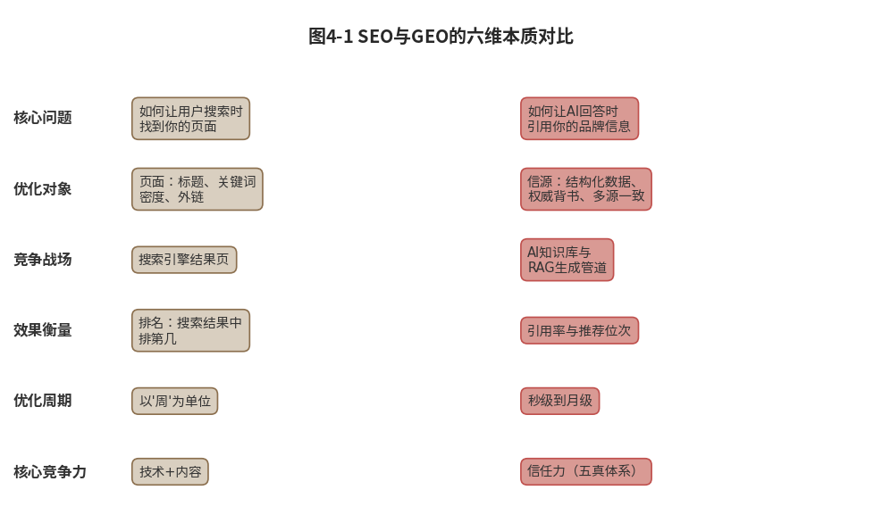
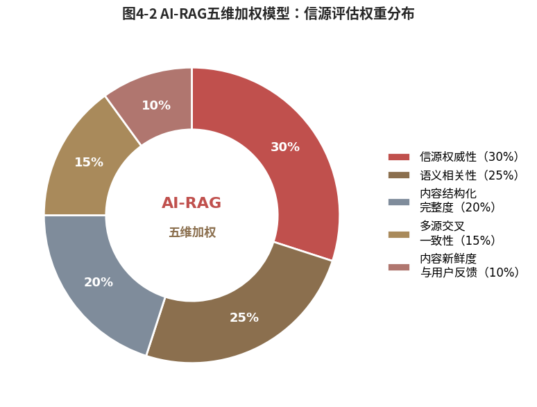
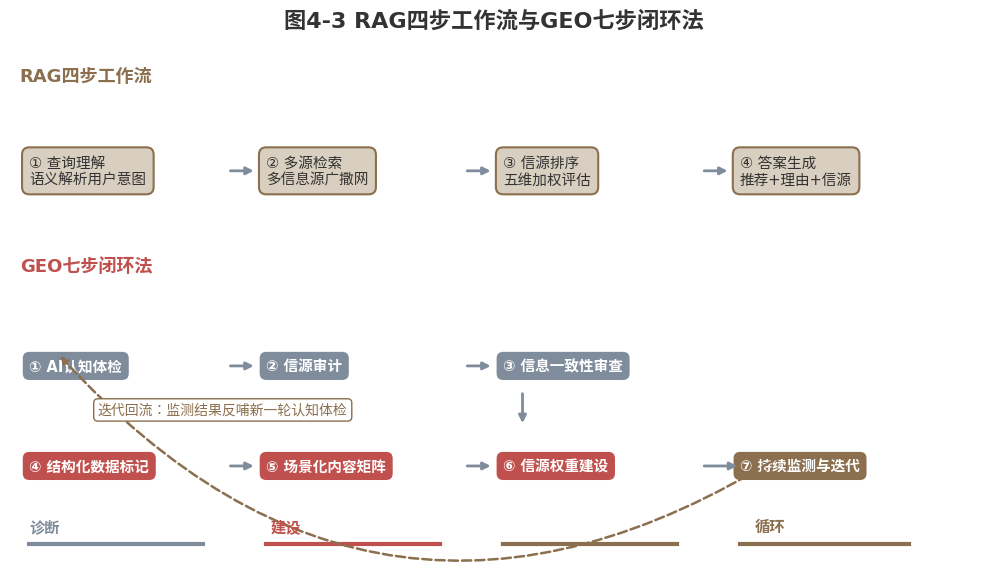

#  GEO之战

## ------品牌赢得AI优先推荐的系统打法

**本章导读**

前两章完成了信任力的理论奠基：第一、二章定义了信任力的"五真"内核，第三章揭示了AI-5A用户旅程的重构逻辑。本章从"定义"走向"建设"，进入信任力最核心的实操方法论。

本章聚焦一个具体问题：品牌如何让AI在回答用户提问时优先推荐你？这个问题在2023年之前几乎不存在，如今却已成为品牌竞争最前沿的战场。当用户打开AI助手，输入"预算三千、送给父母的健康礼品"，AI在几秒钟内完成过去数小时的信息处理（搜索、比对、验证、排序）然后给出带有信源和理由的推荐答案。品牌出现在答案的什么位置、以什么语气出现、附带多少可信证据，直接决定了它在新一代消费者选择清单中的命运。

让品牌赢得AI优先推荐的系统方法论，我称之为GEO，生成式引擎优化（Generative
Engine
Optimization）。它不是SEO的"AI版本"，而是一个全新的技术范式。2023年11月，普林斯顿大学等机构的研究者在arXiv上发布了全球首篇GEO学术论文，后被KDD
2024收录\[1\]，标志着"如何让品牌出现在AI推荐答案中"从产业实践正式进入学术视野。本章将在这篇开创性论文的基础上，结合中国市场的品牌实践，系统展开GEO的底层原理和操作方法。

本章回答四个层层递进的问题：第一，为什么传统SEO在AI时代系统性失效？第二，GEO的底层原理是什么，AI如何检索、如何排序、如何判断可信度？第三，品牌如何落地GEO建设，完整的七步法该如何执行？第四，不同量级的品牌该从哪里起步？

**本节阅读地图**：第一节回答"为什么变"------传统SEO的三重失效与范式跃迁逻辑；第二节回答"怎么运作"------AI-RAG机制与五维加权模型的底层原理；第三至四节回答"怎么落地"------GEO七步闭环法与不同量级品牌的差异化路径。建议决策者重点阅读第二节（理解AI排序逻辑），执行者精读第三节（落地方法）。

  --------------------------------------------------------------------------------------------------------------------------------------
  读完本章，读者将获得一套从"AI忽略你"到"AI优先推荐你"的完整操作手册。这不是理论推演，而是已得到学术研究和企业实践双重验证的可行路径。

  --------------------------------------------------------------------------------------------------------------------------------------

## SEO黄昏：传统搜索优化范式在AI时代的三重失效

先看一个数据。如前言所述，截至2025年6月，我国生成式人工智能用户已达5.15亿（CNNIC《生成式人工智能应用发展报告(2025)》），普及率36.5%。
这五亿多用户每天的AI提问量达十亿级，其中超八成用于\"直接问答\"。每一次提问，都是AI对品牌做出\"推荐\"还是\"忽略\"的审判。

而传统SEO在品牌营销界沿用二十多年的\"让用户搜索时先看到你\"的方法论，在这个新战场上的边际效用正在快速衰减。要理解为什么，需要先理解SEO到底在优化什么：它优化的是网页在检索列表中的排名，而不是内容在模型生成答案中的被引用权。

### SEO逻辑：关键词匹配、外链投票与页面权重 {#seo逻辑关键词匹配外链投票与页面权重-1}

SEO的底层逻辑建立在搜索引擎的工作机制之上。搜索引擎通过"爬虫"抓取全网页面，建立索引，再依据排序算法，决定用户搜索某个关键词时哪些页面排在前面。这个算法的核心变量有三个：

关键词匹配度：页面内容是否与用户搜索的关键词高度相关，这是搜索引擎评估页面价值的基础。标题、正文、标签中关键词的出现频率、位置以及语义相关性都直接影响排序。例如，关键词在标题和首段的合理分布、自然融入正文内容，以及使用相关同义词和长尾关键词，都能提升匹配度，从而增强页面在搜索结果中的可见性。此外，关键词的密度需适中，避免堆砌，以确保内容对用户真正有用。

外链数量与质量：有多少其他网站链接到这个页面，以及链接网站自身的权重和权威性如何，是搜索引擎判断页面可信度的重要指标。外链相当于"投票"，获得越多来自高质量、相关性强的网站链接的页面，在搜索引擎眼中越有权威性。外链的多样性也很关键，包括来自不同域名、行业权威站点的链接，以及锚文本的自然使用。同时，应避免低质量或垃圾链接，这些可能对排名产生负面影响。

页面技术质量：加载速度、移动端适配、结构化数据标记、用户行为指标（如点击率、停留时长、跳出率）等技术因素共同决定了页面的用户体验和搜索引擎抓取效率。快速的加载速度能减少用户流失，移动端适配确保在各类设备上正常显示，结构化数据标记帮助搜索引擎更好地理解内容，而用户行为指标则反映页面的吸引力和实用性。优化这些技术细节，可以提升页面在搜索结果中的排名，并增强整体网站性能。

二十多年来，品牌围绕这三个变量构建了一整套SEO工业：关键词研究→内容创作→外链建设→技术优化→效果监测。这套工业运转有效，至少在搜索引擎是用户决策主入口的时代。

### 优化盲区：用户从搜索关键词变为场景化提问

但AI时代的用户行为发生了根本变化。用户不再输入"最好的空气净化器"这样的关键词，而是输入"北京雾霾天家里有小孩用什么空气净化器比较好"这样的自然语言提问。

这个变化看似微小，实则颠覆了SEO的三个核心假设。

第一，从"关键词"到"语义"。
SEO优化的对象是关键词，品牌猜测用户会搜什么词，然后围绕这些词创建内容。但AI用户输入的是需求场景，他们不搜索关键词，而是描述自己的处境和需求，期待AI理解语义并给出答案。场景是无限的："给过敏体质宝宝用的""小户型客厅用的""颜值高但预算有限的""老人操作简单的"，每一个修饰语都是一个不同的需求场景。品牌无法猜测所有可能的场景提问，SEO的关键词策略覆盖不了无限场景。

第二，从"排序"到"推荐"。
SEO的目标是"在搜索结果页中排在前面"。但AI不展示搜索结果页，它直接给出推荐答案。这个答案可能包含三个品牌，也可能只推荐一个。如果AI只推荐一个品牌，那么"排第二"就等于"没获得推荐"。

第三，从"页面权重"到"信源可信度"。
SEO中的权重主要来自外链。但AI判断可信度不看外链，看的是信源的权威性、多源交叉一致性、内容的新鲜度与真实评价分布。一个在SEO中权重很高的品牌官网，在AI眼中可能只是"品牌自述"，可信度评分并不高。一个在SEO中"权重为零"的政府认证数据库，在AI眼中可能是最高权重的信源。

这三个盲区不是SEO"做得不好"的问题，而是SEO"解决不了"的问题。SEO为一套已经过时的用户决策模式做了极致优化，但当用户决策模式本身发生跃迁，再极致的优化也只是在过时的战场上磨刀。

### 范式跃迁：从优化网页排名到优化AI信源可信度

2023年11月16日，一篇发表于arXiv的论文改变了游戏规则。普林斯顿大学、印度理工学院德里分校等机构的研究者Aggarwal等人发表了题为《GEO:
Generative Engine
Optimization》的学术论文\[1\]，首次系统性地定义了"如何让品牌内容出现在AI大模型的推荐答案中"这一新兴领域。这篇论文后被知识发现与数据挖掘领域顶会KDD
2024正式收录，标志着GEO从产业实践进入学术研究的主流视野。（如图4-1所示）

{width="4.330555555555556in"
height="2.772222222222222in"}

图4-1 SEO与GEO的六维本质对比

Aggarwal 等人（KDD
2024）的核心贡献是：提出并形式化了\"生成式引擎优化（GEO）\"框架，在
GEO-bench（1 万条查询、25 个领域）上系统评估了九种内容改写策略；在以
GPT-3.5 为合成模型的受控实验中，部分策略在 Position-Adjusted Word Count
指标上相较未改写基线最高提升约 40%，并在 Perplexity.ai
线上引擎验证中观察到至多约 22%--37% 的提升。

论文最关键的发现之一是：在AI时代，品牌内容获得引用的概率，不再取决于关键词密度和外链数量。而取决于内容的"可信度信号"，引用权威来源、使用结构化数据、提供可验证的事实而非主观宣称。

这不是对SEO的"升级"，而是一次范式级的跃迁。两者的本质差异可以用六组对比来概括：

第一，SEO（搜索引擎优化）回答的核心问题是"如何让用户在搜索时找到你的页面"，而GEO（生成式引擎优化）则专注于"如何让AI在回答用户问题时引用你的品牌信息"，两者分别针对传统搜索和智能问答场景。

第二，SEO优化对象主要针对"页面"进行精细调整，包括标题的撰写、关键词密度的优化以及外链的构建，以提升搜索引擎的抓取和理解。GEO优化的是"信源"，侧重于通过结构化数据标记内容、借助权威背书增强可信度，并确保多源信息交叉一致性，从而在AI系统中建立可靠知识节点。

第三，SEO竞争的主战场集中在"搜索引擎结果页"，用户在此通过列表式链接获取信息；GEO的战场则深入"AI大模型的知识库和检索增强生成管道"，AI在此实时检索、整合并输出内容，影响用户决策。

第四，SEO效果衡量以"排名"为核心指标，关注页面在搜索结果中的具体位置；GEO则以"引用率和推荐位次"为评估标准，跟踪AI答案中引用品牌信息的频率和呈现顺序，如是否优先推荐。

第五，SEO通常优化周期以"周"为单位，涉及内容更新、索引等待和排名监测的循环；GEO的周期则从"秒级"到"月级"不等，其中AI训练语料的更新可能按月进行，但检索增强生成（RAG）的实时检索能实现秒级响应，适应动态查询。

第六，SEO核心竞争力依赖"技术+内容"的双重驱动，结合算法理解和优质素材；GEO的核心是"信任力"，其五真体系（如真实性、时效性等每个维度）都在塑造AI对信源的评估，进而影响引用行为。

  --------------------------------------------------------------------------------------------------------------------------------------------------------------------------------------------
  在AI时代的可见性，品牌不是"搜索优化"问题，而是"信任建设"问题。GEO不只是教品牌"怎么让AI看到你"，那只是第一步；GEO还是教品牌"怎么让AI相信你值得推荐"。两者的距离，就是从SEO到GEO的范式跃迁。

  --------------------------------------------------------------------------------------------------------------------------------------------------------------------------------------------

## GEO原理：AI-RAG机制与五维加权模型的底层逻辑

理解了GEO与SEO的本质差异之后，一个更深入的问题浮现出来：AI大模型到底如何"决定"推荐哪个品牌？它的排序逻辑是什么？品牌应该从哪里入手去影响这个排序？要回答这些问题，需要先理解AI大模型的知识工作机制，特别是检索增强生成（RAG，Retrieval-Augmented
Generation）技术。

### 双重来源：训练语料的记忆与RAG的实时检索

AI大模型的知识有两个来源。

第一个是训练语料。AI大模型在训练阶段"学习"了海量文本数据，书籍、论文、网页、新闻、百科。这些语料构成了AI的基础知识库。如果品牌信息在训练语料中有足够覆盖，官网内容、新闻报道、学术引用、百科条目大量收录，AI就可能"知道"这个品牌。

但训练语料有两个致命局限。**其一，时效性滞后：**语料有截止日期，AI不可能"知道"截止日期之后发生的事。**其二，权重稀释：**即使品牌信息被收录，它在海量语料中的"浓度"也极低，几万条信息淹没在数万亿token中，AI对品牌的"记忆"可能是模糊的、不精确的，甚至存在幻觉。

这就是为什么AI需要第二个知识来源------实时检索。

第二个来源是检索增强生成（RAG）。当用户提出需要最新信息的提问时，AI不完全依赖训练语料中的"记忆"，而是实时检索外部信息源（搜索网页、查询数据库、抓取API）再将检索结果与训练语料中的知识融合，生成最终答案。

RAG是理解GEO的关键枢纽。AI最终推荐的品牌，主要不是来自训练语料中的"记忆"，而是来自RAG实时检索中的"发现"。品牌在AI答案中的命运，取决于它的信息在RAG检索环节中的"可见性"和"可信度"。

### RAG机制：查询理解、多源检索、排序与生成的流程

RAG的工作流程分为四步。理解每一步，才能理解品牌应该在哪个环节介入。

第一步：查询理解。
AI收到用户提问后，首先进行语义解析，不是简单的关键词提取，而是理解用户的真实意图、需求场景和隐含条件。用户输入"送父母的健康礼品"，AI理解的不是"健康+礼品"两个关键词，而是"一个为中老年人选择健康相关礼品的需求场景，需要综合考虑安全性、实用性、性价比和品牌可信度"。

第二步：多源检索。
AI同时向多个信息源发起检索，搜索引擎、百科数据库、学术论文库、政府公开数据平台、新闻数据库、社交媒体。每个信息源返回一组候选信源。AI在这一步不判断权威性，它只是"广撒网"，尽可能多地收集相关信息。

第三步：信源排序。
这是最关键的一步。AI需要对检索到的成百上千条信源排序，决定哪些进入最终答案。排序的核心依据，就是我称之为"**AI-RAG五维加权模型**"的评估框架，语义相关性、信源权威性、内容结构化完整度、多源交叉一致性、新鲜度与反馈。每一维度的权重因提问类型而异，提问医疗建议时，学术文献和政府认证权重极高；提问消费推荐时，用户真实评价和多源交叉一致性权重上升。

第四步：答案生成。
AI基于排名靠前的信源生成答案，通常是"推荐结论+推荐理由+信源引用"的三段式结构。品牌在这一步无法直接干预，AI不是流量明星，不做品牌付费的代言人，AI是根据信源证据做出的事实判断。但品牌可以通过前三步的优化，间接影响这一步的判断，让自己成为排名靠前的信源。

### 五维加权：语义、权威、结构、一致与新鲜度反馈的算法

AI-RAG五维加权模型是GEO的理论核心，它解释了为什么有的品牌在AI推荐中总是排在前面，有的品牌总是无人问津。需要说明的是，五个维度的权重是基于RAG机制的理论推断，供建设参照，而非行业公认的算法标准。五个维度分别是（如图4-2所示）：

{width="4.330555555555556in"
height="2.886111111111111in"}

图4-2 AI-RAG五维加权模型：信源评估权重分布

维度一：语义相关性（权重约25%（理论推估值）。

品牌信息是否与用户的真实提问在语义层面高度匹配？注意，这里不是"关键词匹配"，而是"语义匹配"。用户问"适合送给注重健康的老人的礼物"，品牌A的产品描述写着"高端健康礼品，天然成分，适合中老年人群"，这是语义匹配。品牌B写着"精选保健品，京东热销第一名"，这是关键词匹配，但语义层面没有回应"送给老人""注重健康"的需求场景。

**GEO优化方向：**品牌内容需要从"关键词堆砌"转向"场景化语义覆盖"，不要堆砌"最好的""第一的""热销的"这类SEO关键词。而要覆盖用户可能提出的真实需求场景："适合老人的""成分天然的""包装体面的""送礼不出错的"。

维度二：信源权威性（权重约30%（理论推估值），权重最高的单个维度）。

品牌信息来自什么样的信源？AI对不同信源有一套内置的权威性评估体系：政府监管部门的数据和认证，权重最高；国际/国家标准的认证和第三方独立检测报告，权重次之；权威学术期刊的引用；主流媒体的独立报道和行业白皮书；品牌官网、自媒体和付费广告。算法会自动识别并排序。

理解这一维度至关重要，它可以解释一个反直觉的现象：两个品牌产品参数几乎相同，但一个获得AI优先推荐，另一个无人问津。原因在于，前者有权威信源背书，国家级质检报告、行业标准制定参与记录、第三方独立评测，后者只有品牌官网的自述。两者"数据真"的程度在同一水平线上（数据都是对的），但"信源真"的程度天差地别，而AI在排序时赋予"信源真"的权重高达30%。

**GEO优化方向：**品牌需要系统性地将核心信息嵌入高权重信源。不是"买通"这些信源，而是让品牌信息"自然出现在"其中，参与标准制定、获得权威认证、接受独立媒体采访、发表经过同行评议的学术论文、进入政府推荐目录。

维度三：内容结构化完整度（权重约20%（理论推估值）。

品牌信息是否以"AI可理解"的方式呈现？这涉及两个技术要素。一是Schema标记，品牌是否在网页中使用了结构化数据标记（如Schema.org标准《由Google、Microsoft、Yahoo等联合发起的结构化数据开放标准》的Organization、Product、Review等类型），让AI可以快速提取品牌名称、产品参数、认证信息、评价评分等结构化信息。二是语义结构，品牌内容是否以"问题---答案""场景---方案""特征---证据"等结构化方式组织，便于AI进行语义匹配和证据提取。

没有做Schema标记的品牌官网，在AI眼中是"一堵文字墙"，AI需要费力地从长篇文字中提取零星的有效信息。做了Schema标记的官网，则是"一个开放的数据库接口"，AI可以快速、精准地提取所需信息。

**GEO优化方向：**品牌官网和核心内容页面必须做Schema.org结构化数据标记。不要把这理解为"技术优化"，而要理解为"为AI安装一个数据接口"。没有这个接口，品牌信息质量再高，AI也可能"读不懂"。

维度四：多源交叉一致性（权重约15%（理论推估值）。

品牌在不同平台上的信息是否自洽、一致？AI在RAG检索时会同时扫描多个信源，自动比对信息一致性。如果官网说"市场占有率25%"，新闻报道说"市场份额行业前三"，电商详情页说"销量突破100万件"，三组信息彼此不一定矛盾，但它们是不同的"说法"，AI难以将其关联为统一的"事实"。

更致命的是核心参数不一致，比如官网标"有效成分含量99%"，第三方检测报告显示"含量95%"，AI会标记为"信息不一致"，可信度评分断崖式下降。

多源交叉一致性考核的不是"信息本身对不对"，而是"信息管理是否到位"。一个由多个部门、多个代理、多个经销商各自发布信息的组织，自然会产生版本不一致的问题。这些问题在传统营销中是"小瑕疵"，在AI评估中是"大硬伤"。

**GEO优化方向：**建立"统一信息源管理"机制，品牌核心数据（产品参数、认证信息、企业资质、市场数据）在所有平台和渠道保持一致的表述、一致的数值、一致的时效。这不是"一次性整改"，而是"持续运营"，每次产品升级、每项新认证、每次数据更新，都需要全平台同步。

维度五：新鲜度与反馈（权重约10%（理论推估值）。

品牌信息是否有持续更新？真实用户的评价分布是否健康？AI偏好"活的品牌"，定期更新内容、持续有新闻报道、用户评价持续积累、社交媒体保持活跃。一个三年没有更新官网新闻的品牌，在AI眼中是一个"可能已经停止运营"的品牌，即使它的产品仍在售。

用户反馈维度的核心判断是评价分布的"真实性"，不是"评分高低"，而是"分布是否自然"。一个只有五星好评的品牌不符合真实统计规律，AI会判定为"可能操纵了评价"；一个有褒有贬、差评集中在非核心维度且品牌有真诚回应的品牌，AI反而会判定为"真实的品牌"。

**GEO优化方向：**保持品牌内容的持续更新，不只是官网，而是所有AI在RAG检索中可能访问的信源。同时，管理评价分布的"健康度"，不是刷好评，而是接受真实评价的自然分布，主动回应差评并展示改进轨迹。

### 七步闭环：从AI认知体检到持续监测迭代的路径

理解了五维加权模型之后，品牌该如何系统性地落地GEO建设？本节提出七步闭环法，从诊断现状到持续迭代，形成品牌在AI认知体系中"越转越快"的优化飞轮。（如图4-3所示）

{width="4.330555555555556in"
height="2.6506944444444445in"}

图4-3 RAG四步工作流与GEO七步闭环法

具体的GEO七步闭环法如下：

第一步：AI认知体检。

在投入任何资源之前，先搞清楚品牌在AI眼中的"健康状况"。具体操作：在主流AI助手（DeepSeek、文心一言、通义千问、豆包、Kimi）中，用品牌核心品类的多种提问方式，"推荐XX品类的品牌""XX品类哪个品牌值得买""XX品牌怎么样"，进行系统性测试，记录品牌是否出现、出现位置、出现语气、引用了什么信源。这是品牌的"AI认知基线"。

第二步：信源审计。

梳理品牌在所有高权重信源上的覆盖情况：是否出现在政府认证数据库中？是否有国际/国家标准认证？是否有权威学术文献引用？是否有主流媒体独立报道？是否有行业白皮书收录？是否有第三方独立检测报告？这一步的产出是"品牌权威信源矩阵的现状报告"，标记覆盖盲区，按权重排序待填补的信源缺口。

第三步：信息一致性审查。

扫描品牌在官网、电商平台、社交媒体、新闻报道、行业协会、经销商渠道等所有公开平台上的核心信息，品牌名、产品参数、认证信息、企业资质、市场数据，检查是否存在不一致。特别注意同一数据的不同表述："市场占有率25%"和"市场份额行业前三"可能被AI判断为不一致。产出"信息一致性整改清单"。

第四步：结构化数据标记。

对品牌官网和核心内容页面实施Schema.org结构化数据标记。优先标记三类信息：Organization（企业基本信息，名称、成立时间、总部地址、行业分类）、Product（产品参数，型号、规格、认证、价格区间）、Review（评价数据，评分、评价数量、评价分布）。这不是"SEO技术优化"，而是"为AI安装数据接口"，没有这个接口，AI无法高效地从你的品牌信息中提取结构化数据。

第五步：场景化内容矩阵建设。

基于目标用户可能向AI提出的真实需求场景，系统性创建"场景化语义内容"。不是围绕关键词，而是围绕场景问题，"给过敏体质宝宝选奶粉要注意什么""预算三千给父母买什么礼物不出错""小户型适合什么样的空气净化器"。每条内容需要具备三个特征：回答真实场景问题、引用权威信源作为证据、使用自然语言而非SEO语体。

第六步：信源权重建设。

系统性填补第二步识别出的权威信源缺口。这通常是中长期工程：从申请行业标准认证（周期：3～6个月），到参与标准制定（周期：1～2年），到发表学术论文（周期：6～18个月），到进入政府推荐目录（周期：视项目而定）。需要强调的是，这不是"公关"，不是花钱买认证；而是"建设"，让品牌的产品和服务达到获得这些认证的标准，然后自然获得。

第七步：持续监测与迭代。

GEO不是"一次性建设"，AI的算法在更新，信源库在变化，竞品也在建设。品牌需要建立"AI认知仪表盘"：定期（至少每月）执行第一步的AI认知体检，追踪"AI引用率""AI推荐位次""AI推荐语气"三个核心指标的变化趋势。同时关注竞品的GEO建设动态，对手是否新增了权威认证？是否做了结构化数据升级？是否在关键信源上超越了你？

七步闭环法的核心设计理念是：GEO是一个"越建越快"的工程。前三步（认知体检、信源审计、一致性审查）是"诊断"，搞清楚品牌的起点在哪里。中三步（结构化标记、场景化内容、信源权重建设）是"建设"，补齐品牌的信任基础设施。第七步（持续监测迭代）是"循环"，让GEO从一个项目变成一个持续运转的飞轮。

## 三档路线：不同量级品牌的差异化GEO建设路径

七步法是一幅完整的GEO建设地图。但对不同规模和预算的品牌，起点和路径截然不同。一个年营收过千亿的头部品牌和一个创业三年的新消费品牌，不可能从同一条起跑线出发。本节给出三条量力而行的建设路线。

### 基础版路径：中小企业从结构化标记与场景问答起步

预算有限、团队精简的中小企业和新锐品牌，GEO建设的起点不是"全量"，而是"精准"。关键是：把有限的资源，投放到能产生最高"AI可见性杠杆"的环节。

第一件事：AI认知体检（成本：几乎为零）。
找一个下午，团队用主流AI工具测试自己的品牌。不需要复杂的技术工具，只需手工记录：品牌在哪个AI中出现？以什么方式出现？竞品是否获得更优先的推荐？这条基线数据是整个GEO建设的"起点坐标"，也是后续所有迭代的"效果参照"。

第二件事：Schema标记（成本：一次性技术投入，数千到数万元）。
这是中小企业能做的"性价比最高"的GEO动作。为官网首页、产品页、关于我们页添加基础的Schema.org结构化数据标记，告诉AI你的品牌名、行业分类、核心产品参数。这通常是请一个前端工程师花一到三天就能完成的工作，但效果是持续的：一旦标记完成，AI每一次调用你的品牌信息，提取效率和准确度都会大幅提升。

第三件事：场景化FAQ内容（成本：内容团队的日常工作）。
围绕目标用户最可能向AI提出的30～50个真实场景问题，创建FAQ内容页面。不是产品介绍，而是场景问答，"XX品牌的XX产品适合什么人群""XX产品的核心优势是什么""XX产品和其他品牌的区别在哪"。每条FAQ引用一个权威信源（如第三方检测报告、行业标准认证）作为证据。

第四件事：至少获得一项权威认证（成本：视行业而定，数千到数万元）。
选择所在行业最具公信力的一项认证，ISO体系认证、行业标准合规认证、第三方质检报告，完成申请。在GEO的五维加权模型中，"有一项权威认证"和"零认证"之间，存在巨大的信源权威性分差。这是中小企业能撬动的"最高杠杆"的GEO投资之一。

### 进阶版路径：中型企业系统构建权威信源认证矩阵

对于年营收数亿到数十亿、有一定IT和品牌预算的中型企业，GEO建设的重点从"单点突破"升级到"系统构建"。

核心动作一：信源矩阵的全面审计和填补。
执行第二节提出的"信源审计"，系统梳理品牌在五类高权重信源上的覆盖情况，制定12～24个月的填补计划。优先填补两个维度：政府/行业认证（权威性最高、建设周期可控）和学术/标准引用（一旦建立具有持续性，竞品短期内难以超越）。

核心动作二：全平台信息一致性管理系统。
建立品牌信息的"单一真相源"（Single Source of
Truth），指定一个核心团队（可以是一个人）负责维护品牌的标准信息库：品牌名与商标、产品核心参数、认证列表、企业资质、核心数据（如市场份额、销量、成立时间）。所有对外发布的信息，官网、电商、社交媒体、经销商物料、媒体报道，都必须从这个"单一真相源"获取数据。这不是"管控"，而是"一致性保障"。

核心动作三：内容矩阵的场景化升级。
从"基础FAQ"升级到"场景化深度内容矩阵"：按照用户决策旅程的不同阶段（认知→偏爱→信任→选择→传播）创建不同深度的内容。认知阶段的内容侧重"场景覆盖"，让AI能在各种场景提问中找到你。信任阶段的内容侧重"证据深度"，每一个品牌主张都配有来自权威信源的可验证证据。

核心动作四：GEO监测仪表盘。
建立自动化的AI认知监测系统，定期（每周或每月）自动在多个AI平台上执行标准化的品牌测试提问，记录品牌的"AI引用率""推荐位次""推荐语气"变化轨迹。这不是"大屏看数字"，而是"早期预警系统"，当某个AI平台突然降低了对品牌的推荐力度，系统应当立即告警，触发诊断和响应。

### 旗舰版路径：头部品牌全域知识图谱与标准话语权

对于年营收百亿以上、拥有独立IT和数据团队的头部品牌，GEO建设的终极目标不是"在AI推荐中排名靠前"，而是"在AI认知体系中建立不可替代的认知主权"。这意味着不仅要建设自己的GEO，还要参与定义GEO的游戏规则。

核心动作一：知识图谱级结构化数据体系。
不是"做Schema标记"，而是构建品牌专有的知识图谱，将品牌的产品体系、技术路线、质量标准、供应链信息、服务体系全部转化为结构化、AI可调用的数据资产。这相当于为品牌建造一个"AI专属数据库"，AI不需要从散落的网页中拼凑品牌信息，而是直接从知识图谱中获取完整、精准、可交叉验证的品牌知识。

核心动作二：行业标准与学术话语权建设。
头部品牌不应只是"获得认证"，而应"参与制定标准"，主导或参与制定行业标准、国家标准、国际标准。这是GEO中最高权重的"信源真"信号：当一个品牌是某个行业标准的起草单位，AI在评估该行业品牌的"信源权威性"时，这个品牌天然处于最高层级。同时要系统性布局学术引用，与高校和科研机构合作，发表经过同行评议的学术论文，将品牌的技术数据纳入学术文献的引用体系。

核心动作三：AI平台直接合作。
头部品牌有条件与AI大模型厂商建立数据合作关系，通过API接口定期向AI知识库推送品牌的结构化数据更新。这不是"买推荐位"，AI大模型厂商目前不会出售推荐位，也不会因此修改排序算法。但"数据合作"可以确保AI知识库中的品牌信息始终最新、最完整、最准确，在"新鲜度与反馈"维度上建立显著优势。

核心动作四：GEO竞争情报系统。
建立全行业GEO监测体系，不仅监测自己的AI推荐表现，也监测所有主要竞品的表现，追踪行业GEO竞争格局的动态变化。当竞品获得了一项重要的权威认证、上线了新的结构化数据体系、在某个关键品类中AI推荐位次显著上升，系统自动告警，触发竞争应对策略。

## 【案例】品牌验证：京东从搜索基因到AI信任基因的转型

前三节建立了GEO的理论框架和操作方法，本节用一个案例来验证。选择京东，是因为它在"用户搜索"这个维度上是中国电商中最具优势的品牌之一，"买东西上京东"几乎是一种用户本能。但在AI时代，"用户搜索"和"获得推荐"是两个完全不同的战场：用户不再"搜索京东"，而是直接向AI提问"XX产品在哪个平台买最靠谱"。京东的品牌认知优势如果得不到AI的充分"认知"和"验证"，就可能在新一代用户的决策路径中被绕开。

用GEO五维加权模型审视京东的数字化建设，可以看到信任资产如何转化为AI推荐优势。语义相关性：京东自营SKU（库存量）超1000万，商品详情页中的场景化描述、适配人群标注和购前问答，天然覆盖了潜在的场景化提问，二十年积累的商品数据由此转化成了AI可直接调用的"场景答案库"；

信源权威性："自营"标签背后的正品保障，来自品牌方直接授权、监管合规与第三方权威机构检测，以及可量化的投诉处理记录，这些是AI评估"京东是否值得推荐"的核心证据；内容结构化完整度：产品参数、规格、价格、评价分布都有标准化数据字段，AI可以像调取数据库一样精准提取，这是叙述式品牌官网难以企及的天然优势；

多源交叉一致性：自营商品信息由品牌方统一管理，"一个版本、全域统一"，天然避免了多代理、多版本的信息打架；

新鲜度与反馈：中国电商中规模最大、最活跃的真实评价池之一持续更新，这种"真实分布"的信号价值远高于精心挑选的KOL好评。

京东的案例验证了一个核心判断：GEO不是一项独立的技术优化工程，而是品牌信任力在AI认知体系中的系统化表达。但这里有一个关键警示：信任资产不会"自动"转化为AI推荐优势。京东的信任资产之所以有效，是因为它们具备"AI可验证"的特征：授权书可追溯、质检报告可查询、评价数据可分析。如果一个品牌拥有同样深厚的信任资产（"百年老字号""匠心品质"），但这些资产只是"品牌故事"而非"可验证数据"，它们在GEO中的价值就大打折扣。

这就回到了本书的核心命题：GEO是信任力在AI认知体系中的"操作界面"；在本框架内，五真体系的每一个维度，都在GEO的五维加权模型中有对应的实现路径。做GEO，本质上是在做信任力建设。信任力建到哪一层，GEO的优势就扩大到哪一层。

## 本章小结 {#本章小结-4}

本章是信任力建设的实操起点，GEO（生成式引擎优化）是品牌让AI优先推荐自己的系统方法论。

第一节揭示了传统SEO的三大结构性盲区，关键词逻辑无法覆盖无限的场景提问、排序逻辑无法适配AI的推荐逻辑、外链权重无法替代AI的信源可信度评估，并指出从SEO到GEO不是"升级"，而是范式跃迁。

第二节系统展开了GEO的底层原理：从AI的两种知识来源（训练语料+RAG实时检索），到RAG的四步工作流（查询理解→多源检索→信源排序→答案生成），再到核心的AI-RAG五维加权模型（语义相关性25%、信源权威性30%、内容结构化20%、多源交叉一致性15%、新鲜度与反馈10%），最后给出完整的GEO七步闭环法。

第三节提供了三条量力而行的建设路线，基础版（中小企业从结构化标记和场景化内容起步）、进阶版（中型企业系统化建设权威信源矩阵）、旗舰版（头部品牌全域GEO部署），让不同规模的品牌都能找到适合自己的起点。

第四节以京东为案例，验证了GEO五维模型对中国头部平台的解释力，并揭示了GEO的终极本质：GEO不是技术优化，而是品牌信任力在AI认知体系中的系统化表达。

读完本章，读者应当能够回答四个问题：传统SEO为什么在AI时代失效？GEO的底层原理和五维加权模型是什么？你的品牌该从哪里开始做GEO？GEO与信任力建设是什么关系？

接下来，第五章将进入信任力建设的方法论深水区，当品牌赢得了AI的"被提及"和"被偏爱"，如何在"被信任"环节建立不可撼动的信任壁垒？"三层五真"信任体系的系统化搭建方法，将在下一章全面展开。

+:-----------------------------------------------------------------------------------------------------------------------+
| SEO让品牌在搜索结果中"排前"，GEO让品牌在AI答案中"被信"。排前可以花钱买到，被信必须用信任资产换。                       |
|                                                                                                                        |
| AI不会因为你"知名度高"而推荐你，AI只会因为你"可信度高"而推荐你。两者的差距，就是SEO和GEO之间的距离。                   |
|                                                                                                                        |
| 在AI时代，品牌的核心任务不是"让用户更容易搜到自己"，而是"让自己更值得AI推荐"。前者是传播力的问题，后者是信任力的问题。 |
+------------------------------------------------------------------------------------------------------------------------+

### 参考文献

\[1\] Aggarwal P, Murahari V, Rajpurohit T, et al. GEO: Generative
Engine Optimization\[EB/OL\]. (2023-11-16)\[2026-08-03\].
https://arxiv.org/abs/2311.09735.

\[2\] 中国互联网络信息中心. 生成式人工智能应用发展报告（2025）\[R/OL\].
(2025-10-18)\[2026-08-03\]. <https://www.cnnic.net.cn.>
