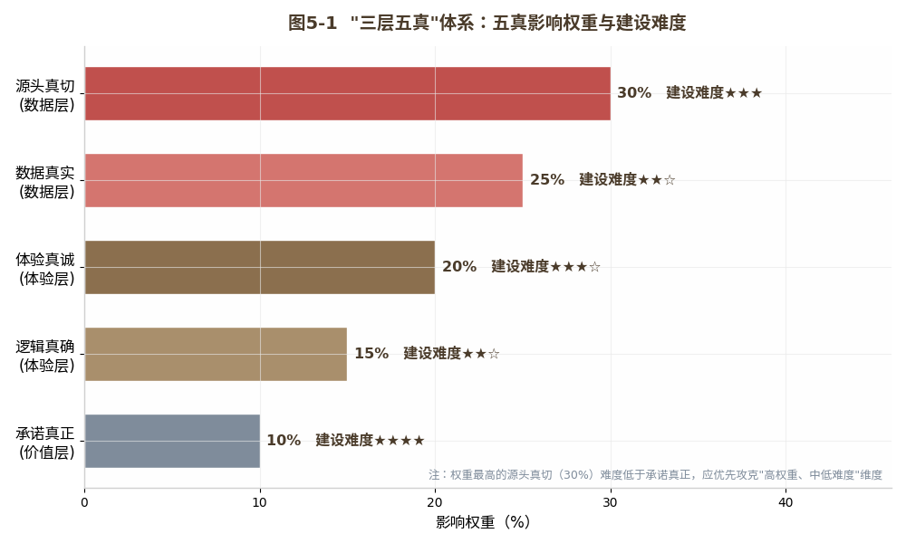
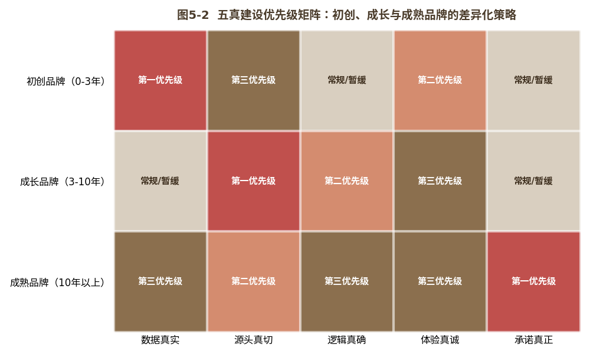
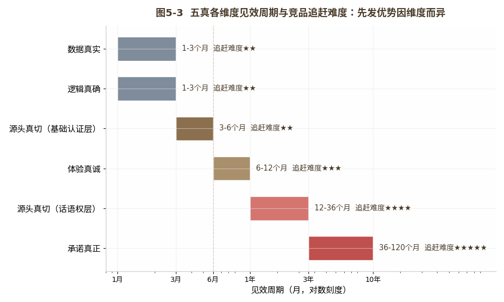

#  信任之基

## ------"三层五真"信任体系的系统搭建

**【本章导读】**

前两章完成了从"被AI提及"到"被AI偏爱"的方法论建设。第四章系统展开了GEO，品牌如何通过结构化数据、权威信源和场景化内容，让AI在回答时优先"看到"你、"推荐"你。

但被看到、被推荐，不等于被信任。

品牌可以凭借出色的GEO建设跻身AI推荐列表前列。可当用户追问"这个品牌真的靠谱吗"时，AI交叉验证的结果才是最终的决定性信号。一旦验证结果模棱两可，信源权威性不足、多平台信息不一致、用户评价分布异常，此前两个环节积累的"AI好感"，便会在"被信任"环节前功尽弃。

本章要解决的核心问题：跨越"被提及"和"被偏爱"的门槛之后，品牌如何在"被信任"这个决策枢纽环节，建立起不可撼动的信任壁垒？答案，就是本书第一、二章定义、但尚未系统展开的"三层五真"信任体系。如果说GEO是信任力在AI认知体系中的"操作界面"，那么三层五真就是信任力的"内核引擎"。本章把这个内核从概念层面拆解到执行层面，逐一回答：五真中的每一"真"是什么、怎么建、建到什么程度算好。章末以华为云为完整案例，验证该体系在B2B领域的实战效果。

**本节阅读地图**：第一至二节回答"是什么"------信任的三层解构与五真体系的定义框架；第三至六节回答"怎么建"------数据真、信源真、逻辑真、体验真、履约真的逐项建设方法；第七节回答"优先建什么"------不同发展阶段品牌的五真建设路线图。建议决策者重点阅读第二、七节（体系框架与优先级），执行者逐节精读建设细则。

  ----------------------------------------------------------------------------------------------------
  读完本章，读者将获得一套从"数据地基"到"信任塔尖"的完整建设方法。这不是理论框架，而是品牌实操手册。

  ----------------------------------------------------------------------------------------------------

## 信任解构："三层五真"架构是信任体系化的前提

先回答一个前置问题：为什么不能把信任力简单等同于"口碑好"？为什么需要一个"三层五真"的体系？

正如第二章"理论对话"部分所述，卢曼早已指出信任本质上是一种降低社会复杂性的机制（参见第二章，此处不重复展开）。这一判断在AI时代获得了新的技术形态：信任不再是一个"整体印象"，而是一个"可逐层拆解、可量化评估的结构"。拆解的结果，就是本章的"三层五真"体系。

这就是信任力必须"可拆解"的原因。"五真"不是理论游戏，而是对AI评估品牌信任五个维度的"镜像建模"，AI怎么看品牌，品牌就怎么建设自己。

### 三层信任：从信号浅层到验证深层到本能内化

在进入"五真"之前，先建立一个认知框架：信任是有层次的。

浅层信任：基于信号的信任。
用户看到品牌有知名代言人、有央视广告、有行业认证，这些"信号"催生初步的信任感。其特点是：建立快，消退也快。信号一旦消失或遭到质疑，信任即刻松动。

深度信任：基于验证的信任。
用户不仅看到"信号"，还通过自身使用体验和社交验证确认了信号的真实性，"不只是广告说好，我自己用了确实好，朋友也这么说"。其特点是：建立慢，消退也慢。信任研究的三维度模型（能力、善意、诚信）也表明，经过验证的信任更为稳固\[2\]。它经得起单次负面事件的冲击，因为信任的基础是一系列已验证的体验，而非一两个信号。

本能信任：基于内化的信任。
用户无需任何"验证"便信任品牌，苹果、"华为"等在各自领域内接近生态级信任力的代表性品牌，已经内化为用户心智中的"信任符号"。其特点是：几乎不可动摇。它超越理性评估，成为一种情感认同和文化共识。

### 立体架构：数据地基、体验承重墙与价值屋顶

"三层五真"体系的"三层"包括数据层、体验层、价值层，它们是三种信任层次的"建设底座"。其中，数据层建设浅层信任的客观基础（"这个品牌有证据"），体验层建设深度信任的验证基础（"这个品牌的证据是真的"），价值层建设本能信任的内化基础（"这个品牌本身就是信任的代名词"）。三层逐级向上，高层以低层为基础，不可跳过任何一层。

数据层：信任的地基。
对应"五真"中的数据真和信源真，解决"品牌是否有可验证的客观事实"，产品参数、认证资质、检测报告、权威信源背书。没有数据层，信任就是"空中楼阁"：话说得再漂亮，AI一查无可验证的证据，信任即刻崩塌。

体验层：信任的承重墙。
对应"五真"中的逻辑真和体验真，解决"品牌的客观事实是否与用户的主观体验一致"，多平台信息是否自洽、真实用户评价是否印证品牌承诺。没有体验层，信任就是"纸糊的房子"：数据漂亮，用户一用就发现问题，AI一交叉验证就暴露矛盾。

价值层：信任的屋顶。
对应"五真"中的履约真，解决"品牌在长期尺度上是否始终兑现承诺"，承诺的兑现率、危机的应对记录、价值观的长期一致性。没有价值层，信任就是"没有屋顶的房子"：地基与承重墙俱在，一场暴风雨（重大危机）袭来，屋内的一切都会淋湿。

### 五真排布：各维度在三层中的权重与建设优先序

这里首先需要厘清两套权重的关系。第四章提出的AI-RAG五维权重，是AI侧对信源的评估推断结果；本章讨论的五真权重，则是品牌侧的信任建设代理指标，二者为互为镜像的关系，而非逐维一一对应：例如"内容结构化完整度"对应支撑"数据真"维度，"新鲜度与反馈"则同时覆盖"体验真"与"履约真"两个维度。需要特别强调的是，两套权重的标定过程完全相互独立：五真权重依托品牌信任建设领域的专家打分与案例回归得到，AI-RAG五维权重则基于AI信源评估机制做技术分析推导；二者数值接近并非巧合：五真权重正是以AI-RAG评估机制为镜像、结合品牌侧建设经验校准而成，两套体系互为映照、互相印证，但不存在数值上的互相推导关系。品牌落地实践中不必纠结两套体系的数值差异，只需以五真作为建设主线，以AI-RAG五维作为检验参照即可。详细论证参见附录一辅报告三。（如图5-1所示）

{width="4.330555555555556in"
height="2.598611111111111in"}

图5-1 "三层五真"体系：五真影响权重与建设难度

图5-1中最关键的洞见，藏在"建设难度"与"影响权重"的维度对照中：二者并不成正比。权重占比最高的"信源真"（30%），建设难度反而低于"履约真"------后者是难度最高的项，权重却仅为10%。这意味着：在信任力建设初期，品牌应当优先攻克"高权重、中低难度"的维度，也就是数据真和信源真，借此快速在AI认知体系中搭建起基础信任分；之后再逐步突破"高难度"的体验真和履约真，实现信任力的深度积累。

## 五真筑基：数据层、体验层与价值层的逐项建设方法

数据层是"三层五真"体系的第一层，也是最基础的一层，包含两个"真"：数据真和信源真。二者共同为品牌在AI认知体系中建立"可验证的客观事实基础"，数据真回答"有没有证据"，信源真回答"证据可不可靠"。没有这个基础，后续所有信任建设都是空中楼阁。

### 数据真：从叙述式信息到AI可读的结构化数据

数据真解决的核心问题是：品牌是否有AI可调用的、结构化的、可验证的客观事实数据？

传统营销中的品牌信息是"叙述式"的，"我们是行业领先者""我们拥有核心技术""我们深受消费者喜爱"。这类话对人类消费者或许有效，配上精美的画面、感人的故事、权威的背书，信任感油然而生。

但AI不吃这一套。AI能"理解"的不是"叙述"，而是"数据"，结构化的、可交叉验证的、来自可追溯信源的事实。AI不在乎你说"我们是最好的"，它在乎你有多少项可追溯的专利、多少次国家级抽检的合格记录、多少个有效期内的权威认证。

因此，数据真的建设，本质上是一个"信息格式转换"工程，把品牌的"叙述式信息"转化为AI可读的"结构化数据"。具体分三步：

第一步：品牌核心数据的结构化梳理。
列出品牌所有可量化的核心信息：产品参数（型号、规格、技术指标、执行标准）、认证资质（认证名称、颁发机构、有效期、证书编号）、知识产权（专利号、商标注册号、著作权登记号）、企业信息（成立时间、注册资本、经营范围、行业分类）、市场数据（销量、市场份额、增长率，需标注来源）。每一条信息都要标注"信源"，数据从何而来、能否独立验证。

第二步：Schema.org结构化标记的实施。
基于梳理好的数据，对品牌官网和核心内容页面实施Schema.org标准（由Google、Microsoft、Yahoo等联合发起的结构化数据开放标准）标记。这不是"技术炫技"，而是为AI安装一个"数据接口"。具体建议：Organization类型（标记企业基本信息）、Product类型（标记产品参数和认证）、Review类型（标记评价数据）、FAQPage类型（标记常见问题与答案）。标记完成后，用Google
Rich Results Test或Schema Markup Validator验证其正确性和完整性。

第三步：结构化数据的持续更新维护。
数据真不是"一次性标记就完事"的工作。品牌数据是动态变化的，新产品上市、新认证获得、新专利获批、市场份额更新，每次变化都要同步更新标记。建议建立"品牌数据日历"，每月或每季度定期审查更新，确保AI任何时候检索到的品牌信息都是最新、最准确的。

一个关键误区需要澄清：数据真不等于"数据多"。
品牌不必把历史上所有信息都做结构化标记，AI不关心品牌在2003年获得过什么认证，它关心"当前有效"的数据。过期的认证、失效的专利、不再适用的标准，这些"僵尸数据"不仅不加分，反而会因逻辑不一致（官网标了某项认证，第三方平台却查不到其在有效期内）而扣分。数据真的核心原则是：宁可少标，不可错标；宁可没有，不可失效。此外，品牌使用AI生成内容对外发布时，还应按照《网络安全技术
人工智能生成合成内容标识方法》国家标准进行显式标识\[3\]，避免因未标识而在AI交叉验证中被降权。

### 信源真：三层认证体系与权威信源矩阵的管理

信源真解决的核心问题是：品牌的数据和主张，是否来自可靠的、独立的、权威的第三方信源？

数据真解决"有数据"，信源真解决"数据有来头"。在AI-RAG五维加权模型中，信源权威性是最核心的单一维度（权重约30%（理论推估值）\[4\]，同样的数据，来自品牌自述和来自政府认证，AI给予的权重天差地别。

信源真的建设，包含三个层级：

第一层：基础认证，行业准入门槛级的权威背书。
这是品牌应优先完成的"基线建设"：所在行业必备的基础资质（如食品行业的SC认证、医药行业的GMP认证）、ISO体系认证（ISO
9001质量管理、ISO 14001环境管理、ISO
27001信息安全管理等）、产品强制认证（CCC认证、CE认证等）。这类认证的权威性属"中等偏高"，证明品牌达到行业基本标准，但不足以构成差异化优势。它们更像"信任门槛"：没有它们，AI评估品牌可信度时会直接大幅扣分。

第二层：专业认证，差异化竞争优势的权威背书。
在基础认证之上，品牌应追求所在行业"含金量最高"的专业认证：国家级/省级企业技术中心认定、国家高新技术企业认定、"专精特新"企业认定、行业标准的主要起草单位、国际权威第三方检测机构的检测报告（如SGS、TÜV、Intertek）。这类认证的权威性属"高"，不仅证明品牌"达标"，更证明品牌在某个维度上"领先"，是AI评估中的显著加分项。

第三层：话语权建设，定义行业标准的权威背书。
这是信源真的最高层级：品牌不仅"获得认证"，更"制定标准"。具体形式包括：主导或参与制定国家标准/行业标准/团体标准、在国际学术期刊或顶会发表同行评议论文、获权威行业白皮书/蓝皮书标杆案例收录、入选国家部委推荐目录或示范名单。这类信源的权威性属"最高"，当AI发现某品牌是国家标准的起草单位，便会将其视为"该品牌在该领域具有定义性权威"的强信号。

信源真建设的核心策略是：不做"撒胡椒面"，而是"打深井"。
与其在十个领域各获一项入门级认证，不如在一个核心领域获得标准制定权。一个国家标准主要起草单位的身份，在AI加权评估中的分数，可能超过十个普通行业认证的总和。

最后，信源真需要一套"维护机制"：认证有有效期，标准有版本更替，论文有引用半衰期。品牌应建立"权威信源资产台账"，记录每项认证的名称、颁发机构、有效期、下次审核日期，并设置到期预警。认证一旦过期未续，AI交叉验证时会标记为"该认证已失效"，不仅不加分，反而因"信息过时"扣分。

数据层解决了"品牌有客观可信的证据"，但证据与体验之间往往横亘着一条鸿沟。品牌的文件很漂亮，用户的体验却一言难尽。AI最擅长的，正是用海量用户数据"丈量"这条鸿沟。体验层包含两个"真"：逻辑真和体验真。二者共同为品牌建立"言行一致"的可信记录，让AI的交叉验证得出"这个品牌说到做到"的结论。

### 逻辑真：单一真相源与信息一致性审计方法

逻辑真解决的核心问题是：品牌在不同平台、不同渠道上的信息，是否自洽、一致、不矛盾？

这个问题看似简单（"不就是把信息写对嘛"）实则对绝大多数品牌极具挑战。一个典型的中型消费品牌，其信息至少出现在以下渠道：品牌官网、天猫旗舰店、京东自营店、拼多多、抖音小店、微信公众号、微博企业号、小红书企业号、百度百科、行业展会资料、经销商宣传物料、媒体报道。

这十几个渠道，通常由三到五个不同的团队（甚至不同的外包公司）分别管理，各团队对品牌信息的理解不一，更新时效也参差不齐。结果是：品牌在官网宣称"国内市场占有率第一"，在天猫详情页写"年销量突破100万件"，在媒体报道中说"市场份额超20%"，在百度百科标注"行业十大品牌"，四组信息彼此并不直接矛盾，却是四种不同的"说法"，AI无法将其关联为一个统一的"事实"。

更致命的是核心参数的不一致。品牌官网标注"有效成分含量99.5%"，第三方检测报告中却是"含量≥99%"，在人类看来几乎是一回事，在AI的语义比对中却是一个"信息不一致"标记。当不一致标记累积到一定程度，AI的可信度评分会断崖式下降。

逻辑真的建设需要三管齐下：

建立「单一真相源」（Single Source of
Truth）机制，指定专属责任团队（可仅由一人组成）负责维护品牌的"标准信息库"，这是一份涵盖品牌所有核心信息（包括名称、参数、认证、资质、官方数据）的标准化统一文档。所有对外发布信息的团队，包括市场部、电商团队、公关公司、经销商，都必须从此处调取信息，绝不能各自"凭记忆"自行编写。这套做法看似笨拙，却是保障信息逻辑真实的核心基石：没有"单一真相源"，信息一致性根本就是无源之水，无从谈起。

定期执行"信息一致性审计"。
每季度（至少每半年）一次，系统性扫描品牌在所有公开平台上的核心信息，与"单一真相源"比对，标记所有不一致之处。建议用AI工具辅助，AI的多源比对能力正合用在此处。审计结果形成"信息一致性整改清单"，按重要性排序，分派各责任团队限期整改。

制定"同步更新"流程。
品牌核心数据一旦变化（产品升级、新认证获得、企业信息变更）不是"官网先更新、电商详情页有空再改"，而是"所有平台同步更新"。这需要标准化流程：数据变更→更新"单一真相源"→生成各平台更新清单→各平台责任人确认更新→二次审计验证。

逻辑真的终极目标不是"百分百一致"，在成百上千个信息节点上追求绝对一致并不现实。目标是：核心数据（产品参数、认证信息、企业资质）一致性达到100%，品牌主张的一致性（如"行业领先"是否有统一的可验证定义）达到90%以上，次要信息（如品牌故事的不同表述版本）允许一定弹性。

### 体验真：评价分布健康度与差评回应的运营

体验真解决的核心问题是：品牌的真实用户体验，是否与品牌承诺一致？真实用户的评价分布，是否健康、自然、可信？

这是五真体系中最"软"、也最具挑战性的维度。品牌可以花钱做结构化标记、投入资源获取认证、建立流程确保信息一致，唯独无法"制造"真实的用户体验。体验真不是一个"建设工程"，而是一个"运营过程"。在AI的评估中，体验真有两个核心考察点：评价分布的真实性和品牌回应的真诚度。

第一核心考察点：评价分布的真实性。

AI用统计方法判断评价是否"真实"，不看评分高低，而看分布是否符合统计规律。具体关注以下信号：

样本量足够大。
只有几十条评价的品牌，即使全是五星好评，在AI眼中也不具统计意义，样本太小，无法排除"选择性展示"。当评价数量达到数千甚至数万条，统计分布的"自然度"才成为可靠的判断依据。

分布符合正态趋势。
真实的评价分布应大致呈现"中间多、两头少"的正态模式，多数用户给出4～5星（满意，但不会人人狂热），少数给出1～2星（任何产品都有不满意的用户），相当一部分给出3星（"还行，但没有惊喜"）。只有五星好评的品牌不符合统计规律，会被AI标记为"评价分布异常"。

差评集中在非核心维度。
AI会分析差评的"归因"，用户不满的是什么？差评集中在核心功能缺陷上（如一台冰箱"制冷效果差"），是严重信号。差评集中在非核心维度（如"快递员态度一般""包装盒有点压痕"），且品牌有真诚回应，则差评本身反而构成"真实"的佐证。

第二核心考察点：品牌回应的真诚度。

AI不仅分析用户评价，也分析品牌对评价的回应。一个从不回应差评的品牌，和一个对每条差评都真诚回复、提供解决方案、展示改进措施的品牌，在AI眼中是完全不同的信任画像：前者"不在乎用户体验"，后者"在乎并持续改进"。更重要的是，品牌对差评的回应本身，也会成为AI可引用、可交叉验证的"新信源"，"XX品牌在用户投诉售后服务响应慢后，公开承诺将售后响应时间从48小时缩短至24小时，并在后续的公开数据中展示了改进结果。"

体验真的建设包含三个层面：

第一层：评价量的积累，让AI有足够的"分析样本"。
品牌需要系统性地鼓励真实用户评价，不是"刷好评"，而是通过售后服务跟进、会员体系激励、购后体验反馈等方式，让"沉默的大多数"愿意留下评价。一个品牌可能有100万用户，却只有5000条评价，评价率0.5%。若能以温和、非诱导性的邀请将评价率提升至5%，评价池便从5000条变成50000条，AI的统计分析将有质的飞跃。

第二层：评价分布的健康管理，让AI看到"真实的分布"。
品牌要学会接受"不完美"，不追求100%好评，而是追求"真实的好评率+自然的差评分布+真诚的差评回应"。一个4.3分、差评均在非核心维度且品牌真诚回应的评价结构，在AI眼中的可信度，高于一个5.0分却只有几十条评价的"完美品牌"。

第三层：评价回应的系统化运营，让AI看到"活着的品牌"。
品牌应建立评价回应的SOP（标准操作流程）：差评24小时内回复（展示响应速度）。回复必须包含具体解决方案，而非模板化的"抱歉给您带来不便"（展示解决问题的诚意）。重大投诉的后续处理结果公开更新（展示改进轨迹）。这些动作不仅改善用户关系，更在持续为AI积累"体验真"维度的信任证据。

### 履约真：不可逆设计、可验证兑现与危机检验

价值层是"三层五真"体系的最高层，只包含一个"真"：履约真。但这一"真"的当期评估权重最低，其长期壁垒价值却超过前四真的总和，因为它是信任的终极检验。

履约真解决的核心问题是：品牌说的话到底算不算数？品牌的承诺在多大程度上兑现了？在长期时间尺度上，品牌是否展现出一致的可信性？

数据真和信源真是"立信"，让品牌值得信任；逻辑真和体验真是"验信"，验证品牌是否言行一致；履约真则是"守信"，证明品牌经得起时间的考验。

所谓"履约真"，从来都不是指品牌"不出错"，任何品牌都难免犯错，真正关键的是"出错之后如何应对"，以及"长远来看是否始终在往更好的方向走"。放到AI的评估体系里看，一个拥有三十年历史、历经两三次重大危机，却次次都兑现整改承诺的品牌，它的"履约真"评分反而可能高于一个成立仅三年、从未出过问题的品牌。毕竟前者的承诺早已历经危机的检验，而后者的承诺还从未经受过考验。

履约真的建设，围绕三个机制展开：

承诺的"不可逆性"设计。
一个承诺的可信度，与"违诺的成本"成正比。前文所述比亚迪"禁燃"式不可逆承诺（切断自身退路、违诺成本极高）正是这一机制的样本。品牌设计承诺时，应尽可能让其具有"不可逆性"，不是"我们会努力做到"，而是"我们已经关闭了不做这件事的可能性"。公开承诺、合同承诺、资金投入承诺、供应链改造承诺，不可逆性越强，它在AI眼中的"履约真"得分越高。

承诺兑现的"可验证"机制。
承诺本身不够，品牌还要为每个重大承诺建立"可公开验证的兑现记录"。承诺"售后响应时间不超过24小时"，就要公开发布每月的售后响应时间统计；承诺"产品退换货不设门槛"，就要公开发布退换货率、退换货原因分布和用户满意度。这些公开数据不仅是"对用户透明"，更是"为AI提供可交叉验证的信任证据"。当AI发现品牌不仅做出承诺，还公开发布了兑现的统计数据，这是一个高权重的"履约真"信号。

危机中的"承诺验证"。
履约真的最高检验场景不是顺境，而是危机。品牌在危机中的表现，是否承认问题、是否承担责任、是否兑现整改承诺、整改是否有可验证的效果，是AI评估"履约真"的最重要依据。在危机中推卸责任的品牌，前四真的建设可能一夜之间扣分至不及格。在危机中坦诚面对、积极整改、公开结果、并借此升级整个体系的品牌，其"履约真"得分反而可能在危机后上升。

履约真的建设没有"捷径"，也无法外包。它是五真中难度最高、时间跨度最长、但也最具"不可替代性"的维度。数据真，竞品可以追赶，你做了结构化标记，竞品也可以做；信源真，竞品可以追赶，你获得了行业认证，竞品也可以获得。但履约真，尤其是经长期兑现和危机检验建立起来的履约真，是竞品最难追赶的信任壁垒。因为它不是靠"投入"能在短期内做出来的，它是"熬"出来的，是"经历"出来的。

## 协同增效：五真从五个孤岛到一个增强闭环

前两节逐一展开了五真的建设方法。但五真最大的价值，不在于每一"真"各自的建设，而在于五真之间的协同效应：五个"真"协同运转形成的"信任增强闭环"，其效果远超五个维度的简单加和。

### 增强闭环：五真逐级反馈的自强化正向循环

五真之间存在一个逐级增强的闭环反馈机制：

数据真为信源真提供"可认证的对象"------没有可验证的结构化数据，权威信源就无法为你背书。

信源真为逻辑真提供"参照基准"------不同平台的信息是否一致，以权威信源的版本为基准。

逻辑真为体验真提供"信任锚点"，当用户发现品牌在所有平台上信息一致，他们对品牌"诚实度"的预判会更高，这种正面预判会影响实际体验的主观感受（心理学中的"期望效应"）。

体验真为履约真提供"验证数据"，用户真实评价的分布和趋势，是判断品牌是否"长期兑现承诺"的最直接证据。

履约真反过来强化数据真和信源真，一个经受了长期验证和危机检验的品牌，其数据和信源会获得AI更高的"真实度加权"。AI的逻辑是："一个有长期承诺兑现记录的品牌，其发布的数据和引用的信源，更可能是真实的。"

这个闭环意味着：品牌在五真上投入的每一分努力，都会通过协同效应产生"超过一分的回报"。反之，任何一个维度上的严重短板，也会通过协同效应拖累其他维度的得分。

### 优先级矩阵：初创、成长与成熟品牌的建设策略

不是所有品牌都需要（或能够）在五真上全线推进。不同阶段的品牌，应根据自身资源禀赋和竞争环境，制定差异化的建设优先级。（如图5-2所示）（如表5-1所示）

{width="4.330555555555556in"
height="2.598611111111111in"}

图5-2 五真建设优先级矩阵

表5-1 五真建设优先级矩阵（按品牌发展阶段）

  ---------------------------------------------------------------------------------
        品牌阶段         第一优先级      第二优先级         第三优先级       暂缓
  --------------------- ------------ ------------------ ------------------ --------
   初创品牌（0～3年）      数据真          体验真             信源真        履约真

   成长品牌（3～10年）     信源真          逻辑真             体验真         ---

   成熟品牌（\>10年）      履约真     信源真（话语权）   持续维护全部五真    ---
  ---------------------------------------------------------------------------------

初创品牌的逻辑：先让AI"看到"你（数据真），再以有限的真实用户评价建立初步信任信号（体验真）。信源真选择性获取一到两项"入门级"认证即可，履约真尚需时间积累。

成长品牌的逻辑：在数据真的基础上，系统性建设权威信源矩阵（信源真），着手管理多平台信息一致性（逻辑真），并持续优化体验真，用户基数扩大、评价池自然增长，更需要管理评价分布的健康度。

成熟品牌的逻辑：前四真已有较好基础，决胜点在"履约真"，建立不可逆的承诺机制、公开可验证的兑现记录、在危机中验证和升级承诺体系。同时，信源真应从"获得认证"升级到"制定标准"（话语权层级）。

### 时间资源：各维度的见效周期、投入与追赶难度

表5-2 五真各维度见效周期、投入与竞品追赶难度

  -----------------------------------------------------------------------------------------
         五真维度                见效周期                  持续投入           竞品追赶难度
  ---------------------- ------------------------- ------------------------- --------------
          数据真                 1～3个月            低（主要为维护更新）          ★★

   信源真（基础认证层）          3～6个月           中（认证年费+定期审核）        ★★

    信源真（话语权层）            1～3年            高（持续研发标准参与）        ★★★★

          逻辑真           1～3个月（建立流程）      低（主要为定期审计）          ★★

          体验真          6～12个月（积累评价池）    中（持续的运营投入）         ★★★

          履约真            3～10年（长期积累）     高（承诺兑现实质成本）       ★★★★★
  -----------------------------------------------------------------------------------------

这张表的核心启示是：信任力建设的"先发优势"因维度而异。数据真、信源真的基础层、逻辑真，先发优势较弱，竞品可在3～6个月内追平。信源真的话语权层、体验真，先发优势中等，竞品需要1～3年追平。履约真，先发优势极强，竞品需要3～10年甚至更长才能追平。（如图5-3所示）

{width="4.330555555555556in"
height="2.598611111111111in"}

图5-3 五真各维度见效周期与竞品追赶难度：先发优势因维度而异

因此，品牌信任力建设的战略节奏应当是：先用6个月在数据真和逻辑真上打牢基础；再用1～2年在信源真和体验真上建立中程优势；最后用3～10年在履约真上筑起长期不可替代的信任壁垒。三个阶段层层递进，没有第一阶段的基础，进不了第二阶段；没有第二阶段的积累，就无法在第三阶段建立真正的竞争壁垒。

## 【案例】品牌验证：华为云B2B场景下的三层五真实战

前述三章分别以比亚迪、伊利、京东为B2C案例，本章以华为云为案例，展示\"三层五真\"体系在B2B领域的实战效果。B2B市场的信任逻辑与B2C有本质差异：企业采购一套云计算服务，\"信任\"意味着这个平台未来三到五年必须保证业务连续不中断、数据安全不泄露、技术服务不断档，高风险、高卷入、决策部分不可逆。因此在B2B领域，信任力不是\"品牌溢价\"的加分项，而是\"有资格参与竞争\"的门槛\[5\]。

华为云2017年成立Cloud
BU、全面进军公有云时，中国云计算市场已巨头林立，作为后来者，它凭什么在不到十年间跻身前列？答案中有一个关键变量：多年积累的信任力资产在云计算领域实现了跨域迁移和升级。

用\"三层五真\"逐层审视。

数据真：所有服务产品的性能参数、SLA承诺、安全合规认证和价格体系，均以结构化、可被AI直接调用的方式公开。当企业CTO在AI中搜索\"金融级云数据库的可靠性对比\"时，AI能快速提取\"华为云GaussDB三可用区实例SLA承诺99.99%可用性，已通过PCI-DSS、等保三级（部分Region达四级）等认证，满足金融机构上云合规要求\"，这种精确提取直接建立在数据真之上。

信源真：截至2025年，华为云在全球获得的权威安全认证和合规资质达100余项（华为云官方白皮书口径），覆盖金融、医疗、政府、能源等对合规要求最高的行业，构成AI交叉验证中的密集型证据矩阵。

逻辑真：业务覆盖全球33个区域、93个可用区（截至2024年官方口径，2025年已扩展至34区域101可用区），通过统一的云服务目录和全球技术文档管理平台，确保同一款产品在不同区域、不同语言的参数描述与服务承诺一致。

体验真：公开客户案例时不回避\"选型时的犹豫\"\"实施中的挑战\"\"迭代中的教训\"，这种\"不完美叙事\"在B2B决策者眼中恰是可信的信号，因为做过技术选型的人都知道，任何系统的实施都不会一帆风顺。

履约真：2023年盘古大模型3.0提出\"不作诗，只做事\"，放弃通用AI助手的风口市场，选择门槛更高、壁垒更深的行业AI赛道，以\"放弃\"证明\"坚持\"，在AI的长期信任评估中，愿意放弃短期利益兑现长期承诺的品牌，其承诺可信度天然更高。

华为云的案例验证了本书的核心命题：信任力不是品牌营销的\"加分项\"，而是品牌生存的\"基础设施\"，在B2B领域尤其如此。更深层的启示是：信任力资产具有\"跨域迁移\"属性，华为在通信设备领域的信任积累以\"信任力品牌溢价\"的方式迁移到了云计算领域。信任力是所有品牌资产中可迁移性最强的一种，你在大本营建立的信任，会成为你进军新战场时的\"信任杠杆\"。

## 本章小结 {#本章小结-5}

本章是全书的"方法论枢纽"------系统展开了"三层五真"信任体系的建设方法。

第一节建立了信任的三个层次，浅层信任（基于信号）、深度信任（基于验证）、本能信任（基于内化），以及与之对应的"三层"架构（数据层、体验层、价值层），并给出了五真在三层中的位置与建设优先序。

第二节展开了数据层的建设方法：数据真的核心是将品牌的"叙述式信息"转化为AI可读的"结构化数据"。信源真的核心是分层级构建权威信源矩阵，从基础认证到专业认证到话语权建设；展开了体验层的建设方法：逻辑真要求品牌建立"单一真相源"机制、定期执行信息一致性审计、制定同步更新流程。体验真要求品牌积累评价量、管理评价分布健康度、系统化运营评价回应；展开了价值层的建设方法：履约真的三大机制，承诺的不可逆性设计、承诺兑现的可验证机制、危机中的承诺验证。

第三节揭示了五真之间的协同增强闭环，并给出了不同阶段品牌的五真建设优先级矩阵和时间线。

品牌验证以华为云为B2B完整案例，验证了"三层五真"体系在信任密集型行业中的实战效果，并揭示了信任力资产的"跨域迁移"属性。

读完本章，读者应当能够回答三个问题：什么是"三层五真"信任体系，每一"真"怎么建？我的品牌处在哪个阶段，五真建设的优先序该怎么排？信任力如何从"五个分散的建设维度"变成一个"自我增强的信任系统"？

接下来，第六章将进入AI-5A链路的第五环节，"被传播"。当品牌赢得了用户的选择和推荐，如何构建一个AI驱动的"信任飞轮"，让每一次传播都在为下一次AI推荐积蓄势能？

+:-------------------------------------------------------------------------------------------------------------------------------------------------------------------------------------------------------------+
| 数据真让AI"看到"你，信源真让AI"相信"你，逻辑真让AI"确认"你，体验真让AI"验证"你，履约真让AI"敬重"你。履约真的最高境界，不是承诺"我永远不会让你失望"，而是"如果我让你失望了，我会用行动证明我值得你继续信任"。 |
|                                                                                                                                                                                                              |
| 五真不是五个独立的工程，而是一个自我增强的信任闭环。你在一真上投入的每一分努力，都会通过闭环效应在其余四真上产生回报。                                                                                       |
+--------------------------------------------------------------------------------------------------------------------------------------------------------------------------------------------------------------+

### 参考文献

\[1\] Luhmann N. Vertrauen: Ein Mechanismus der Reduktion sozialer
Komplexität\[M\]. Stuttgart: Enke, 1968.

\[2\] Mayer R C, Davis J H, Schoorman F D. An integrative model of
organizational trust\[J\]. Academy of Management Review, 1995, 20(3):
709-734.

\[3\] 国家市场监督管理总局, 国家标准化管理委员会. 网络安全技术
人工智能生成合成内容标识方法: GB 45438-2025\[S\]. 北京: 中国标准出版社,
2025.

\[4\] Aggarwal P, Murahari V, Rajpurohit T, et al. GEO: Generative
Engine Optimization\[EB/OL\]. (2023-11-16)\[2026-08-03\].
https://arxiv.org/abs/2311.09735.

\[5\] Delgado-Ballester E, Munuera-Alemán J L. Does brand trust matter
to brand equity?\[J\]. Journal of Product & Brand Management, 2005,
14(3): 187-196.
