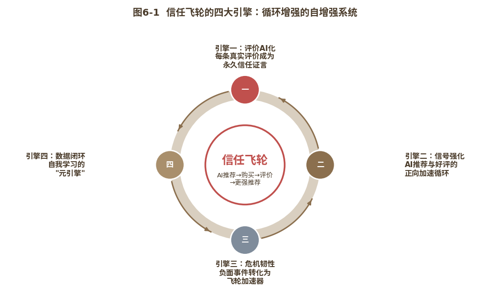
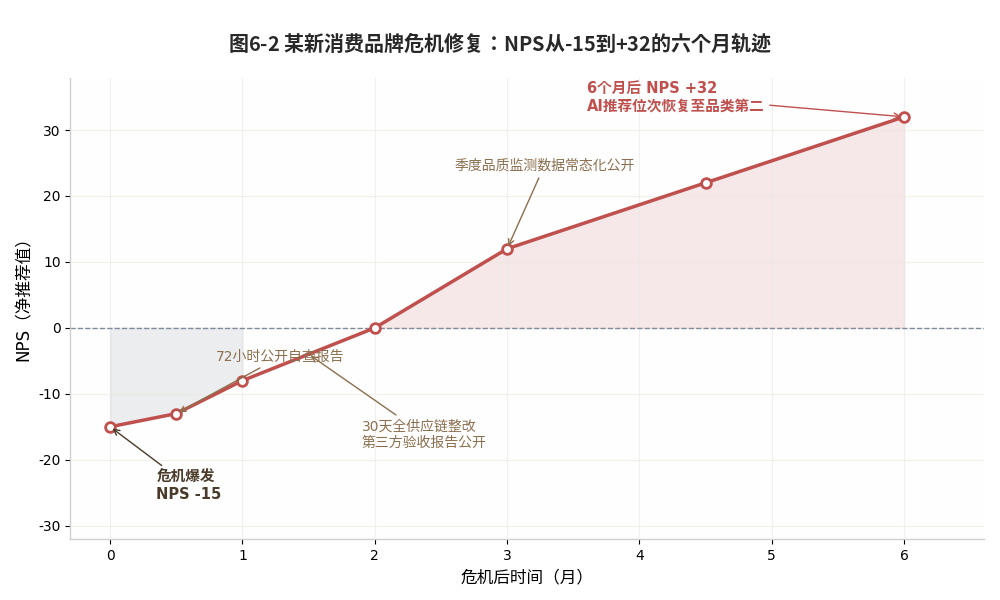
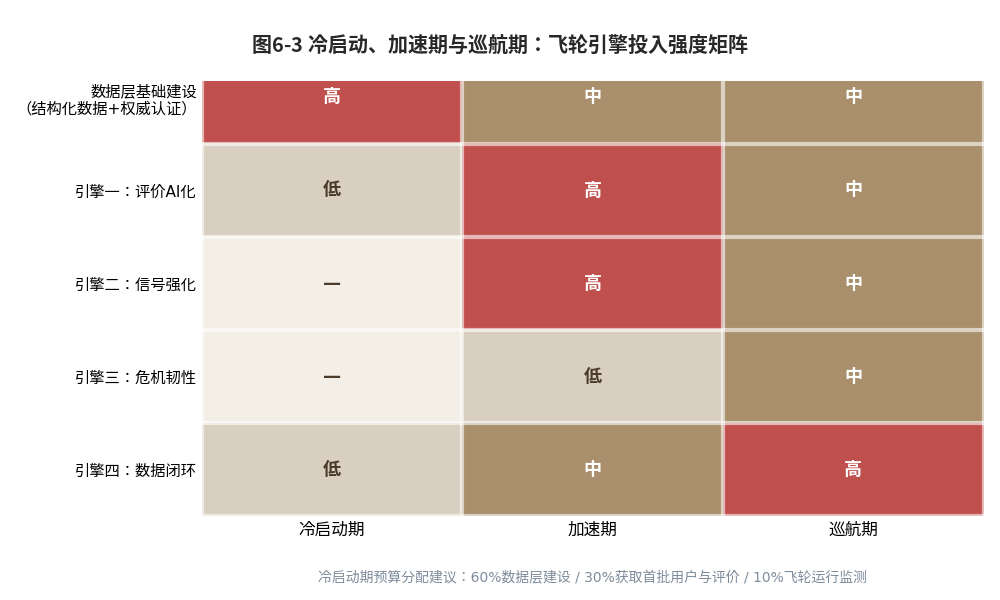

#  飞轮效应：AI驱动的信任自增强系统

**【本章导读】**

前五章完成了信任力从定义到建设的全链路拆解：第一、二章定义了信任力的"五真"内核，第三章重构了AI时代的用户决策旅程，第四章部署GEO让AI"看到"和"偏爱"品牌，第五章搭建"三层五真"体系让AI"信任"品牌。

现在，一个关键问题浮现出来：这些能力建设完成之后，它们之间的关系是什么？信任力是一栋"建好就完工"的房子，还是一个"越用越转越快"的飞轮？

答案是后者，而且这一点至关重要，它决定了品牌在信任力上的投入，究竟是一笔一次性建设成本，还是一笔持续复利的战略投资。

本章将揭示信任力最迷人的特性：它不是一个"静态资产"，而是一个"动态系统"。当品牌的五真建设跨越了某个临界点，一个自我增强的"信任飞轮"就会自动启动，AI推荐带来新用户，新用户产生真实好评，AI收录好评形成更强推荐信号，更强的推荐又带来更多新用户。飞轮一旦转起来，每一次用户互动都在为品牌的"信任账户"复利增值。竞品要追上你，不再是"做一次漂亮的营销战役"，而是要在飞轮转速上超越一个已经在加速的系统。

本章将回答三个核心问题：第一，为什么AI时代的信任传播不再是"人对人"的线性扩散，而是一个"AI放大"的飞轮系统？第二，飞轮由哪些引擎驱动，品牌如何让每一次传播都为下一次AI推荐积蓄势能？第三，不同阶段的品牌如何启动并加速自己的信任飞轮？

本章末以胖东来为完整案例，解读这个中国零售业最独特的"信任现象"，正是"信任飞轮"的现实标本。

## 线性终结：传统口碑的三重物理极限与AI的三重突破

先回到一个最古老的品牌信念：口碑是最好的营销。这个信念没有错，但它隐含的传播模型已经过时。

### 三重极限：人对人、一次性与不可累积的物理约束

传统口碑传播建立在三个"物理级"假设之上。这些假设在数千年商业史中从未动摇，直到AI出现。（如表6-1所示）

表6-1 传统口碑与数字口碑对比表

  ----------------------------------------------------------------------------------------
     维度          传统口碑（WOM）              数字口碑（eWOM）             核心差异
  ---------- --------------------------- ------------------------------- -----------------
   传播半径​   有限：强关系链（3～8人）\   无限：弱关系链（潜在百万级）\     线性扩散 vs
                 难以突破邓巴数限制           算法推荐打破社交圈层           指数裂变​

   传播时效​      瞬时：半衰期\<7天\              永久：长尾留存\            烟花易冷 vs
               无回放、无搜索、靠记忆       支持搜索、收藏、二次转发         常青资产​

   资产属性​       消散型：无法沉淀\           累积型：可结构化存储\        露水 vs 老酒​
                随舆论热点更替而蒸发        形成品牌内容库，复利增长     
  ----------------------------------------------------------------------------------------

第一重：传播半径的"邓巴天花板"

传统口碑遵循"人对人"的线性路径：A 告知 B，B 转述
C。这一路径天然受限于个体的强关系社交圈，即著名的"邓巴圈层"。实证数据显示，在自发状态下，一位满意用户平均直接推荐
3～5 人，极度忠诚用户约为 4～6 人，乐观估计亦难突破 8
人上限。尽管尼尔森调研证实，高达 84%
的消费者信赖亲友推荐而非广告，使得口碑具备极高的信用溢价，但其规模天花板却极低。即便是拥有
100 万满意用户的品牌，其直接影响人群通常仅能覆盖 300～500
万。口碑由此陷入一个经典悖论：信用极高，却无法规模化。

第二重：传播时效的"一次性博弈"

传统口碑本质上是"一次性"的。设想 A 在 2021 年向 B 推荐某品牌，B
或许当时留了心，或许转头就忘。等到 2024 年 B
产生购买需求时，记忆早已模糊，而 A 也绝无可能像 App
那样主动"推送"第二次。口碑缺乏回放机制、搜索入口与永久存档；产品体验后的口碑产出半衰期不足一周，数月之后，接收方记忆衰减，传播者亦无二次触达的动力。这是一场"发射后不管"的博弈，传播效果高度依赖场景的偶然重合，错失即永久流失。

第三重：口碑资产的"消散型困境"

传统口碑是一种典型的"消散型资产"。品牌曾因某一善举赢得用户感动，当日好评如潮；然而三天后，新热搜覆盖旧热搜，算法将过往好评推入信息流的"深水区"；一个月后，除公关团队外，无人记得细节。品牌无法将口碑内容结构化存储，更难以跨周期复用。单次感动仅能带来短暂的好评峰值，随即被新话题覆盖，被记忆衰减吞噬。口碑资产如同阳光下的露水，虽曾晶莹璀璨，却难以留存为品牌的长效资产。

### AI破局：AI对人、永久在线与复利效应的实现

AI的出现，不是优化传统口碑，而是重构口碑传播的底层范式。三重物理极限，由AI的三重能力逐一突破。

突破一：AI让口碑从"人对人"变成"AI对人"。

传统口碑是A对B说；AI口碑是AI从海量评价中提取统计信号，以"集体意见"的方式呈现。当用户问"某品牌值得买吗"，AI的回答是："根据一万条真实用户评价，82%的用户对该品牌的核心评价是'质量稳定、售后响应快'，12%的用户提出'价格偏高'，6%的用户反馈'包装可以更环保'"，这不是"一个人说好"，而是"一万人的集体判断"，其统计说服力远超任何单一朋友的推荐。

更重要的是，AI口碑可同时触达无数用户。一条评价在传统模式下只能影响寥寥数人（前文的3～8人经验估算），在AI模式下却可能出现在成千上万次回答中。口碑由此从"私域社交传播"变为"公域AI传播"，半径从个位数的人际圈层扩展为整个AI用户群（生成式AI应用的用户规模已达数亿级\[1\]）。

突破二：AI让口碑从"一次性"变成"永久在线"。

传统口碑说过即散；AI口碑储存在知识库与实时检索系统中，只要未被删除、覆盖或取代，就会持续出现在AI的交叉验证结果中。用户2023年写下的一条真实好评，在2026年的AI推荐中依然发挥作用。口碑从"即发即散"的烟火，变成"永久在线"的信任资产。

这里需要澄清一个关键机制：AI并非"记住"每一条评价（那需要无法想象的存储与算力）而是通过RAG（检索增强生成）机制实时检索提取。只要品牌的评价数据在互联网上持续维护、保持可抓取状态，AI就能在每次提问时重新"发现"这些评价。所谓"永久在线"，不是AI记住了，而是AI每次都能找到。

突破三：AI让口碑从"消散型资产"变成"复利型资产"。

传统口碑的"资产半衰期"极短，一次好评的热度在数天内衰减殆尽。AI口碑的"资产半衰期"极长，只要评价数据持续存在并保持"新鲜度"（有持续更新的新评价加入），AI对品牌的信任评估便能保持"锁定"在较高水平。更关键的是，AI口碑具有复利效应：每一条新好评都会在已有评价池的基础上，进一步强化AI对品牌的信任评估，这种强化是累积而非替代的。第10001条好评不会替代前10000条好评，而是与它们共同构成一个更加坚实的统计证据。

### 飞轮诞生：从线性口碑到闭环飞轮的系统跃迁

当三重极限被同时突破，"口碑"这个概念本身需要重新定义。

传统口碑是线性的：用户购买→用户满意→用户推荐给朋友→部分朋友购买→部分朋友满意→部分朋友再推荐。这个链条的每一步都有显著的能量损耗，从100个满意用户出发，最终可能只有10个人接收到口碑并转化为购买。

AI口碑是闭环的：AI推荐品牌→用户购买→用户留下评价→AI收录评价→评价数据强化AI对品牌的可信度评估→AI以更强的力度推荐品牌→更多用户购买。这个链条没有能量损耗，每一步都在为下一步积蓄动能，而非消耗动能。这正是"飞轮"的核心含义：不是线性的"A→B→C→D"，而是循环增强的"A→B→C→D→A+"，每一次循环的终点都比起点更强。

品牌在传统营销中的核心痛点是"停投停效"，广告预算一停，流量和转化立刻下降。品牌在信任飞轮中的核心优势是"建好即转"，飞轮一旦建成并跨越临界点，不需要持续的外部推力，就能靠自身的内循环持续加速。

  -----------------------------------------------------------------------------------------------------------------------------------------------------------------------------------------------
  信任的本质，是降低社会复杂性的一种机制\[2\]，它让人们在信息不完备时仍敢于做出决策。这就是为什么信任力是AI时代品牌最稀缺的战略资产。它不是一个"更好的营销方法"，而是一个"更高维度的增长引擎"。

  -----------------------------------------------------------------------------------------------------------------------------------------------------------------------------------------------

## 四重引擎：驱动信任飞轮加速的四大核心动力

理解了飞轮的底层原理之后，一个问题随之而来：飞轮靠什么驱动？品牌应在哪些"引擎"上投入，才能让飞轮不仅转起来，而且越转越快？

{width="4.330555555555556in"
height="2.5340277777777778in"}

图6-1 信任飞轮的四大引擎：循环增强的自增强系统

信任飞轮由四个引擎驱动。它们不是四个独立项目，而是一个系统的四个动力源，每个引擎都在为另外三个提供动能。（如图6-1所示）

### 评价AI化：每一条真实评价都成为永久信任证言

第一个引擎，也是最基础的引擎：将用户的真实评价，从"即时消散的口碑"变为"永久在线的信任资产"。

这听起来像是一个技术问题，但它首先是一个战略认知问题。绝大多数品牌对用户评价的认知停留在"售后管理"层面，评价是"用户满意度"的晴雨表，差评需要处理，好评值得高兴。但在信任飞轮的逻辑中，用户评价的本质不是"用户满意度的反映"，而是"AI信任评估的原材料"。每一条真实评价（无论好评还是差评）都是在为AI提供"判断品牌是否值得信任"的数据依据。

引擎一的建设包含三个关键动作：

第一，评价量的系统化积累。
品牌不能"被动等待"用户评价，绝大多数满意用户是"沉默的"。他们不会主动去写评价，不是因为不满意，而是因为没有动力。品牌需要通过温和的、非诱导性的方式，让"沉默的大多数"愿意留下评价：售后服务后的自动邀请（"您的产品已使用一个月，有什么想分享的吗？"）、会员体系的评价积分激励（不是"五星好评送积分"，而是"留下真实评价送积分"）、购后体验的轻度互动（"这双鞋穿了两个月还舒服吗？分享你的感受"）。关键原则是：邀评但不诱导，激励但不操纵。AI能识别人为操纵的评价，100%五星且文本高度相似的模式，在AI眼中是严重的可信度扣分项。

第二，评价结构的健康度管理。
品牌需要接受"不完美"，自然的评价分布应该是有好评、有中评、有差评的。品牌的工作不是"消除差评"，而是"管理差评的分布和回应"：让差评集中于非核心维度（包装、物流、客服态度）而非核心品质。对每条差评给出真诚、具体、有解决方案的回应。将差评中的合理建议转化为产品与服务的改进证据。当一个品牌的评价分布呈现"核心维度高分+自然的中差评+真诚的回应"时，AI对其"体验真"的评分会高于"只有五星好评"的品牌，前者符合真实统计规律，后者疑似人为操纵。

第三，评价的AI可见性保障。
品牌须确保评价数据能被AI的RAG检索机制"看到"和"提取"。具体包括：评价页面避免JavaScript动态加载（许多JS渲染的评价内容对AI爬虫不可见）。评价数据采用结构化标记（Schema.org的Review类型）。引导评价包含具体场景描述而非简单的"好评""不错"，AI做语义匹配时，更容易将场景化评价与用户的具体提问对应起来。"很好用"对AI而言难以评估，因为它不知道"好用"指什么；"用了两个月，每天通勤两小时戴着很舒服，降噪效果比我之前用的某品牌好"则是AI能精准评估的评价，有场景、有时长、有对比。

### 信号强化：AI推荐与用户好评的正向加速循环

第二个引擎是飞轮的"核心动力组"：AI推荐→用户购买→用户好评→AI收录好评→更强的AI推荐。

这个循环的关键在于每一步之间的"转化效率"。如果AI推荐了品牌，但用户购买后没有留下评价，循环就断了；如果用户留下了评价，但评价质量不够高（笼统的"好评"），AI无法从中提取有价值的信任信号，循环的效率便大打折扣。

引擎二聚焦两个"转化率"：

购后评价转化率，指有多少比例的用户在购买后留下评价？行业平均水平通常在1%～5%之间（经验估算，不同品类差异较大）。这意味着95%～99%的用户是沉默的。若品牌能将购后评价转化率从5%提升至15%，飞轮中"好评→AI信号"环节的效率即提升三倍。提升的关键不是更激进的邀评（那只会导致用户反感），而是更聪明的邀评时机与方式：在产品使用的"啊哈时刻"发出邀请。用个性化话术替代模板化的"请给我们五星好评"。让邀评本身成为品牌体验的一部分（"你的意见真的会帮助我们改进产品"，并用后续改进证明这句话的真诚）。

评价的信噪比，指评价池中有多少评价能让AI提取"语义信号"？一条"很好"在AI眼中近乎零信号，没有任何可交叉验证的具体信息。而"买给父亲的按摩椅，老人家用了三个月说腰部支撑特别舒服，之前买过两个品牌都说太硬。这个力度刚好"则是高信号评价：包含用户画像（老年人）、使用场景（腰部支撑）、时长（三个月）、对比信息（之前买过两个品牌）和核心评价点（力度刚好）。提升信噪比，就是通过评价页的引导设计（"告诉我们：谁在用？什么场景？用了多久？和之前用过的东西比有什么不同？"），让用户自然提供更多语义信号，而非空洞好评。

### 危机韧性：负面事件如何成为飞轮的加速器

第三个引擎看起来违反直觉：品牌遭遇的负面事件，如果处理得当，可以成为飞轮的"加速器"而非"刹车片"。

传统品牌管理的逻辑是"不出事最好"，危机是品牌资产的消耗，危机越大、消耗越多。但在信任飞轮的逻辑中，危机不仅是消耗，更是"试炼"。品牌在危机中的表现，是否坦诚面对、是否承担责任、是否兑现整改承诺、整改是否有可验证的效果，构成AI评估品牌"履约真"维度的最重要证据。

  ----------------------------------------------------------------------------------------------------------------------------------------------------------------------------------------------------------------------------------
  一个从未经历危机的品牌，其"履约真"分数是"未经验证的假设"，AI不知道这个品牌在压力下是否真的能兑现承诺。一个经历了危机但以教科书级方式应对的品牌，其"履约真"分数在危机后反而可能上升，因为它的承诺经过了压力测试，并被验证为真实。

  ----------------------------------------------------------------------------------------------------------------------------------------------------------------------------------------------------------------------------------

引擎三的建设包含三个要点：

危机的"24小时信任窗口"。

在AI时代，品牌对危机的响应速度不仅是"公关效果"问题，更是"信任力数据"问题。AI会记录、存档品牌在危机发生后的首24小时内发布的公开回应，是否承认问题、是否承担第一责任、是否给出具体的解决时间表，并纳入未来的交叉验证。在"履约真"信号的AI训练数据中，"第一时间公开承认并承担责任"与"沉默数日后发布模棱两可的声明"，是两类完全不同的信号。

整改的"可验证性建设"。

品牌在危机后承诺的整改措施，不能只是"我们深刻反思并将全面提升"，这种空洞的承诺在AI的评估中几乎为零信号。整改必须可验证：具体的改进措施（"我们将升级全自动质量检测系统，新增某道检测工序"）、明确的时间表（"新系统将在三个月内全面上线"）、公开的验证方式（"升级完成后将邀请第三方检测机构独立审核并公开报告"）。整改完成后，这些可验证的证据将成为AI评估"履约真"的高权重加分项。

危机的"学习系统化"。

每一次危机都是一次"飞轮体检"，它暴露了品牌在五真体系中的某个薄弱维度。品牌不应只"处理这次危机"，而应"升级整个系统以防止类似危机"。前文所述丰田"刹车门"后的体系升级便是典型：从飞轮韧性看，重大危机后的系统性改革，不仅修复了当时的信任损伤，更成为此后十余年AI评估丰田"履约真"时的核心正面证据，"一个在重大危机后以系统性改革兑现了承诺的品牌"。

### 【沙盘推演】新消费食品领域有一个生动案例

某知名新消费品牌（案例脱敏处理）在2022年遭遇食品安全舆情后，NPS（净推荐值）暴跌至-15，每100个消费者中，批评者比推荐者多15人。其在AI平台的推荐位次从稳定的品类前三跌落至五名开外，部分AI助手甚至明确标注"近期有食品安全争议"。

但该品牌没有选择沉默等待舆论自然降温，而是启动了教科书级的信任力修复行动：72小时内公开发布完整的自查报告，承认问题的具体原因与责任归属，不回避、不推诿、不模糊化。30天内完成全供应链的深度整改，从原料采购到生产加工再到物流交付的全流程升级，并将第三方审核机构的验收报告全部公开。此后建立每季度公开发布品质监测数据的常态化机制，涵盖产品抽检合格率、消费者投诉处理时效、供应商合规率等关键指标。

{width="4.330555555555556in"
height="2.357638888888889in"}

图6-2 危机修复：从NPS从-15到+32的六个月轨迹

六个多月后，其NPS不仅走出负值区间，更攀升至+32的历史新高。在主流AI助手中的推荐位次也恢复至品类第二，AI的交叉验证捕捉到了品牌在危机中展现的"履约真"信号：透明的问题披露、可验证的整改进展、持续公开的品质数据。这场危机非但没有摧毁品牌的信任力，反而因坦诚面对与系统性整改，成为AI评估其信任力的重要正面证据。（如图6-2所示）

### 数据闭环：自我学习让飞轮越转越快越转越稳

第四个引擎是飞轮的"元引擎"，它不直接产生推力，却决定了前三个引擎的"进化速度"。

数据闭环的自我学习，指的是品牌建立一个持续运转的"信任力监测→分析→优化→再监测"的数据闭环。这个闭环让飞轮从"机械运转"升级为"智能进化"，品牌不是在"维护"信任力，而是在"迭代"信任力。

引擎四的核心机制包括：

AI认知仪表盘，品牌需要持续监测自己在AI认知体系中的表现。

主流AI助手回答中的引用率、推荐位次、推荐语气、引用信源，以及这些指标的变化趋势。这不是看看排名，而是早期预警系统。当AI推荐位次出现连续下降趋势，系统应自动告警并触发诊断：是什么导致了下滑？是竞品有所动作（获得了新的权威认证、提升了结构化数据质量），还是品牌自身出了问题（某个认证过期了、某条负面评价被AI放大引用了、多平台信息出现了新的不一致）？

竞品GEO/信任力情报，品牌需要持续监测主要竞品的信任力建设。

要监测竞品是否新增了权威认证？是否发布了高影响力的学术论文或行业报告？是否在某个关键品类中AI推荐位次显著上升？竞品情报不是为了模仿，而是为了预判：当竞品在"信源真"维度上取得重大突破（如获得国家级标准的制定权），品牌需要预判，这个突破在3～6个月内将如何影响竞品在AI推荐中的位次？品牌应当如何提前应对？

用户反馈的语义聚类与趋势分析，品牌监测自己AI表现和分析用户反馈趋势

品牌可以定期用AI对最新一批用户评价做语义聚类分析：用户最近在集中讨论什么？什么维度上的正面评价在增加？什么维度上的负面评价在上升？这些趋势分析的结果，直接为品牌下一个周期的信任力建设提供方向，不再凭经验与直觉决定"下一步该做什么"，而是基于数据驱动的洞察。

## 三段策略：冷启动、加速期与巡航期的差异化策略

四个引擎是全系统的动力源，但对不同阶段的品牌，"先启动哪个引擎"是一个战略选择。错误的启动顺序，可能导致飞轮半途卡壳。（如图6-3所示）

{width="4.330555555555556in"
height="2.33125in"}

图6-3 冷启动、加速期与巡航期：飞轮引擎投入强度矩阵

### 冷启动期：用数据层为飞轮提供初始点火动力

初创与新锐品牌面临的核心挑战是：飞轮启动需要初始动力，要有AI推荐才能获得用户，要有用户才能获得评价，要有评价才能强化AI推荐。而在起点，这三个要素都为零。这就是经典的"飞轮冷启动"悖论。

破局的关键是：用数据层点火。

在没有用户评价、没有AI推荐记录的起点，品牌唯一能做的，是先在"数据真"与"信源真"上打基础：做结构化数据标记，让AI在品类搜索中"看到"你。取得行业入门级权威认证，为AI评估提供基本的信源权威性基准。创建高质量的场景化FAQ内容，覆盖目标用户可能向AI提出的核心问题。

这些动作不会立刻带来AI推荐，在用户评价为零的情况下，AI的评估会因"体验真"维度的缺失而有所保留。但它们为后续的飞轮启动创造了必要条件：当品牌通过其他渠道（广告投放、KOL合作、线下渠道）获得第一批用户，这些用户留下的评价将不再是孤立的，它们会与品牌已有的结构化数据和权威信源一起，构成AI评估品牌的完整证据链。

  ------------------------------------------------------------------------------------------------------------------------------------------------------------
  冷启动阶段的预算分配建议：60%用于数据层建设（结构化标记+权威认证+场景化内容），30%用于获取第一批用户与评价（精准投放+种子用户体验），10%用于飞轮运行监测。

  ------------------------------------------------------------------------------------------------------------------------------------------------------------

### 加速攀升期：三引擎同步发力的飞轮提速策略

当品牌的用户评价量积累到"统计显著性"的水平，通常在数千到数万条，视品类而定，飞轮开始进入加速期。

加速期的核心标志是：AI开始主动推荐品牌，而非仅在用户明确提问时顺带提及。从"用户问某品牌怎么样"到"用户问这个品类推荐什么，AI主动推荐某品牌"，这是飞轮突破临界点的信号。

加速期的核心策略是三引擎同步发力：

评价引擎加大油门。
在评价量已达统计显著性的基础上，重点转向提升信噪比，引导用户留下高语义信号的场景化评价。一千条高信号评价对AI信任评估的强化效果，远超一万条低信号的笼统好评。

推荐引擎建立正反馈。
当发现AI开始主动推荐自己，品牌应顺势而为，在获得推荐的品类中加大用户获取力度，确保AI推荐来的用户获得良好体验并留下高质量评价，形成"推荐→体验→评价→更强推荐"的加速循环。

数据引擎持续维护。
在加速期，品牌可能因为忙于应对增长而忽视数据层和体验层的维护：认证过期了没有续、产品升级了没有更新所有平台的信息、新增的销售渠道信息不一致，这些都是加速期最常出现的信任力维护漏洞。一个正在加速的飞轮突然卡住，通常不是因为用户评价出了问题，而是因为数据层的维护出了纰漏。

### 巡航稳定期：飞轮自运转的维护体系与风控机制

当品牌的信任飞轮进入稳定高速运转的状态，AI在品牌所在的核心品类中持续优先推荐、用户评价池不断壮大且分布健康、品牌在五真的各个维度上都建立了较高水平的壁垒，品牌进入巡航期。

巡航期的核心任务不是加速，而是维持与风控。

维持：防止信任力"熵增"。
任何系统在没有外部能量输入的情况下都会趋向于熵增，即从有序走向无序。品牌的信任力系统同样如此。认证会过期、评价会过时、内容会陈旧、竞品会追赶。品牌需要建立"信任力维护日历"，定期（每月/每季度）执行：认证有效性审查（是否有即将过期需续期的认证？）、信息一致性审计（新增渠道和平台的信息是否与"单一真相源"一致？）、AI认知仪表盘更新（推荐位次是否有波动？）、竞品动态监测（竞品是否有重大信任力动作？）。

风控：防止黑天鹅事件的"飞轮停转"。
在巡航期，品牌面临的最大风险不是"增长放缓"，而是"黑天鹅事件"。一次重大质量事故、一场舆论危机、一次领导人的不当发言，可能导致多年建立的信任飞轮瞬间失速甚至停转。品牌需要建立"信任力危机预案"：识别哪些危机场景最可能发生、对信任力的冲击有多大。针对每种场景准备"24小时响应预案"；明确危机中的"信任力数据管理"策略，哪些数据需要在第一时间公开、哪些承诺需要立即做出、如何确保整改的可验证性。有预案的危机，是信任力的"压力测试"；无预案的危机，是信任力的"致命一击"。

## 【案例】品牌验证：胖东来三十年信任飞轮的自然运转

前三节建立了信任飞轮的理论框架与操作策略。本章的验证案例选择胖东来：这个河南许昌起家的区域零售企业，线下门店至今全部集中在许昌和新乡（2026年在营约14家，未出河南省），从未投放全国性广告，却在社交媒体上拥有不亚于全国性品牌的讨论热度，无数消费者专程坐高铁"跨城购物"（许昌---郑州城际甚至被网友称为"郑胖专线"）。它的存在本身，就是信任飞轮最鲜活的现实验证。

胖东来的飞轮可追溯到1995年------创始人于东来在许昌开出40平"望月楼胖子店"时，以一句"用真品换真心"奠定了初始动力（至2025年已整整三十年）。用信任飞轮的四个引擎分析它的实践：

引擎一，评价资产的AI化：胖东来的口碑不是线上"打分+评论"的数字游戏，而是人人口耳相传的"元口碑"，在社交媒体上呈现出极高的信噪比，几乎每条讨论都包含具体场景和故事，比如"买了一件衣服穿了半个月觉得不合适去退，店员二话不说就退了，还问我需不需要帮忙选新的"，这些在AI的语义分析中构成极高权重的"体验真"信号。

引擎二，推荐信号的持续强化：在2025年前后多家国产AI助手与第三方GEO抽检中，当中性提问"中国最好的超市/值得去的超市有哪些"时，胖东来在主动提及率上常居首位（某次6家国产AI抽样提及率约80%），但严格"首选推荐率"并非百分百稳定第一。这并非任何GEO建设的结果，而是"海量高质量口碑→AI形成推荐判断→更多用户前去体验→新口碑"这一飞轮在无人"驾驶"状态下的自然运转。

引擎三，危机中的飞轮韧性："退换货不设门槛"的承诺不可逆性极高，每一次退换货都是一次承诺兑现成本；胖东来经历过2024年新乡擀面皮联营卫生舆情（最终退款+每份补1000元、奖举报人10万、赔近900万）、2026年多宝鱼"金属异物"溯源标签乌龙等事件，每次危机后反而因其透明应对而"增粉"，危机不是飞轮的"刹车"，而是飞轮的"试金石"。

引擎四，数据闭环的自我学习："用真品换真心""把员工当家人"的理念渗透到每一个运营细节，形成"理念的自学习系统"，这正是第一、二章所定义的"生态级信任力"，信任力已内化为品牌的DNA。

胖东来的案例验证了本章的核心命题：信任飞轮的最高境界，不是品牌推动它运转，而是它自己在运转。但这也引出一个值得所有品牌深思的问题：胖东来的口碑之所以能转化为AI的推荐，是因为海量口碑以文本、视频、图片的形式存在于公开的互联网上，AI可以检索和提取。如果一个品牌同样拥有深厚信任力，却只存在于"人的记忆和口口相传"中，没有留下可供AI抓取的文本证据，它的信任力变现就会大打折扣。这就是信任力建设的"数字可验证性"原则：信任力不仅要存在，还要以AI可发现、理解、验证的方式存在。

## 本章小结 {#本章小结-6}

本章是全书的"方法论闭环"，揭示了信任力的最高特性：它不是一成不变的静态资产，而是自我增强的动态飞轮。

第一节揭示了传统口碑的三重物理极限，人对人的半径限制、一次性的时效限制、不可累积的资产限制，以及AI如何通过"AI对人""永久在线""复利效应"三重突破，将口碑从线性扩散升级为飞轮系统。

第二节系统展开了信任飞轮的四个引擎：评价资产的AI化（让每一条评价成为永久信任证言）、推荐信号的持续强化（AI推荐与用户好评的正向循环）、危机中的飞轮韧性（负面事件如何反而加速飞轮）、数据闭环的自我学习（飞轮越转越快的元引擎）。

第三节给出了不同阶段品牌的飞轮策略，冷启动（以数据层点火）、加速期（三引擎同步发力）、巡航期（维持与风控），为不同发展阶段的品牌提供差异化的建设路线。

最后，以胖东来为极致案例，验证了信任飞轮的现实可能性：一个几乎不做广告、不做GEO、不做SEO的企业，如何凭借三十年极致信任力积累，在AI时代成为AI主动推荐的信任标本。

读完本章，读者应当能够回答三个问题：为什么传统口碑在AI时代失效？信任飞轮由哪些引擎驱动？你的品牌处于飞轮的哪个阶段，下一步该做什么？

接下来，第七章将进入全书的"评估体系"，信任力的量化评估：如何知道信任力建设是否有效？如何衡量飞轮的转速？如何向组织内外证明信任力投入的ROI？至此，中篇的四道工序全部交付：旅程重构是测绘图，勘定了战场；GEO是入场许可，赢得了被看见的资格；"三层五真"是地基，支撑起被信任的高度；信任飞轮是动力系统，让信任力从此越转越强。

+:-----------------------------------------------------------------------------------------------------------------------------------------------------------------------------------+
| 传统口碑是一个人告诉三个人，AI口碑是AI从一万人的评价中提取统计证言告诉每一个人。从"人对人"到"AI对人"，传播的物理极限彻底打破。                                                     |
|                                                                                                                                                                                    |
| 信任飞轮的魅力不在于"转得快"，而在于"停不下来"，它一旦建成并跨越临界点，每一次用户互动都在为下一次AI推荐积蓄势能。信任力的终极形态不是"品牌在管理信任力"，而是"信任力在驱动品牌"。 |
+------------------------------------------------------------------------------------------------------------------------------------------------------------------------------------+

### 参考文献

\[1\] 中国互联网络信息中心. 生成式人工智能应用发展报告（2025）\[R/OL\].
(2025-10-18)\[2026-08-03\]. https://www.cnnic.net.cn.

\[2\] Luhmann N. Vertrauen: Ein Mechanismus der Reduktion sozialer
Komplexität\[M\]. Stuttgart: Enke, 1968.

\[3\] Reichheld F F. The One Number You Need to Grow\[J\]. Harvard
Business Review, 2003, 81(12): 46-54.

**下篇 导论**

中篇四章完成了信任力的建设方法，旅程重构、GEO部署、五真搭建、飞轮启动。但能力建好，只是上半场。更重要的挑战，才刚刚开始。下篇四章回答四个问题：前三问管的是"现在怎么管好"，第四问管的是"未来怎么不输"。

第一问：怎么证明有效？花了几百万做GEO、建信源矩阵、搭内容体系，怎么向董事会和CFO交代这笔钱的回报？度量不了，信任力就永远停留在"理念"层面，被财务总监归为"说不清回报的费用"。第七章要回答的，正是信任力的量化评估与ROI审计，让信任力成为企业资产负债表上一行"可验证的资产"。

第二问：怎么不因人而废？方法论再完备，如果只停留在CMO的办公桌上，就永远无法产生组织级的战略价值。一次高管转岗、一轮预算削减，就足以让建好的成果快速退化。第八章要回答的是：信任力如何从"某个人的项目"变成"整个组织的能力"，做到不因人而兴、不因人而废。

第三问：怎么突破组织边界？在AI的全景式交叉验证之下，AI不只扫描品牌自己发布的信息，还扫描供应商、经销商、用户社区和媒体报道。内部做到一百分，一个经销商的失实信息就足以拖垮整体评分。第九章要回答的是：信任力如何穿透供应链、渗透用户社区、融入行业共识，从组织能力跃迁为社会级的"公共信任资产"。

第四问：怎么赢在未来？AI以月为单位迭代，今天的打法明天就可能失效。第十章不做预测，而做战略情景推演，基于三条不变的底层逻辑，推演未来三到五年的竞争格局与三种可能的终局，告诉你现在就该为未来准备什么。

下篇四章，从"度量→组织→生态→未来"，构成一条从"有效"到"可持续"再到"永续"的完整路径。如果说上篇是"认识论"（理解信任力），中篇是"方法论"（建设信任力），那么下篇就是"治理论"，让信任力成为组织治理的一部分，并最终指向全书的终极命题：认知主权。
