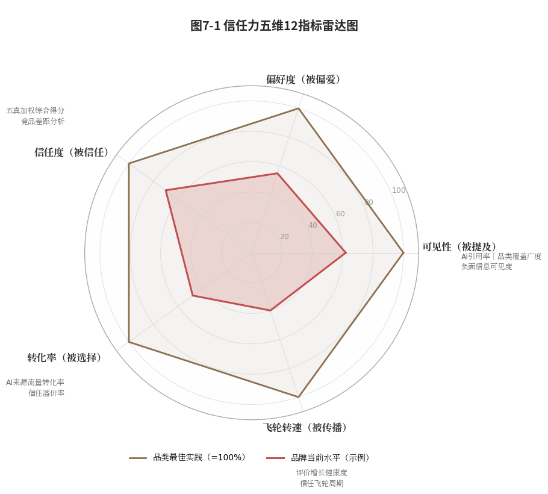
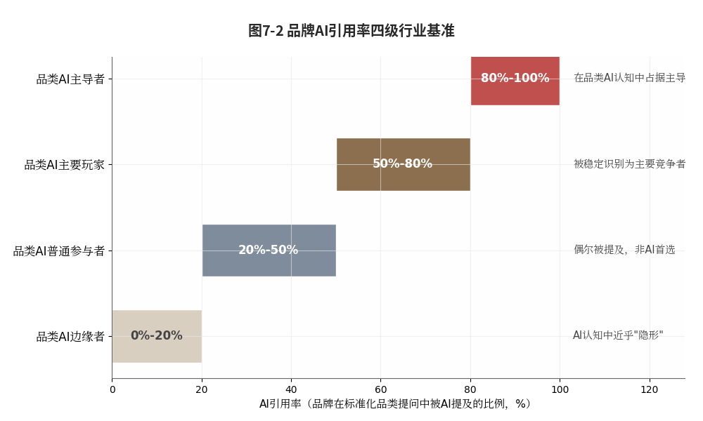
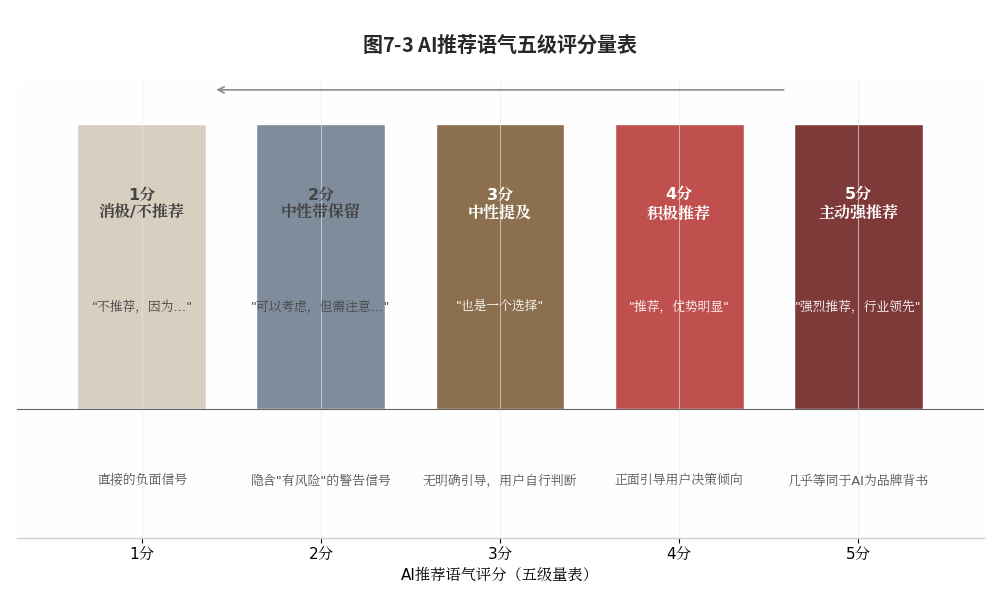
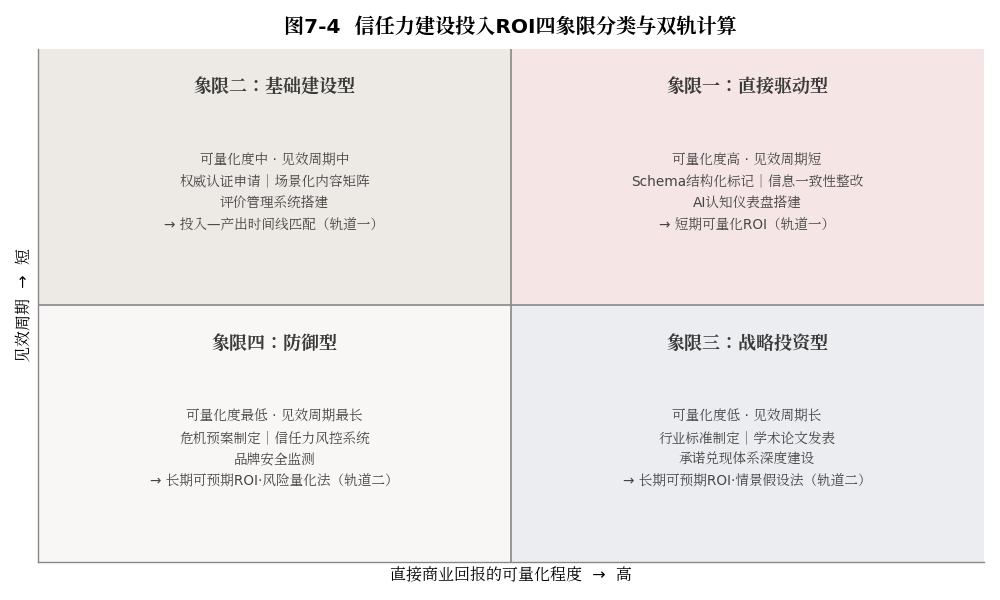

#  度量之道

## ------信任力的量化评估与ROI审计

**本章导读**

前六章完成了信任力从定义到建设再到飞轮的全链路展开。现在，一个无法回避的问题浮出水面：怎么知道这些投入是有效的？

这不是"锦上添花"的问题，而是"生死攸关"的问题。在任何组织中，信任力建设要获得持续的资源支持，必须回答三个问题：第一，我们现在的信任力处于什么水平？第二，过去一年的投入带来了多少改善？第三，这些改善在多大程度上转化成了商业回报？

三个问题，指向同一件事：信任力的可度量性。度量不了，信任力就只能停留在"理念"和"感觉"层面，CMO在战略会上慷慨陈词，CEO礼貌点头，财务总监则在心里把它归为"说不清回报的费用"。信任力建设要进入组织的战略级议程，必须先过度量这一关。

**本节阅读地图**：第一节回答"为什么难"------信任力度量的三重特殊挑战与方法论突破；第二至四节回答"怎么量"------五维指标体系、体检报告与ROI审计框架；第五至六节回答"怎么用"------监测预警系统与正反案例的完整闭环。建议决策者精读第四节（ROI审计），执行者重点阅读第二节（指标体系）与附录三配套工具。

本章将系统构建信任力的量化评估体系。第一节回答"为什么需要评估"，第二节展开五维量化指标体系，第三节设计标准化的品牌信任力体检报告，第四节建立信任力投入的ROI审计框架，第五节构建信任力监测预警系统，第六节以携程和西贝的正反案例展示"从度量到行动"的完整闭环。

  ------------------------------------------------------------------------------------------------------------------------------------------
  读完本章，你将拥有一套向CEO、董事会、投资人呈报的信任力"财务报表"，这不是感觉，不是故事，不是PPT上的漂亮图表，而是经得起追问的量化数据。

  ------------------------------------------------------------------------------------------------------------------------------------------

## 度量之困：信任力评估的三重特殊挑战与方法论

在进入指标体系之前，先正视一个现实：信任力的度量，可能是整个方法论体系中最困难的一环。它面临三重挑战，任何一重没有突破，度量体系都会沦为"看起来很美却无法落地"的指标堆砌。

### CMO困局：无法量化的信任拿不到董事会的预算

**【沙盘推演】2025年，一家上市消费品企业的CMO在年度预算答辩会上经历了煎熬的三小时（综合估算数据，基于作者团队咨询实践，已做脱敏处理）。他提交了一份"品牌信任力建设三年计划"，预算需求八位数。CEO的问题是："去年我们在品牌建设上花了数千万元，你能给我一个数字，证明这笔钱带来了多少实际回报吗？"**

这不是刁难。同一间会议室里，销售VP能用"每元投入带来X元营收"回应预算质疑，技术VP能用"研发投入占营收比X%"加上"新产品贡献率Y%"支撑预算逻辑。唯独CMO（手握最大单笔市场预算的人）只能用"品牌信任对长期增长至关重要"这样的定性陈述来答辩。预算宽松时，定性陈述尚能过关；预算紧张的年份，它敌不过任何一张Excel表。

CMO不是不想量化，而是缺乏量化的方法论。传统品牌建设尚可用"品牌知名度提升X%""品牌喜好度提高Y个百分点"交差，这些指标与销售转化的因果关系并不精确，但至少获得了行业的广泛接受。而信任力建设连这样粗糙的"通用指标"都没有。多项针对大型企业CMO的调查反复显示，品牌信任被普遍视为长期增长的关键因素，但系统性度量方法的普及率始终偏低。

这个困局的本质是：在传统营销体系中，"信任"被默认为一个"不可量化"的变量，它存在，它重要，但它只能感知，不能测量。本书的核心命题之一，就是打破这个默认假设。在AI时代，信任的每一个维度都能找到对应的"量化代理指标"：AI的引用率、推荐位次、推荐语气、信源权威性评分、评价分布健康度、信息一致性得分。信任力不是"不可量化"，而是"缺乏系统性的量化"。管理界有句广为人知的格言："如果你不能度量它，你就无法管理它。"信任力管理的起点，就是信任力的可度量性。

### 三重挑战：滞后性、多维性与归因复杂性的破解

信任力的度量，面临三个区别于传统营销指标的特殊挑战：

挑战一：滞后性，今天种下的种子，明年才开花结果。

信任力建设的效果存在显著滞后。品牌今天完成一次结构化数据标记，AI推荐位次的可观测改善可能要等3～6个月。品牌用三年积累的"履约真"资产，可能要到第四年的一次危机中才显现"抗冲击"价值。

【沙盘推演场景】某新锐消费品牌在重大质量舆情中市值短期重挫约六成。而某老牌消费品牌在同类危机中市值波动不足一成，分析师将其归因于后者"数十年来累积的品牌信任储备"（综合多个真实事件改写，不指向任何特定企业）。

传统营销指标（曝光量、点击率、转化率）的反馈周期以天或周计，信任力指标则以月或年计。这意味着：衡量广告效果的"即时反馈"标准，不能套用到信任力建设上。品牌需要建立"投入---滞后产出"追踪体系，把今天的投入与未来6～24个月的产出匹配分析。

挑战二：多维性，信任力不是一个数字，而是一幅雷达图。

信任力由五真体系构成，是一种复合能力。品牌可能在一个维度上显著进步（新获一项国家级认证，信源真得分提升20分）。同时在另一个维度上出现退化（新增三个销售渠道，信息尚未统一管理，多平台信息一致性下降15%）。只用一个"信任力综合得分"，就会掩盖维度之间的此消彼长。

这就像只用"平均身高"描述一支篮球队，一个2.1米的中锋加四个1.7米的后卫，平均1.78米，"看起来不错"，上了赛场就会暴露弱点。信任力的度量必须是"多维雷达图"而非"单一仪表盘"，这种多维平衡的度量思路，与平衡计分卡的精神一脉相承\[1\]：品牌需要同时看清每个维度上的强项与短板。

挑战三：归因复杂性，怎么证明增长来自信任力，而不是降价促销？

销量提升、份额扩大、复购率上升，从来是产品力、渠道力、价格策略、市场环境、竞品动态、广告投入与信任力共同作用的结果。要把增长的某个百分比精确"归因"给信任力，几乎不可能，所有因素同时起效，且存在复杂的交互效应。

因此，信任力ROI不应追求"精确归因"（"销量增长的14.3%来自信任力建设"）。而应追求"可信归因"（"在可比条件下，信任力建设带来了显著的效率提升和风险降低"）。区别在于：前者声称"我精确地知道这个数字"，后者呈现的是"我有一组证据表明这个方向是对的"。

### 度量哲学：宁要大致正确，不要精确地错误

关于度量，有一个经典论断值得每一位信任力建设者铭记："宁可大致正确，不可精确地错误。"

传统营销度量追求"精确"，曝光量精确到个位数，点击率精确到小数点后两位，转化漏斗精确到每个环节的流失率。这无可厚非：度量的对象是广告投放这种"短期、线性、可追踪"的行为时，精确度量是可能的。

但信任力不是广告投放。用广告投放的精度标准衡量信任力，就是在追求"精确的错误"，比如声称"品牌信任力指数为73.2分"。这个精确到小数点后一位的数字背后，往往隐藏着一系列基于主观赋权和有争议的假设，这些假设在度量过程中不可避免地引入了偏见和不确定性。因此，正确的做法不是强行追求绝对精确，而是坦然接受度量本身固有的"模糊性"，同时确保这种模糊的方向是"大致正确"的，从而引导决策朝着有益的方向发展。具体来说，我们可以从以下三个方面入手：

首先，在归因分析上，不执着于计算出"信任力建设为销量贡献了X%的增量"这种精确但往往不可靠的数字（精确归因），而是转向追踪"高信任力组和低信任力组在同等条件下的转化效率差异"（可信方向）。例如，在实际业务中，可以对比通过AI推荐来的用户（通常具有高信任力信号）与通过广告投放来的用户（通常信任力信号较低）在相同产品、相同促销活动下的转化率差异。这种差异不仅揭示了信任力带来的实际影响，还可以被视作信任力的"效率溢价"，为资源分配提供依据。进一步地，可以定期进行A/B测试，控制其他变量，以更清晰地隔离信任力的作用，从而避免将外部因素误判为内部成效。

其次，在效果评估上，不期望"今天GEO优化的效果明天就立即体现在AI推荐位次上"（即时反馈），因为这种即时关联在复杂系统中往往不现实。相反，应该观测"GEO优化的季度趋势与AI推荐位次的季度趋势之间的同步性"（趋势验证）。通过分析长期数据，如果发现GEO优化的改善趋势与AI推荐位次的提升趋势在时间上吻合，那么就能更有信心地认为优化措施是有效的，尽管无法精确锁定每一天的具体变化。此外，可以引入相关性分析或滞后指标对比，以量化趋势之间的关联强度，从而增强判断的可靠性。

第三，在指标构建上，不追求用一个简单的"综合得分"来囊括所有维度（过度简化），因为这种简化会丢失重要细节，导致误判。更好的做法是维护一个"五维雷达图+关键指标趋势"的多维视图（保持复杂度）。雷达图可以直观展示各维度的相对强弱，而趋势图则能揭示动态变化，两者结合既能全面评估现状，又能识别改进重点。例如，信任力的五个维度------如信源真、透明度、一致性等------可以分别跟踪，并通过季度复盘会议讨论其互动关系，避免因单一数字的波动而做出片面反应。

这不仅是方法问题，更深层的是理念问题。在管理决策中，一个"精确但错误"的信任力得分，比如由于模型缺陷或数据噪声导致的"得分从73.2降到68.5"，可能误导管理者做出"全面收紧预算"的错误决策，反而损害业务。相反，一个"模糊但正确"的趋势判断，例如基于多维数据观察到"过去两个季度信源真持续走弱"，虽然不提供具体数字，却能有效校准方向，提示团队"未来应优先补强"这一关键环节，从而实现更稳健的长期增长。这种理念转变要求团队拥抱不确定性，专注于信号而非噪音，从而在动态环境中做出更适应性的调整。

## 五维指标：与AI-5A对应的十二项可测量指标

基于"大致正确"的度量哲学，本节构建一个与AI-5A五个环节对应的五维量化指标体系。每个维度包含2～3个核心指标，共12个，每个指标都配有定义、计算方法、数据来源和参考基准。它们不是"学术定义的精确变量"，而是"实战可操作的量化代理指标"。（如图7-1所示）

{width="4.330555555555556in"
height="3.571527777777778in"}

图7-1 信任力五维12指标雷达图

### 可见性指标：引用率、覆盖广度与负面信息占比

对应AI-5A的"被提及"环节。如果品牌在AI回答中从未出现，后续的"被偏爱""被信任"都无从谈起。可见性是信任力大厦的"地基指标"。

指标1：AI引用率。
定义：在品牌所在核心品类的标准化测试提问中，AI在推荐答案中提及品牌的比例。

操作方法：每月（或每季度）用一套标准化的品类提问模板，品类通用提问（如"推荐几个某品类的品牌"）、场景化提问（如"预算三千给父母买什么"）、对比提问（如"某品牌和另一品牌哪个更值得买"），在5～10个主流AI助手上执行测试，记录品牌是否获得提及。计算公式：AI引用率
= 品牌获得提及的测试次数 ÷ 总测试次数 ×
100%。行业基准参考（如图7-2所示）：

{width="4.330555555555556in"
height="2.598611111111111in"}

图7-2 品牌AI引用率四级行业基准

指标2：品类覆盖广度。
定义：AI提及品牌的品类数量与品牌实际覆盖品类的比值。

操作方法：列出品牌实际经营的所有品类，逐一测试每个品类中品牌在AI中的"提及状态"，计算获得提及的品类数与总品类数之比。计算公式：品类覆盖广度
= AI提及品牌的品类数 ÷ 品牌实际经营的品类数 ×
100%。这个指标对跨品类经营的平台型品牌（如京东、淘宝）和多品类消费品牌（如小米、华为）尤为重要，一个在3C品类AI推荐中排名第一、却在家电品类中"AI隐形"的品牌，存在显著的"品类认知缺口"。

指标3：负面信息可见度比率。
定义：在AI关于品牌的回答中，负面或保留性信息出现的频次与总提及频次的比值。

操作方法：在执行AI引用率测试的同时，对每次提及内容分类，纯正面/中性推荐（不含任何保留性表述）、正面但带保留（如"某品牌值得推荐，但需要注意......"）、中性罗列、负面提及。计算公式：负面信息可见度比率
= （带保留的提及次数 + 负面提及次数）÷ 总提及次数 × 100%。

理想趋势是"持续下降"，不是消除一切负面信息（那不现实），而是让正面证据的数量和权重持续增长，使负面信息的"相对可见度"不断降低。行业参考：品类AI主导者的负面信息可见度比率通常在10%以下；强信任力品牌在20%以下；存在信任危机的品牌可能在40%以上。

### 偏好度指标：推荐位次、推荐语气与推荐理由质量

对应AI-5A的"被偏爱"环节。被提及只是"入场券"，被偏爱才是"竞争力"。当AI在回答中推荐多个品牌时，你的品牌排在什么位置？用什么语气推荐？理由有多充分？

指标4：AI推荐位次。
定义：在AI给出多品牌推荐的测试提问中，品牌的平均排序位置。

操作方法：执行AI引用率测试时，当一次AI回答包含多个品牌推荐（如"推荐A、B、C三个品牌"），记录品牌的排序位置。第1位=3分，第2位=2分，第3位=1分，第4位及以后=0分。全部测试得分加总除以测试次数，即得"平均推荐位次得分"。行业基准：持续保持2.5分以上（绝大多数测试中排在第1～2位）的品牌，拥有该品类的"AI认知主导权"。

AI推荐位次与传统SEO排名的"生态"完全不同。传统搜索结果页中，第1名与第4名的点击率差距可达数十倍。而AI回答通常只给出2～4个品牌的精简推荐，"第2名"与"第3名"之间的心理差距远小于传统搜索。这使得AI推荐位次的核心竞争力不在于"是不是第1"，而在于"是否在推荐列表里"，在3个推荐名额中占一席，比在20个搜索结果中排第1更有价值。

{width="4.330555555555556in"
height="2.2625in"}

图7-3 AI推荐语气五级评分量表

指标5：AI推荐语气评分。 定义：AI提及品牌时所使用的语言隐含的推荐强度。

操作方法：对测试中每次品牌被提及的段落进行人工或AI辅助评分，采用五级量表（如图7-3所示）：

全部测试评分取平均值，即得AI推荐语气评分。健康品牌应持续保持3.5分以上；行业标杆通常在4.0分以上。语气评分与推荐位次高度相关，但并不完全同步，品牌可能排在推荐列表第1位，语气评分却只有3分（"某品牌是一个选择，此外还可以考虑YY品牌"）。这意味着：品牌在AI知识库中"存在感强"，但"可信度信号"不够强。

指标6：AI推荐理由质量。
定义：AI推荐品牌时引用了多少条"可验证的具体理由"，与笼统推荐的比率。

操作方法：将推荐理由分为三级，A级（包含可验证的具体证据，如信源引用、数据支撑、权威背书）、B级（包含具体但不可直接验证的理由，如"口碑好""品质稳定"）、C级（无理由或笼统推荐，如"推荐某品牌"）。计算公式：推荐理由质量得分
= （A级次数×3 + B级次数×1）÷
总推荐次数。这个指标直接反映"五真"建设成果，A级理由通常来自信源真（政府认证引用）和数据真（结构化参数引用）。

### 信任度指标：五真加权综合得分与竞品差距分析

对应AI-5A的"被信任"环节。这是五个维度中技术性最强的一个，直接反映AI-RAG五维加权模型的评估结果。

指标7：五真加权综合得分。
定义：基于第五章的"五真"体系，为每个"真"的量化代理指标打分并加权汇总。总分100分。

评分细则（如表7-1所示）：

需要强调：这套评分是"快照"而非"定论"，它反映品牌当前时刻的信任力水平。各维度权重可按品类微调：B2B品牌的信源真权重可上调至35%（权威认证在B2B决策中的价值更高），快消品牌的体验真权重可上调至25%（用户评价对快消品购买决策影响更大）。

表7-1 五真维度评分标准与数据来源

  --------------------------------------------------------------------------------------------------------------------------
   五真维度   满分   评分标准                                                                                 数据来源
  ---------- ------- ----------------------------------------------------------------------------------- -------------------
    数据真    25分   Schema标记完整性（10分）+标记准确性（10分）+更新频率（5分）                          品牌官网技术审计

    信源真    30分   基础认证数×1分（上限10分）+专业认证数×3分（上限15分）+话语权认证数×5分（上限5分）      品牌认证台账

    逻辑真    15分   核心平台信息一致性率×15分                                                             信息一致性审计

    体验真    20分   评价样本量（5分）+评价分布自然度（10分）+差评回应质量（5分）                          多平台评价数据

    履约真    10分   重大承诺兑现率（5分）+危机应对评分（3分）+长期一致性（2分）                          公开记录+历史数据
  --------------------------------------------------------------------------------------------------------------------------

指标8：竞品信任力差距分析。
定义：品牌与本品类"信任力标杆"之间的五真综合得分差距。

**操作方法：**选取品类中AI推荐位次最高、推荐语气最积极的1～2个品牌作为标杆，对其执行同样的五真加权评分，计算五项分差与总差距。差距分析的价值不在于"看别人有多好"，而在于"找到差距在哪个'真'上"，品牌A可能比标杆低15分，其中10分集中在"信源真"（标杆有3项国家级认证而品牌A只有1项），3分在"体验真"，2分在"逻辑真"。结论一目了然：当前最值得投入的，是信源真。

### 转化率指标：AI来源流量的转化表现与信任溢价

对应AI-5A的"被选择"环节。这个维度的指标最接近传统营销KPI，但解读方式不同，其核心价值不在"绝对值"，而在"信任力高低与转化效率之间的相关性"。

指标9：AI来源流量转化率。
定义：通过AI推荐来到品牌的用户，其购买转化率与品牌整体转化率的对比。

**操作方法：**在品牌落地页设置UTM参数标记"AI推荐"流量来源，追踪AI来源用户的购买行为并计算转化率，再与品牌整体转化率对比得出"AI流量转化溢价率"。计算公式：AI流量转化溢价率
= （AI来源转化率 - 品牌整体转化率）÷ 品牌整体转化率 × 100%。

行业参考（作者基于行业访谈的经验估算，供建立量级直觉）：强信任力品牌的AI流量转化溢价率通常在30%～80%之间，AI推荐来的用户，转化率比整体平均水平高出30%～80%。溢价的来源很清楚：AI在推荐时已完成"预信任"，用户无需自行验证品牌可信度，决策路径由此缩短。

指标10：信任溢价率。
定义：消费者在同等条件下，愿意为"高信任力品牌"支付的额外溢价。

**操作方法：**定期（每半年或每年）开展消费者调研或A/B价格测试，"如果两个产品参数完全相同，品牌A获得了某项权威认证、有大量用户评价，品牌B没有，你愿意为品牌A多支付百分之多少？"这个指标直接量化信任力的"货币化价值"，信任力不只是"让用户更愿意买"，更是"让用户愿意花更多钱买"。

行业参考（作者基于行业访谈的经验估算，尚无可溯源的权威统计）：消费者愿意为"高度信任的品牌"支付10%～30%的价格溢价，幅度因品类而异，母婴和保健品类溢价容忍度最高（可达25%～30%），快消品较低（通常10%～15%）。

### 飞轮转速：评价增长健康度与飞轮周期监测

对应AI-5A的"被传播"环节。这些指标衡量的是信任飞轮是否健康运转------是否越转越快、越转越稳。

指标11：评价增长健康度。
定义：品牌用户评价三个关键健康指数的综合评估，包含三个子指标。其一，月均新增评价量的环比增长率，持续增长，说明飞轮在加速，越来越多用户愿意留下评价。其二，差评占比的月度变化趋势，持平或下降，说明产品和服务质量持续改善，飞轮的"燃料质量"在提升。其三，评价平均语义信号强度，可用一个简单的代理指标衡量：包含具体场景描述的评价占比（如"用了两个月""买给父母的""比之前用的某品牌好"）。占比越高，评价的"语义信号"越强，对AI信任评估的贡献越大。综合判断：三个子指标同时向好=飞轮健康加速；两个向好一个持平=飞轮稳定运转；两个及以上恶化=飞轮出现隐患。

指标12：信任飞轮周期。
定义：从"品牌投入信任力建设动作"到"AI推荐位次出现可观测改善"的平均时间周期。

操作方法：为每个关键建设动作建立"时间戳"，投入日期、投入内容、预期见效周期、实际见效日期。持续追踪后，品牌即可建立自己的"信任力建设日历"（如表7-2所示）：

表7-2 信任力建设动作的见效周期一览

  -----------------------------------------------------------------------------------------------
        **建设动作**        **典型见效周期**    **最快见效周期**            **影响因素**
  ------------------------ ------------------ -------------------- ------------------------------
      Schema结构化标记          1～3个月             2～4周               AI爬虫的抓取频率

       信息一致性整改           1～2个月             2～4周             AI交叉验证的更新频率

        基础行业认证            3～6个月       取决于认证审批周期        认证机构的审核速度

        高级专业认证           6～12个月              同上             认证的复杂度和排队时间

   话语权建设（标准制定）        1～3年               ---                标准制定的行业周期

       场景化内容矩阵           1～3个月             2～4周               AI索引内容的速度

         评价池积累            6～12个月              ---           取决于用户基数和评价激励机制
  -----------------------------------------------------------------------------------------------

## 信任体检：标准化六模块诊断报告的设计与应用

指标体系建立之后，下一个问题是：如何把零散的指标整合成一份"拍在CEO桌上"的综合评估报告？本节给出一套标准化的"品牌信任力体检报告"框架。

### 六大模块：从执行摘要到数据附录的报告结构

信任力体检报告由六个模块组成，按"总→分→对标→诊断→行动→附录"的逻辑展开：

模块一：执行摘要（1页）

用一段话概括品牌的信任力综合状况、与上一周期相比的变化、最突出的优势与最紧迫的风险。这是给CEO和董事会看的"一页纸结论"。关键原则：只说最重要的三件事，进步最大的一个指标及其幅度、退步最大的一个指标及其风险、最紧迫的一个行动建议及其预期效果。

模块二：五维雷达图（1页）

将五维12个指标的核心数据整合为一张五维雷达图，五个维度分别为：AI可见性、AI偏好度、AI信任度、转化效率、飞轮转速。每个维度的综合得分以百分比呈现（品类最佳实践为100%），连线构成品牌的"信任力轮廓"。雷达图的核心价值是"一眼看出短板"，哪个维度最靠近圆心，哪个维度就是当前的优先建设方向。

模块三：关键指标趋势（2～3页）

将12个指标过去4～8个季度（或12～24个月）的变化趋势以折线图呈现，每张图配一句话解读。趋势图的核心价值是"验证投入效果"，资源投下去了，指标是否出现预期改善？如果投入了却没有改善甚至下降，就必须深挖原因。

模块四：竞品对标（1～2页）

选取品类中最强的2～3个竞品（或行业公认的信任力标杆），在五维雷达图上叠合对比。品牌与标杆的雷达图形状差异，就是信任力建设的"战略缺口"。此外，追踪竞品过去12个月的重大信任力建设动作（认证获取、内容升级、评价管理优化）分析对手动作与AI推荐位次变化之间的关联。

模块五：诊断与行动建议（1～2页）

基于前四个模块的发现，给出"五真"建设优先级建议。诊断必须具体到"可操作的行动"，而非"笼统的方向"，不是"加强信源真建设"，而是"未来三个月内完成ISO
27001认证申请，预计六个月后获批，届时信源真评分预计从当前的18分（满分30分）提升至24分"。

模块六：数据附录

包括12个指标的原始数据、测试方法说明（测试AI平台列表、测试提问模板、测试日期）、数据时效说明与局限性声明。数据附录的价值在于"可复现"，任何第三方都能按报告描述的方法，独立复现报告的结论。

### 三层对标：行业基线、品类均值与最佳实践的参照

不同品类的信任力基准差异巨大：快餐行业的评价量级天然大于高端医疗设备行业，B2B品牌的权威认证密度天然高于B2C快消品牌。因此，信任力体检不能"一刀切"，需要建立三层对标体系：

第一层：行业通用基准，信任力的"及格线"和跨行业的信任力"基线水平"

所有品牌不论品类都应达到的最低标准。通用基准示例：品牌信息在至少5个主流平台上保持一致（逻辑真基线）、至少拥有1项有效期内的行业基础认证（信源真基线）、品牌核心数据有基本的Schema标记（数据真基线）。这一层的意义是"排除硬伤"，连行业通用基准都达不到，说明信任力建设尚未起步。它相当于品牌信任力的"体能测试及格线"。

第二层：品类均值，品牌在同行中的"相对位置"

品牌所在品类的信任力平均水平，数据来源包括：品类头部5～10个品牌的公开数据、行业报告、第三方数据工具。品类均值让品牌能够回答"我在同行中处于什么百分位"，前25%是领先者，25%～75%是中游，后25%是落后者。在AI认知体系中，"中游"是一个危险位置：AI只推荐2～3个品牌时，中游品牌通常拿不到推荐。

第三层：品类最佳实践，信任力的"天花板"

品类中信任力得分最高者的指标水平是品牌的"追赶目标"，但要区分"可追赶的差距"与"结构性差距"。竞品比你多2项ISO认证，这是可追赶的，投入时间和预算即可。竞品是某项国家标准的起草单位而你不是，这在一定时间内是结构性的，因为标准制定周期长、门槛高。品牌必须在差距分析中把两类差距分开，各自制定追赶策略。

### 频率触发：按建设阶段的体检节奏与加急机制

信任力体检作为评估品牌信任度的重要工具，其频率的设定需根据品牌所处的建设阶段灵活调整，以确保监测的有效性与及时性。具体而言，信任力体检的频率主要取决于品牌的发展进程，可分为以下三个阶段：

冷启动阶段（通常为品牌建设的第一年）：建议每季度进行一次信任力体检。在此阶段，品牌正处于初步建立基础的关键时期，重点在于夯实数据真实性与信源真实性，整体变化较为迅速。高频次的监测有助于及时验证各项投入的实际效果，识别潜在问题，并快速调整战略方向，从而为品牌信任力的稳步提升奠定坚实基础。

加速期（涵盖品牌建设的第二至三年）：推荐每半年进行一次信任力体检。进入此阶段后，品牌的核心信任指标已趋于稳定，但增长势头依然显著，整体发展呈现积极态势。半年一次的频率既能有效捕捉到趋势的渐进变化，避免因监测间隔过长而遗漏重要信息，又能减少不必要的资源消耗，确保品牌在快速成长中保持信任体系的健康演进。

巡航期（品牌建设三年以上）：适宜每年进行一次全面的信任力体检，并辅以季度关键指标简报。此时，品牌的信任力体系已进入成熟期，各项指标波动平缓，整体架构稳固。年度全面体检可系统评估长期表现与可持续性，而季度简报则能持续跟踪核心指标的最新动态，确保品牌在稳定运行中及时应对细微变化，维持信任力的持久优势。

此外，以下情形应触发加急体检：品牌遭遇重大负面舆情（24小时内启动，评估舆情对各维度的冲击）；品牌获得重大权威认证（72小时内更新信源真评分，评估对整体信任力的拉动）；主要竞品发布重大信任力建设成果；AI平台发生重大算法更新，如新增RAG数据源或调整信源权重分配。

## ROI审计：四象限分类与双轨制投入产出计算

指标体系解决了"品牌处于什么水平"的问题，体检报告解决了"品牌应该做什么"的问题。但还有一个终极问题没有回答：信任力建设的投入，到底值不值？

### 投入四象限：直接驱动、基础建设、战略投资与防御

{width="4.330555555555556in"
height="2.436111111111111in"}

图7-4 信任力建设投入ROI四象限分类与双轨计算

信任力建设的投入，可按"直接商业回报的可量化程度"分为四个象限（如图7-4所示）：

象限一：直接驱动型投入（可量化度高、见效周期短）。

典型动作：Schema结构化标记（一次性投入数千至数万元，做完即可量化AI对品牌信息提取效率的提升）、多平台信息一致性整改（投入市场和IT团队约2～4周工时，整改后AI交叉验证中的"不一致标记"可量化减少）、AI认知仪表盘搭建（投入开发成本，建成后可持续使用）。这类投入的ROI论证相对容易，直接对比整改前后的指标变化，计算改善幅度的商业价值。

象限二：基础建设型投入（可量化度中、见效周期中）。

典型动作：权威认证申请（投入认证费用+合规建设成本，3～12个月后获批）、场景化内容矩阵建设（投入内容团队持续运营，1～3个月后可见语义相关性改善）、评价管理系统搭建（投入系统开发与运营团队）。这类投入的产出滞后较长，但可量化。ROI论证需要"投入---产出时间线匹配"，把本期投入与未来6～12个月的产出对应分析。

象限三：战略投资型投入（可量化度低、见效周期长）。

典型动作：参与行业标准制定（投入研发和行业协作资源，周期1～3年）、学术论文发表（投入研究资源，周期6～18个月）、承诺兑现体系的深度建设（持续运营投入，周期数年）。这类投入的产出极难精准量化，但对品牌信任力的长期价值可能最大。ROI论证应采取"情景假设"法，核心问题是："如果没有这笔战略投入，未来X年的行业竞争中，我们可能失去什么？"

象限四：防御型投入（可量化度最低、见效周期最长）。

典型动作：危机预案制定、信任力风控系统建设、品牌安全监测。这类投入的价值在于"防止损失"而非"创造收益"，ROI论证应采取"风险量化"法，"基于行业历史数据，同类品牌在类似危机中的平均市值损失动辄数以亿计。而防御型投入的年均成本仅为其零头，风险对冲比极为可观。"

### 双轨计算：短期可量化与长期可预期的差异化模型

鉴于信任力投入的异质性，ROI计算不应追求单一公式，而应采用"双轨制"：

轨道一：短期可量化ROI，适用于象限一和象限二的投入。

计算逻辑：

ROI = （信任力指标改善幅度 × 单位改善的商业价值）÷ 投入成本

关键难点在于"单位改善的商业价值"的估算，品牌需通过A/B测试或历史数据回归分析建立这个系数。举例：

假设品牌通过结构化数据标记和权威认证建设，将AI推荐位次从平均第3.5位提升到第1.8位。历史数据显示，AI推荐位次每提升1位，AI来源流量增长约40%，AI来源流量的平均转化率为品牌整体转化率的1.5倍。投入成本为：Schema标记2万元 +
ISO认证申请及合规建设15万元 = 17万元。年度AI来源流量价值增量 =
提升位次（1.7位）× 位次系数（40%流量增长）× 原AI流量基数 × AI来源转化率
× 平均客单价 × 毛利率。

若原AI月均流量10万UV，品牌整体转化率为1.3%，则AI来源转化率为1.3% × 1.5 ≈
2.0%。客单价500元，毛利率40%，年度价值增量约为：1.7 × 0.4 × 10万 × 12 ×
2.0% × 500 × 40% ≈ 326万元。短期ROI = 326万 ÷ 17万 ≈ 19倍。

当然，这个模型包含多个假设参数，任一参数调整都会影响结果。核心原则是：明确列出所有假设，让决策者自行判断其合理性，而不是用一个"看似精确"的数字掩盖假设的不确定性。（本测算为方法论演示示例，不构成任何投资建议。）

轨道二：长期可预期ROI，适用于象限三和象限四的投入

不追求精确的ROI数字，而是建立一条"投入---产出逻辑链"：投入了什么→改善了哪个信任力维度→该维度的改善如何长期降低风险敞口或提升竞争壁垒→这些效应用什么"代理指标"追踪。长期可预期ROI的核心不是"一个数字"，而是"一条逻辑链"，它帮助决策者理解：这笔投入虽不立竿见影，为什么仍然是必要的。

一个典型的逻辑链示例："我们投入一笔预算参与行业标准制定（象限三投入）。这将在18个月后使我们成为该标准的主要起草单位（信源真的话语权层级）。这一身份在AI-RAG五维加权模型中为信源真维度贡献5分（满分30分），而信源真在AI推荐排序中的权重为30%。这意味着我们在AI推荐中的综合竞争力将持续提升。代理追踪指标：AI推荐位次的季度趋势、AI推荐语气评分的年度趋势。"

### 差异汇报：向CEO、CFO与CMO的三套话语体系

同一份信任力评估报告，面对不同汇报对象需要不同的"翻译"：

向CEO/董事会汇报（5分钟版本）

聚焦战略价值。一页PPT：品牌信任力五维雷达图与品类标杆对比→过去12个月最重要的2个进步和1个风险→未来12个月的战略优先级→所需资源与预期战略回报。CEO关心的不是"AI推荐位次从第3位升到第2位"，而是"我们从竞品手中抢回了可观的品类AI认知主导权。这将在未来3年节省大笔广告投放成本，并降低因AI推荐降级导致的客流风险"。

向CFO/财务团队汇报（15分钟版本）

聚焦投入产出比。一页总览加一页四象限明细：信任力建设总投入→四个象限的分配比例→象限一和二的短期可量化ROI汇总→象限三和四的长期风险对冲价值评估→预算的"效率对标"（与行业平均水平和品类标杆的投入效率比较）。CFO关心的核心问题是："每一块钱是否花在了最需要的地方，投入产出比是否可追踪、可验证。"

向CMO/营销团队汇报（30分钟版本）

聚焦操作层面。完整的六模块体检报告：哪个维度在恶化？根因是什么？下一步优先攻坚哪个"真"？需要协调哪些部门的资源？执行时间表和责任人是谁？CMO关心的不是战略层面的差距叙事，而是"下个季度应在哪个具体动作上投入最多团队资源，预期产生什么可量化的改善"。

## 信任预警：从定期体检到实时ICU级风险监护

体检报告解决了"定期评估"问题。但信任力还有一层更高的管理需求：当某个维度急剧恶化时，品牌能否第一时间收到警报，就像ICU里的心电监护仪，不是在病人倒下之后才发现问题，而是在指标出现异常趋势的第一时间就报警。

### 预警必要：信任力骤变速度远超月报季报的节奏

信任力不是"匀速变化"的。它在大多数时间里平缓波动，但在特定条件下会急剧变化，一次质量事故的社交发酵、一次高管不当言论的舆论引爆、一个竞品的重大认证突破，都可能在数天内造成数月甚至数年才能修复的损伤。

传统品牌管理的节奏是"月度例会看报告、季度复盘看趋势"。面对信任力的急剧变化，这个节奏太慢。品牌需要一套"7×24小时自动运转"的预警系统，在以下信号出现时自动触发警报：

- AI推荐位次连续两周下降超过1个位次

- 负面信息可见度比率在72小时内上升超过15个百分点

- 竞品获得了品牌所在品类的国家级认证或标准制定权

- 品牌的某个核心平台出现信息不一致问题（如电商详情页参数与官网不一致）

- 用户评价中的核心痛点发生统计显著的负面偏移

### 三层预警：数据采集、分析判断与响应行动的闭环

第一层：数据采集层，实时汇聚信任力数据源。

预警系统至少接入三类数据源：AI平台监测数据（每日自动执行品牌核心品类的标准化AI提问，记录引用率、推荐位次、推荐语气变化）；社交媒体舆情数据（通过舆情监测工具实时追踪品牌社交声量与情感倾向）；品牌自有数据（官网访问数据、电商平台评价数据、投诉平台数据）。

采集频率因指标而异：AI推荐位次建议每日追踪，AI算法更新可能是天级的，今天第1明天可能掉到第3。多平台信息一致性建议每周追踪，信息不一致不会"一夜之间"发生，但一周内新增的平台或更新的信息可能遗漏。权威认证状态建议每月核查，认证过期通常有提前通知期。

第二层：分析判断层，区分"噪声"与"信号"。

不是每一次数据波动都值得报警。信任力指标天然存在"日常波动"，今天AI推荐位次第1，明天第2，后天又回到第1，这属正常。只有当波动幅度和持续时间超过预设阈值时，才触发真正的警报。

阈值设置有三个维度：幅度异常（单次变化幅度超过历史标准差的2倍）、趋势异常（连续N次变化方向一致，形成统计显著的上升或下降趋势）、关联异常（多个不直接相关的指标同时异常，如AI推荐位次下降+社交负面情绪上升+投诉量增加同时发生）。

第三层：响应行动层，从"警报"到"行动"的闭环。

预警系统的终极价值不是"告诉你出事了"，而是"触发相应的应对行动"。因此，当预警被触发时，系统必须实现从信息传递到任务执行的自动化衔接，确保警报不悬空、责任不落空。

系统应依据事件级别与类型，自动分配预设的责任人、团队及响应时限，并推送行动指引与关键上下文，从而形成"监测-警报-分配-执行-反馈"的完整闭环。这一机制不仅提升了响应速度，也通过标准化流程降低了人为疏漏的可能，使得预警真正转化为风险控制力。具体责任分工与时限要求可参照如下分级响应机制（如表7-3所示）：

表7-3 信任力预警分级响应机制

  ---------------------------------------------------------------------------------------------------------------------------
   预警级别                      触发条件                     响应时限    责任人                    标准动作
  ----------- ---------------------------------------------- ---------- ---------- ------------------------------------------
   黄色预警               单一指标超过阈值但可逆              48小时内   品牌经理      诊断原因→制定修复计划→跟踪修复效果

   橙色预警                两个指标同时超过阈值               24小时内     CMO      跨部门协调→启动应急预案→评估对业务的影响

   红色预警    三个及以上指标同时超过阈值或单一指标急剧恶化   4小时内    CEO层级         启动危机管理→对外沟通→对内动员
  ---------------------------------------------------------------------------------------------------------------------------

### 免打扰原则：高信噪比优于高灵敏度的设计哲学

最后必须强调：预警系统的设计要遵循"免打扰"原则，只报警真正重要的事。如果系统每天弹出5条预警、其中3条是"虚惊一场"，团队就会开始"无视预警"。这是预警系统最致命的失败模式，比"没有预警"更危险，"没有预警"至少不会制造"狼来了"效应。

好的预警系统应当"平时沉默、关键时刻大声"：信任力平稳期，系统几乎不发声；信任力出现结构性恶化时，系统用无法忽视的方式（短信+电话+邮件+工作群消息）通知所有相关人员。预警的"信噪比"，比预警的"灵敏度"更重要。

## 【案例】品牌验证：携程与西贝的正反度量驱动对比

前五节构建了信任力度量的完整体系。本节以携程（正面）与西贝（反面镜鉴）的对比案例，展示\"度量驱动修复\"与\"缺少度量导致被动\"两条路径的截然不同结局。第一章将携程作为信任赤字的镜鉴，本章换一个视角：正是度量体系的重建，让携程的信任修复从口号变成了可审计的工程。

携程的信任危机始末第一章已有详述，此处只拆解三个度量驱动动作的结构（本案例涉及的具体运营数据为沙盘推演场景，用以说明方法论，非特指该企业真实数据）。

动作一，建立可量化的\"信任基线\"：以NPS（净推荐值）\[3\]、复购率、投诉率、退改签满意度为指标，依托客服工单、会员交易和定期调研数据按月汇总，任一项恶化即触发专项诊断，\"信任修复\"由此从模糊目标变成可量化的工程。

动作二，基于诊断的精准修复：全链路埋点数据指向\"退改签\"为用户信任的最大断点，针对性推出退改签政策公开透明化、服务响应时间具体承诺、投诉处理结果公开披露，每项措施与对应指标挂钩，整改效果以指标变化验证。

动作三，公开\"信任数据仪表盘\"：将每季度为用户节省的退改签费用、投诉限时解决率等承诺兑现数据经审计后对外发布，以\"公开承诺+公开兑现数据\"接受外部监督。这种组合直接构成了外部评估\"履约真\"维度的高权重证据样本。携程案例的核心启示在于：度量的最高价值不是\"事后评估\"，而是\"事前驱动\"，度量与建设之间由此形成飞轮关系。

与携程形成对照的，是餐饮品牌西贝的轨迹。

西贝曾是中式餐饮赛道的信任标杆，\"西贝不好吃不要钱\"的品牌调性与创始人贾国龙的\"公开承诺型\"个人IP，共同构建了消费者心目中的\"真诚\"形象。

但据公开报道，2020年至2024年间，西贝连续遭遇多轮信任冲击：2020年因疫情期间涨价被\"骂\"上热搜，创始人公开致歉并恢复原价；2021年因\"一个馒头21元、一份花卷33元\"再上热搜；2023年\"3只莜面蒸饺售价29元\"引发广泛争议（以上事件均据公开报道）。

从信任力度量的视角看，值得深思之处在于应对方式：多轮危机的回应更多依赖创始人出面发声和单次事件公关，回应之后缺少可验证的持续修复动作与量化追踪，结果是每一次修复都不彻底，下一次冲击来临时用户记忆中的\"旧账\"被重新激活，交叉验证发现的不一致信号也在同步累积。

  ----------------------------------------------------------------------------------------------------------------------------------------------------------------------------
  这个对照的启示是：缺少度量体系的信任力管理，就像没有仪表盘的飞机，感觉好时飞得不错，遇到气流时却无法判断真实姿态。度量体系的核心价值，就是为品牌装上那套\"信任力仪表盘\"。

  ----------------------------------------------------------------------------------------------------------------------------------------------------------------------------

## 本章小结 {#本章小结-7}

本章是全书的"度量闭环"，为信任力建设提供了一套可操作、可验证、可向组织交代的量化评估体系。

第一节揭示了信任力度量的三重特殊挑战（滞后性、多维性、归因复杂性）并确立了"宁可大致正确，不可精确地错误"的度量哲学。

第二节构建了与AI-5A五环节对应的五维12指标量化体系，每个指标都配有定义、计算方法、数据来源和参考基准。

第三节设计了标准化的品牌信任力体检报告，六模块框架（执行摘要→五维雷达图→关键指标趋势→竞品对标→诊断与行动建议→数据附录），以及三层对标体系（行业通用基准→品类均值→品类最佳实践）。

第四节建立了信任力ROI的四象限投入分类、双轨制计算模型（短期可量化ROI+长期可预期ROI），以及向CEO/CFO/CMO的差异化汇报策略。

第五节构建了信任力预警系统，预警三层架构（数据采集→分析判断→响应行动），并确立了"免打扰"设计原则。

第六节以携程和西贝的正反案例，验证了"度量驱动修复"与"缺少度量导致被动"两种路径的截然不同的结果。

读完本章，读者应当能够回答四个问题：我的品牌信任力处于什么水平？优先建设哪个维度？如何证明信任力投入的价值？如何在信任力出现恶化时第一时间收到警报？

接下来，第八章将进入全书的下篇，信任力的组织化与生态化。信任力如何从一个部门的项目，变成整个组织的战略级能力？

  ----------------------------------------------------------------------------------------------------------------------------------------------------------------------------------------------------------------------
  信任力如果不能度量，就永远只能停留在CMO的PPT里；缺少度量体系的信任力管理，就像没有仪表盘的飞机，凭感觉飞，当遇到气流时才知道危险；最好的预警系统不是最灵敏的，而是最会"沉默"的，它只在真正需要时发出无法忽视的信号。

  ----------------------------------------------------------------------------------------------------------------------------------------------------------------------------------------------------------------------

### 参考文献

\[1\] Kaplan R S, Norton D P. The Balanced Scorecard: Measures That
Drive Performance\[J\]. Harvard Business Review, 1992, 70(1): 71-79.

\[2\] Aggarwal P, Murahari V, Rajpurohit T, et al. GEO: Generative
Engine Optimization\[EB/OL\]. (2023-11-16)\[2026-08-03\].
https://arxiv.org/abs/2311.09735.

\[3\] Reichheld F F. The One Number You Need to Grow\[J\]. Harvard
Business Review, 2003, 81(12): 46-54.
