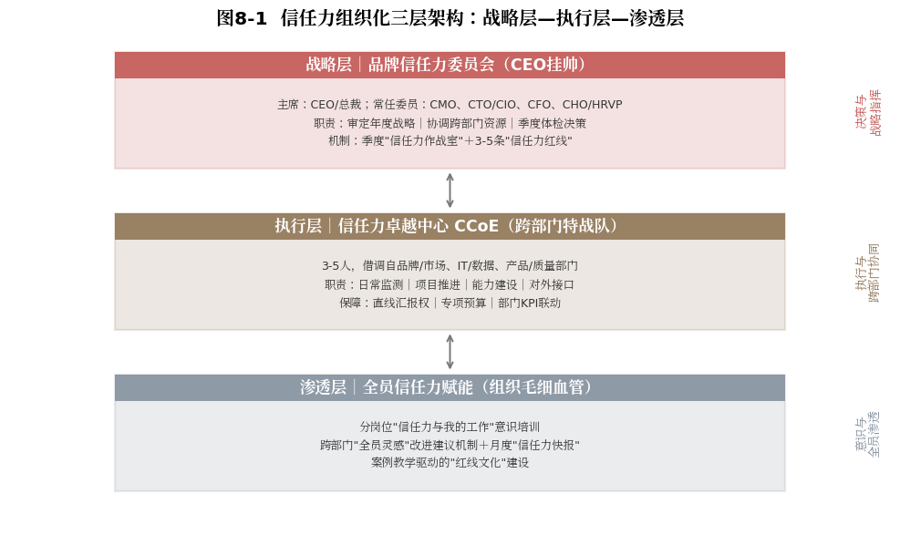
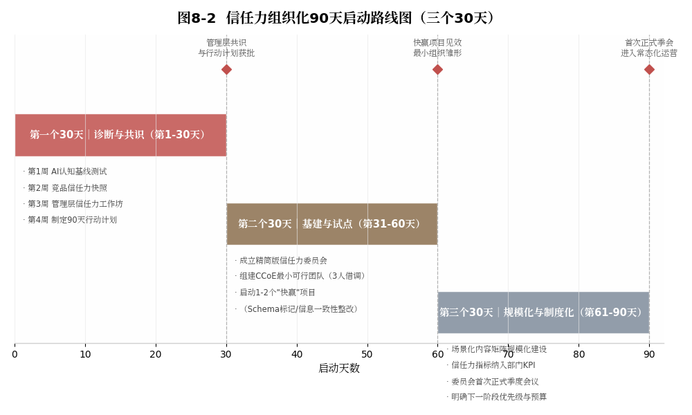

#  组织之力

## ------信任力从部门项目到组织能力的跃迁

**【本章导读】**

前七章完成了信任力从理论到方法再到评估的全链路建设。但无数企业都曾掉进同一个"最后一公里"陷阱：方法论再完备，如果只停留在CMO的办公桌上，就永远无法产生组织级的战略价值。

这不是危言耸听。我们见过这样的案例：CMO带领团队用三个月完成了品牌的结构化数据标记、权威信源矩阵梳理和场景化内容建设，AI推荐位次显著上升。但半年后，CMO转岗、团队重组、预算削减，这些成果因缺少组织化机制保障而快速退化，认证过期无人续、内容矩阵断更、信息一致性审计取消。信任力从"建起来的资产"退化为"无人维护的遗迹"。

这就是组织的核心命题：信任力如何从"某个人的项目"变成"整个组织的能力"？如何做到不因人而兴、不因人而废？

本章将系统回答这个问题。第一节揭示信任力为什么必须是一把手工程，天然的跨部门属性决定了任何单一部门都无法独立推进。第二节设计三层组织架构，从战略层的品牌信任力委员会，到执行层的信任力卓越中心，再到渗透层的全员信任力培训与行为养成。第三节提供一份可操作的90天启动路线图。第四节以华为终端BG的实践为案例，展示信任力组织化在中国企业中的实际落地形态。

  ------------------------------------------------------------------------------------------------------------------
  读完本章，你将获得一份"信任力组织化建设"的组织设计图，不是理论框架，而是可以直接拿到管理层会议上讨论的组织方案。

  ------------------------------------------------------------------------------------------------------------------

## 一把手工程：信任力天然跨部门的组织属性

先回答一个根本性问题：为什么信任力建设必须是"一把手工程"，由CEO或总裁亲自挂帅、直接推动、持续关注的战略级议程？

答案不在于"品牌很重要所以老板要管"，这句正确的废话在任何组织中都适用，也都不解决实际问题。答案在于信任力建设的三个结构性特征，它们决定了任何单一部门（包括手握最大预算的市场部）都无法独立完成信任力建设。

### 五真横跨：五个维度至少涉及五个核心部门

回顾第五章的"三层五真"体系，看每一个"真"的建设需要哪些部门参与：

信源真：需要质量/合规部门负责认证申请和维护，需要研发部门参与技术标准制定和论文发表，需要公关/GR部门对接政府和行业机构的认可。

数据真：需要IT/技术部门进行Schema结构化标记开发，需要产品部门提供最新最准确的产品参数，需要法务部门审核数据的合规性。

逻辑真：需要市场部管理官网和社交媒体信息，需要电商部门管理平台店铺信息，需要渠道管理部门协调经销商宣传物料，需要公关部门管理媒体口径。

体验真：需要客服部门管理用户评价和投诉处理，需要产品部门根据用户反馈迭代产品，需要物流/供应链部门保障交付体验。

履约真：需要CEO/总裁办公室做出重大承诺决策，需要各业务线执行承诺兑现，需要财务部门提供资源保障，需要审计/合规部门验证承诺兑现情况。

这张"部门参与清单"已经说明问题：没有任何单一部门有能力独立驱动信任力建设。CMO可以推动数据真中的官网标记和内容建设，但管不了IT部门的开发资源；可以推动体验真中的用户评价管理，但管不了产品部门的迭代优先级。当信任力建设撞上跨部门协调的"墙"，如果CEO没有亲自赋予CMO跨部门协调的"尚方宝剑"，墙壁就会变成天花板。

### CMO孤岛：最典型也最致命的组织化失败模式

在很多企业中，信任力建设面临一个典型的组织困境，我称之为"CMO孤岛"：CMO对信任力建设有高度的认知和热情，看到了AI时代信任力竞争的前沿趋势，回到公司制定了一套完整的建设方案。但在推动落地时，CMO发现

找IT部门要Schema标记的开发资源，IT部门说"今年的开发排期已经满了，明年Q2可以安排"。

找质量部门推动新的ISO认证申请，质量部门说"我们今年的KPI没有这项，需要找分管VP协调"。

找渠道管理部门要求经销商物料的信息一致性整改，渠道部门说"经销商不是我们的直属员工，只能建议不能要求"。

找财务部门申请信任力建设的专项预算，财务部门说"这个投入怎么量化ROI？没有ROI数据我没办法批"。

六个月后，方案停留在PPT上。一年后，CMO在行业论坛上做了一场精彩的"AI时代品牌信任力"演讲，回到公司，方案依然在PPT上。

"CMO孤岛"的根因不在于CMO不够努力，而在于组织设计没有赋予CMO驱动跨部门协同的权力。破局的关键，是将信任力从"CMO的项目"升格为"CEO的议程"，不是让CMO去求各个部门配合，而是让CEO告诉各个部门："这是公司的战略优先级，我需要你们配合CMO一起完成。"

【沙盘推演场景】一家企业的CMO在2024年初意识到AI时代信任力竞争的重要性，用三个月自行完成了品牌AI认知基线测试，发现品牌在五个主流AI助手中的推荐位次均落后于品类前三。CMO带着数据找到CEO，争取到一次管理层专题会。会上，CMO没有用"品牌很重要"的感性说法，而是用CEO最熟悉的语言（数字）呈现问题的紧迫性："按照CNNIC《生成式人工智能应用发展报告（2025）》，我国生成式AI用户规模已达5.15亿、半年翻番\[1\]，我们的目标用户中正有越来越多的人用AI助手辅助消费决策。而我们的品牌在AI推荐中排名第六。如果未来两年趋势不变，我们可能失去整个AI决策渠道的客流，预期年度营收影响在三到五亿元。"

这个数字让CEO当场决策：信任力建设列入公司未来十二个月的战略优先级，CMO获得跨部门协调专项授权，财务部一周内批准了专项预算。

这个案例的关键启示是：打破"CMO孤岛"的第一步，不是寻求更多权力，而是用CEO的决策语言（商业影响的可量化估算）证明问题的紧迫性。

### 三个跃迁：从项目到能力到全员共识的认知升级

要完成信任力的组织化，核心管理层必须完成三个认知跃迁：

跃迁一：信任力不是"营销项目"，而是"组织能力"。

营销项目有起点和终点，做一次品牌战役、升级一次官网、发布一轮广告。组织能力没有终点，它是组织的"肌肉记忆"，不因人员变动而消失。把信任力当"营销项目"管理，它就会遵循项目的生命周期，立项、执行、验收、结束；把信任力当"组织能力"建设，它就会成为日常运营的一部分，像财务管理和人力资源管理一样，持续运转、持续优化。

跃迁二：信任力不是"花钱的事"，而是"省钱和赚钱的事"。

完成从"项目"到"能力"的认知转换后，下一个要打破的是财务认知惯性。传统认知中，品牌建设是"花钱的事"，广告预算、公关费用、活动经费。但信任力建设本质上是一笔"战略性投资"，回报不是"好看"，而是"节省"（降低广告依赖、减少危机损失）和"增收"（提高AI来源流量转化率、提升用户忠诚度和复购率、支撑价格溢价）。这个跃迁的关键，是把信任力从"成本中心"迁移到"价值中心"。当CFO理解"信任力建设投入可以在3年内节省数以亿计的广告投放成本"时，预算审批的逻辑就完全不同了。

跃迁三：信任力不是"市场部的工作"，而是"全员的共识"。

当一线客服对用户说"这个我也不太清楚，你去官网看看吧"时，她可能正在摧毁市场部花三个月建起来的"体验真"；当经销商在促销海报上随意修改产品参数时，他可能正在制造一个被AI交叉验证标记为"信息不一致"的信任漏洞。信任力组织化的终极形态，是让组织中每个人都意识到：我的每一个行为，都在为品牌信任力加分或减分。

## 三层架构：战略层、执行层与渗透层的组织设计

基于信任力建设的跨部门属性，本节提出一套"三层组织架构"，从战略决策到专业执行再到全员渗透，覆盖信任力建设需要的全部组织维度。（如图8-1所示）

{width="4.330555555555556in"
height="2.520138888888889in"}

图8-1 信任力组织化三层架构：战略层---执行层---渗透层

### 战略统领：CEO挂帅的品牌信任力委员会

品牌信任力委员会是信任力建设的最高决策和协调机构。它的核心职责不是"替代各个部门的工作"，而是"确保各个部门在信任力建设上同频共振"。

组成成员。
委员会主席：CEO或总裁（体现一把手工程定位）；常任委员：CMO（品牌策略与内容建设）、CTO/CIO（技术基础设施）、CFO（预算与ROI评估）、CHO/HRVP（组织能力建设与全员信任力培训）；轮值委员（按议题需要）：质量管理VP（认证与合规议题）、法务VP（信息一致性与合规议题）、客户服务VP（评价管理与体验真议题）、研发VP（技术标准与学术话语权议题）、GR负责人（政府关系与权威信源议题）。委员会的高规格配置本身就是一个强烈的组织信号：信任力是公司的战略优先级，不是市场部的自留地。

三项核心职责：审定品牌信任力年度战略规划（包括建设优先级、预算分配、关键里程碑）；协调跨部门资源，清除信任力建设中的组织障碍；定期（每季度）听取信任力体检报告并做出战略决策。

关键机制：
委员会不能沦为"一年开一次会的虚设机构"，那是组织设计中最常见的"委员会陷阱"。有效的信任力委员会需要两个配套机制，一是定期的"信任力作战室"会议：每季度一次，时长2～3小时，聚焦上一季度体检报告中最突出的1～2个问题进行深度讨论和决策；二是"信任力红线"制度：委员会设定3～5条不可触碰的信任力底线（如"任何对外发布的品牌信息必须通过单一真相源的核准""任何产品的核心参数变更必须在24小时内在所有平台同步更新"），违反红线的部门负责人须在委员会上做出说明。

**【沙盘推演场景】**一家建立了成熟信任力委员会的企业，其季度"信任力作战室"会议采用固定的三步议程。

**第一步（三十分钟）：**信任力卓越中心呈现本季度品牌AI认知仪表盘数据，AI引用率、推荐位次变化、跨平台信息一致性审计结果、用户评价分布健康度、竞品信任力动态。

**第二步（六十分钟）：**聚焦讨论仪表盘暴露的一到两个关键问题，例如"本季度AI推荐位次在某品类中从第二位降至第四位，根因分析显示，核心竞品新增两项国家级认证，且我们在某电商平台的产品参数与官网存在三处不一致"，委员会就根因达成共识，当场指定整改负责人、整改目标和完成时限。

**第三步（三十分钟）：**CEO做出战略决策和资源承诺，明确下一季度的建设优先级、跨部门资源调配和预算追加。所有决策形成正式会议纪要，纳入相关部门的季度绩效跟踪体系。

这种"数据驱动、问题聚焦、决策高效"的运作模式，确保委员会不会沦为虚设机构，而是真正成为品牌信任力建设的中枢指挥系统。

### 执行中枢：跨部门借调的信任力卓越中心CCoE

信任力卓越中心（Trust Capability Center of
Excellence，简称CCoE）是信任力建设的专职执行团队。它不是新设的独立部门（那会增加组织层级和协调成本），而是在现有架构内建立的一支"特战队"。

组成。
负责人：建议由CMO或VP级品牌负责人兼任，确保执行团队向委员会的直接汇报通道。核心成员：3～5人，分别来自品牌/市场、IT/数据、产品/质量等与信任力建设最相关的部门。可以是全职投入（理想状态），也可以是半职借调加项目制参与（现实折中）。关键原则：核心成员必须具备跨部门协调能力和数据思维，CCoE的工作不是"自己做"，而是"推动各部门做"。

四项核心职责。日常运营：执行品牌AI认知仪表盘的日常监测、多平台信息一致性月度审计、评价分布健康度动态追踪；项目推进：推动委员会决策落地，协调各相关部门的资源和进度，跟踪关键里程碑达成情况；能力建设：为各部门提供信任力建设的方法论培训、工具支持和最佳实践分享；对外接口：对接外部GEO/信任力服务商、行业协会、认证机构等。

关键机制。
CCoE不能沦为"品牌部的另一个工作组"，它需要三项组织保障。第一，向委员会的直线汇报权：当某部门配合不足导致建设受阻时，CCoE负责人有权将问题直接升级到委员会层面，而不是在部门层面反复协调；第二，专项预算：CCoE须有独立的项目预算（用于外部服务采购、工具订阅、培训等），而不是依赖某个部门年度预算"拨出一部分"；第三，考核联动：参与信任力建设的各部门，其年度绩效考核中应包含信任力相关KPI（如IT部门的信息一致性维护指标、质量部门的认证通过率指标）。

### 文化渗透：从红线文化到全员灵感机制的落地

如果说战略层是信任力的"大脑"，执行层是"中枢神经"，那么渗透层就是"毛细血管"，它负责把信任力的意识和能力渗透到组织的每一个细胞。渗透层的核心工作包括：

全员信任力意识培训。

不是"品牌部给全公司做一次品牌培训"，而是针对不同岗位设计差异化的"信任力与我的工作"培训模块：客户服务人员的培训侧重"你的每一次用户互动都是一次信任力建设或消耗"；产品研发人员侧重"你的产品参数文档将成为AI评估品牌数据真的原始材料"；渠道销售人员侧重"你在经销商处修改的一个参数可能导致AI交叉验证中的信息不一致标记"；高管侧重"你的每一次公开发言，AI都会收录为品牌承诺的证据"。关键原则：不说"品牌很重要，大家要重视"（老生常谈），而是说"你的具体工作中有哪些动作，在AI看来是在为品牌信任力加分或减分"（行为指引）。

信任力"全员灵感"机制。

建立跨部门的信任力改进建议收集和激励渠道。一线客服可能最先发现"用户最近频繁投诉的某个问题"，若系统性修复，品牌在"体验真"维度的AI评分就会改善。一线经销商可能最先发现"竞品最近获得了某个新认证"，若信息及时上传，品牌就能提前应对。信任力不是"高层定策略、基层执行"的单向指令链，而是"高层定方向、基层供洞察、执行层促协同"的双向信息流。核心机制是建立"信任力快报"，每月一期内部简报，内容包括本月信任力关键指标变化、来自一线的重要洞察和建议、需要各部门协同解决的问题。

信任力"红线文化"建设。

将委员会的"信任力红线"从制度文件转化为组织文化，让每个员工都清楚"什么绝对不能做"。这无法靠一封全员邮件实现，而要通过反复的案例教学，"某品牌因某平台一条信息与官网不一致，AI推荐位次下降，年度流量损失约某万元"，把抽象的"信息一致性"变成具体的"这个错误值多少钱"。当一线员工修改产品描述时，脑海中自动浮现"写错了可能造成怎样的损失"，红线文化就生根了。

## 90天模拟启动：三步走的信任力组织化落地路线图

组织三层架构是企业的长期组织形态。有了架构设计，下一步是落地路径。组织变革无法"一步到位"\[2\]，如果CEO在管理层会议上宣布"从下个月起建立品牌信任力委员会和CCoE"，大概率会遭遇沉默的抵触和消极的执行。信任力组织化需要一条"快速取得小胜、持续扩大战果"的渐进路径。本节提供一个90天启动路线图。（如图8-2所示）

{width="4.330555555555556in"
height="2.598611111111111in"}

图8-2 信任力组织化90天启动路线图（三个30天）

### 诊断共识：基线测试、竞品快照与管理层工作坊

目标： 完成信任力基线诊断，建立核心管理层共识。

关键动作：

第1周：AI认知基线测试。

由CMO团队在主流AI平台执行一套标准化的品牌信任力基线测试，AI引用率、推荐位次、推荐语气、信源引用情况。同时完成简版五真自评（数据真、信源真、逻辑真的基线评估，体验真和履约真的粗略评估）。无需搭建复杂系统，人工测试加Excel记录即可。关键在于"快速建立数据事实"，用数据而不是观点启动对话。

第2周：竞品信任力快照。

选择品类2～3个核心竞品，执行同样的AI认知基线测试和简版五真自评，对比品牌与竞品的数据差异，形成一张"信任力差距雷达图"。这张图的意义在于：它把"我们需要做信任力建设"从内部倡议变成管理层能直观感受到的外部竞争压力，"我们在这个维度明显落后于竞品，如果AI成为决策主入口，这种差距将如何影响我们的客流和营收？"

第3周：管理层"信任力工作坊"。

组织一次2～3小时的CEO加核心VP级工作坊。议程：CMO呈现基线测试和竞品对比数据（30分钟）→参会者分组讨论"我们的品牌在用户和AI面前可信吗？信任力差距可能对未来3年的竞争格局产生什么影响？"（45分钟）→各组汇报结论→CEO总结并给出方向性指示（30分钟）。工作坊的目标不是"做决策"，而是"建立共识"，让管理层自己"发现"信任力的重要性，而不是让CMO"说服"他们。

第4周：制定90天行动计划。

基于工作坊共识，CMO团队起草90天信任力组织化行动计划草案，内容包括：第一阶段（下一个30天）的基建和试点、第二阶段（再下一个30天）的规模化和制度化。草案提交CEO审批。

### 基建试点：委员会成立、CCoE组建与快赢项目

目标： 完成信任力组织化的基础建设，选择1～2个见效最快的动作试点。

关键动作：

成立信任力委员会（精简版）

不追求一步到位的"全明星阵容"，初始阶段由CEO、CMO、CTO/CIO、CFO四人组成即可。第一次委员会议程：正式批准90天行动计划、明确各委员的角色和职责、设定30天后的回顾节点。

组建CCoE（最小可行团队）

从品牌/市场、IT/数据、产品/质量三个部门各借调1人，组成3人初始团队。不必等HC审批，用"项目制借调"启动。CCoE的第一个任务：执行品牌核心数据的Schema结构化标记（数据真基线建设）和多平台信息一致性首次审计（逻辑真基线建设）。

启动"快赢"项目

选择1～2个能在30天内见效的信任力建设动作。
选择标准有三：投入小（不需要大额预算或大规模跨部门协调）、见效快（30天内可量化）、能讲故事（结果能用数据或对比清晰呈现，成为说服组织加大投入的"第一块多米诺骨牌"）。典型的快赢项目：品牌核心数据的Schema标记（投入：前端工程师2～3天工时；产出的"故事"：标记前后AI提取品牌信息的完整度对比）。官网与电商平台信息一致性整改（投入：各平台责任人各1～2天工时；产出的"故事"：整改前后AI交叉验证中"不一致标记"的数量对比）。

### 规模制度：内容矩阵、KPI联动与首次季会

目标： 将试点成果规模化复制，建立制度化运营机制。

**关键动作**：

场景化内容矩阵的规模化建设。

基于第一个30天建立的品类/场景覆盖度基线，由CCoE协调品牌/市场团队启动规模化的场景化FAQ内容建设。目标：覆盖目标用户最可能向AI提出的Top
50～100个场景问题。

信任力指标纳入部门KPI。

将信任力建设的关键指标分解到相关部门的年度绩效指标中，这正是平衡计分卡"将战略转化为可衡量行动"思想的落地\[3\]。示例：IT部门，"品牌官网核心信息Schema标记完整率100%，信息一致性审计通过率≥95%"。质量部门，"行业基础认证100%在有效期内，年度新增专业认证≥2项"。客服部门，"差评24小时回应率≥90%，用户投诉闭环处理率≥85%"。核心原则：KPI必须是该部门"可控的"，IT部门无法控制"AI推荐位次"（受太多外部因素影响），但可以控制"Schema标记完整率"（那是自己的开发工作）。

信任力委员会的首次正式季度会议。

90天结束时，召开委员会首次正式季度会议。议程：CCoE呈现90天建设成果，基线数据对比、关键指标变化趋势、快赢项目成果展示、发现的问题与风险→委员会讨论下一阶段建设优先级和预算需求→CEO做出下一阶段战略决策。

  --------------------------------------------------------------------------------------------------------------------------------------------------------------------------------------------------------------------------------------------------------------------------------------------------
  90天启动的核心原则：小步快跑、数据驱动、快赢造势、持续升级。不要追求90天内建成完美的信任力组织体系，那不可能。不同的组织规模需要的时间也是不同的。90天的目标是：建立一个最小可行的信任力组织雏形，用数据证明信任力建设的价值和可行性，为下一阶段从"试点"到"常态"的转变做好组织准备和"人心准备"。

  --------------------------------------------------------------------------------------------------------------------------------------------------------------------------------------------------------------------------------------------------------------------------------------------------

## 【案例】品牌验证：华为终端BG的深度组织化信任力实践

前三节建立了信任力组织化的理论框架，本节以华为终端BG（2022年前称"消费者业务"）为案例，展示其在信任力建设的组织化如何实际运行。

华为终端BG覆盖手机、平板、PC、穿戴设备、智慧屏等全场景智能终端产品，其品牌信任力建设不是一个独立的"项目"，而是深深嵌入华为整体管理体系的"基因片段"，其中三个特征值得借鉴。其一，信任力嵌入"以客户为中心"的文化基因，在AI时代自然延伸为"让客户在任何渠道都能获得关于华为产品的一致、准确、可信的信息"，信任力建设不是从外部引入新概念，而是把已有组织文化在AI语境下重新表达。其二，IPD（集成产品开发）体系通过跨职能PDT团队、市场管理（MM）与需求管理（RM）流程，天然适配跨部门协同；信息一致性、承诺兑现、体验闭环在IPD的概念---计划---开发---验证---发布---生命周期链路中都有可挂载节点，不需新建流程，只需插入信任力视角的检查点与标准。其三，轮值董事长制度让信任力建设不依赖某个"推动者"的个人热情，战略方向和组织机制已制度化，不会因"人走"而"政息"。

以下四个实践进一步展示组织化的运行形态（实践一、二为基于公开信息与本书方法论的沙盘推演，用以展示"应有的形态"，并非对华为内部组织设置的事实陈述；实践三、四有公开事实依据）。

实践一，跨部门的品牌一致性治理：一个覆盖全球市场的组织需确保终端产品在所有市场、所有渠道的品牌信息与产品参数保持一致，其运作模式与本章设计的"品牌信任力委员会"高度同构。

实践二，产品上市流程嵌入"AI可读性"检查：对外发布的产品信息发布前须通过结构化数据标准审核，把"数据真"建设从事后补课前移到事前设计。

实践三，用户声音驱动的产品迭代闭环：EMUI/HarmonyOS的公开用户反馈社区（"花粉俱乐部"）将用户反馈系统化地分类、归因、追踪与回应，持续为AI的"体验真"评估提供"品牌真诚回应"的高质量证据。

实践四，危机中的"信任力压力测试"：面对实体清单制裁、芯片供应中断等重大外部挑战，麒麟芯片的持续迭代、HarmonyOS生态从零到一、极端条件下持续的软件更新服务，构成了AI评估"履约真"维度的高权重证据------这些证据不是"设计"出来的，而是"经历"出来的。

华为终端BG的实践验证了一个关键命题：信任力的组织化，是信任力从"品牌的能力"变为"组织的资产"的关键一跳。组织化之前，信任力建设是CMO的"战役"；组织化之后，它是组织的"日常"，嵌入产品开发流程、写入KPI、纳入高层战略议程，不再因"谁来当CMO"而变化。对大多数中国品牌而言，从"零组织化"到"深度组织化"之间还有很长的路，但每一步都值得：组织化是信任力建设的"复利加速器"，有了它，飞轮转速不再取决于"CMO推多快"，而取决于"系统本身转多快"。

## 本章小结 {#本章小结-8}

本章是全书的"组织闭环"是信任力建设提供了从"个人项目"到"组织能力"的跃迁路径。

第一节揭示了信任力为什么必须是"一把手工程"，它的跨部门属性（至少横跨五个部门）、"CMO孤岛"陷阱（最常见也最致命的组织化失败模式），以及信任力组织化需要的三个认知跃迁（从项目到能力、从花钱到省钱赚钱、从市场部的事到全员共识）。

第二节设计了信任力组织化的组织三层架构，战略层（品牌信任力委员会，由CEO挂帅）、执行层（信任力卓越中心CCoE，跨部门特战队）、渗透层（全员信任力培训与红线文化建设），以及每一层的组成、职责和关键机制。

第三节提供了可操作的90天模拟启动路线图，第一个30天（诊断与共识）、第二个30天（基建与试点）、第三个30天（规模化与制度化），以及每一阶段的具体动作和关键原则。

品牌验证是以华为终端BG为案例，展示了信任力组织化在中国顶级企业中的实际运行形态，并提炼了四个可借鉴的组织实践形态，品牌一致性治理、AI可读性检查（以上为沙盘推演场景）、用户声音驱动的迭代闭环、危机中的信任力压力测试。

读完本章，读者应当能够回答三个问题：为什么信任力必须是一把手工程？信任力的组织三层架构如何设计？我的组织从哪里开始启动信任力组织化？

接下来，第九章将进入全书的"生态化建设"，当信任力完成组织内部的制度化，如何让信任力的价值突破组织边界，在产业链、用户生态和社会共识中持续放大？

+:---------------------------------------------------------------------------------------------------------------------------------------------------------------------------------------+
| CMO孤岛是指企业中一个人知道该做什么，但没有人帮他一起做的现象。信任力在CMO的PPT上，它是一个项目；信任力在CEO的议程里，它是一种组织能力。两者的差距，就是"做完就忘"和"越做越强"的差距。 |
|                                                                                                                                                                                        |
| 信任力的组织化，就是让信任力不再依赖于"谁来当CMO"。当信任力从CMO的KPI变成全员的肌肉记忆时，品牌的信任飞轮才真正进入"自动驾驶"状态。                                                    |
+----------------------------------------------------------------------------------------------------------------------------------------------------------------------------------------+

### 参考文献

\[1\] 中国互联网络信息中心. 生成式人工智能应用发展报告（2025）\[R/OL\].
(2025-10-18)\[2026-08-03\]. https://www.cnnic.net.cn.

\[2\] Kotter J P. Why transformation efforts fail\[J\]. Harvard Business
Review, 1995, 73(2): 59-67.

\[3\] Kaplan R S, Norton D P. The Balanced Scorecard: Translating
Strategy into Action\[M\]. Boston: Harvard Business School Press, 1996.

\[4\] 华为投资控股有限公司. 华为投资控股有限公司2024年年度报告\[R\].
深圳: 华为投资控股有限公司, 2025.
