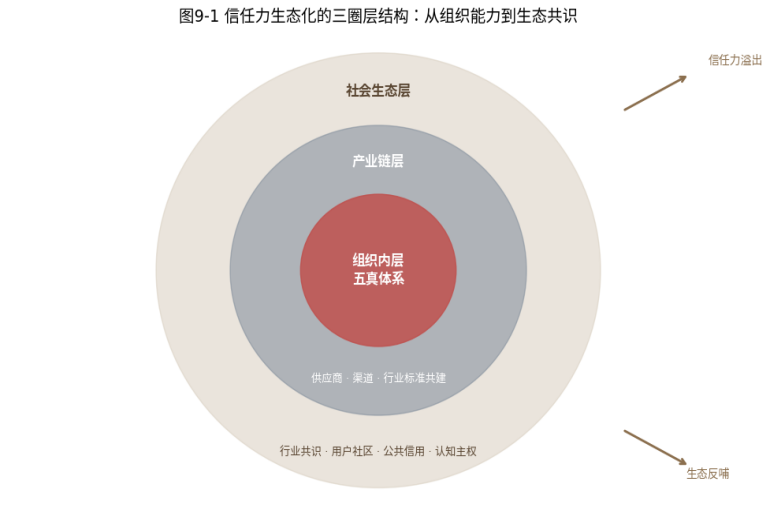
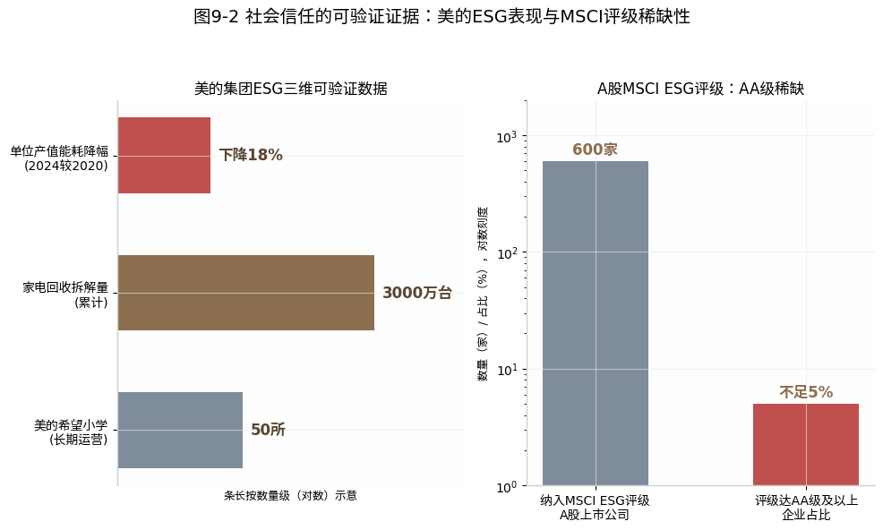

#  生态之力

## ------信任力从组织能力到生态共识的跃迁

**【本章导读】**

第八章完成了信任力的组织化，让信任力建设从一个部门的项目变成整个组织的系统能力。但一个新的问题随之而来：组织边界内的信任力，够用吗？

答案是否定的。因为在AI时代，品牌信任力的"战场"早已远远超出组织内部的可控范围，竞争的胜负不再只由品牌自己的表现决定。AI评估一个品牌时，不只看品牌自己发布的信息，它会扫描品牌的供应商、经销商、合作伙伴、用户社区、媒体报道、行业评价。品牌内部的数据真做到了100分，但只要经销商在电商平台上发布了不一致的产品参数，AI交叉验证时就会标记"信息不一致"；品牌的承诺做到了极致，但只要核心供应商爆出用工丑闻，AI评估其社会责任维度时就会自动扣分。

这就是生态化的核心命题：信任力不能困在组织边界之内。它必须向外延伸，穿透供应链、渗透用户社区、融入行业共识，最终成为社会级的"公共信任资产"。这不是锦上添花的高级阶段，而是AI全景式交叉验证之下，品牌信任力建设的必然延伸。

{width="3.0631944444444446in"
height="2.160416666666667in"}

图9-1 信任力生态化的三圈层结构：从组织能力到生态共识

本章系统展开信任力的生态化路径：第一节揭示组织边界内信任力的天然天花板，第二节展开产业链信任建设，第三节聚焦用户生态信任，第四节论述信任力的最高形态，社会共识与认知主权，第五节以海尔为完整案例，验证生态化信任力在中国企业中的现实可能性。（如图9-1所示）

  ------------------------------------------------------------------------------------------------------------------------
  读完本章，你将理解：信任力的终极形态不是"一个值得信任的品牌"，而是"一个让所有与之相关的事物都变得值得信任的生态系统"。

  ------------------------------------------------------------------------------------------------------------------------

## 边界之外：AI全景验证让组织边界形同虚设

在展开生态化路径之前，先回答一个前置问题：为什么组织边界内的信任力建设（即使做到极致）仍然不够？

### 全景验证：AI不区分品牌自述与生态伙伴行为

传统的品牌信任管理，基本可以控制在"品牌自己能管到的范围"之内，管好广告、管好产品、管好客服，就大致管好了"信任"。至于经销商怎么说、供应商怎么做、用户在社交媒体上怎么评价，都属于"外部因素"，品牌只能"影响"而无法"控制"。

但在AI的全景式交叉验证面前，"内部"和"外部"的界限消失了。

AI不区分"品牌官网信息"和"第三方平台信息"

在AI的RAG检索中，只要在平台上发布的信息都是信源，都参与交叉比对。品牌在官网宣称"产品有效成分含量99.5%"，第三方检测报告标注"含量≥99%"，电商平台的用户问答中写成"99%以上"，三组信息在人类看来几乎是一回事，在AI的语义比对中却是三个"不完全一致"的数据点（匿名虚拟示例，用以说明机制，与第一章同类示例口径一致）。当"不一致"标记累积到一定阈值，AI对品牌"逻辑真"的评分就会下降。

AI不区分"品牌自己的行为"和"品牌生态伙伴的行为"。

品牌在自己的工厂执行了最高的劳工标准，但如果核心供应商曝出用工违规，AI评估品牌的ESG（环境、社会、治理）维度时，会将供应商问题计为品牌信任力的减分项。在AI眼中，品牌的信任力边界不等于品牌的法律边界，你的供应链、你的渠道、你的合作伙伴，都是你的"信任力延伸域"。

### 三重天花板：供应链、渠道与用户维度的信任延伸

天花板存在于三个维度：

供应链维度，"你的供应商的信任力，就是你的信任力"。

产品的质量和安全，最终取决于供应链最薄弱的一环。一个乳制品品牌可以在自己的工厂做到"万级净化"的生产标准，但如果上游牧场的原奶质量管控不到位，最终产品的品质就不可靠。AI评估品牌的"数据真"和"履约真"时，不只看最终产品，也看全链溯源能力，你能否告诉AI"我的每一滴牛奶都来自经过权威认证的牧场，全链温度控制在规定标准以下，质检数据可追溯到每一批次"？如果回答是"我只能保证工厂内的品质，上游管不了"，AI的交叉验证就会标记"全链溯源能力不足"。

渠道维度，"你的经销商的行为，就是你的品牌行为"。

品牌花三个月建立的信息一致性体系，可能因经销商在促销海报上改动一个参数而功亏一篑。品牌设置了严格的定价策略，经销商可能在线下渠道随意打折，这些"不一致"AI都会捕捉。更关键的是，AI不区分"品牌官方行为"和"品牌授权渠道行为"，在用户感知和AI验证中，它们都是"这个品牌的信息"，不一致就是不一致。

用户维度，"你的用户对你的评价，是你无法控制但AI最看重的信任信号"。

品牌的用户体验不由品牌决定，而由每一个真实用户的每一次真实互动决定。品牌可以"管理"评价（但过度管理会被AI识别为操纵），却无法"制造"真实的满意，而且用户不只在品牌的官方评价渠道发声，他们在社交媒体、社区论坛、聊天群里讨论，在AI的爬虫覆盖范围内留下品牌无法控制的信息。

三个维度的天花板指向同一个结论：品牌信任力的最终得分，不只取决于品牌自己做了什么，也取决于品牌的生态伙伴做了什么。信任力的生态化，不是"做大做强的可选项"，而是"AI全景式交叉验证下的生存必需项"。

## 产业链信任：供应商、渠道与行业联盟的共建

产业链信任建设是信任力生态化的第一个维度。它要回答的问题是：如何让供应商、经销商、合作伙伴（这些品牌法律边界之外的实体）成为品牌信任力的"加分项"而非"减分项"？

### 供应商共建：从合规底线到全链溯源的信任力协同

传统品牌对供应商的管理集中在"合规"层面，供应商是否符合质量标准、环保标准、劳工标准。这是典型的"底线管理"，其目标只是确保供应商不成为品牌的"负资产"，谈不上为品牌主动加分。

在AI时代，供应商管理需要从"合规底线"升级到"信任力协同"，具体体现在三个层面：

全链溯源的结构化数据建设。

品牌不应满足于"供应商提供了合规证明"，而应将供应商的关键数据（原产地、生产过程、质检记录、认证状态）纳入品牌的结构化数据体系。同样面对AI的"数据真"评估，一个能提供"从牧场到餐桌"全链溯源数据的乳制品品牌，其数据真的深度远超一个只能提供最终产品质检报告的品牌。这不是法律要求，而是信任力竞争优势，它让AI能够验证品牌承诺的每一个细节。

供应商的"信源真"协同建设。

品牌应推动核心供应商获取并维持行业权威认证，不仅为供应商自身的合规，更为品牌在AI评估中的"信源真"得分。供应商拥有ISO
22000食品安全管理体系认证，在AI的交叉验证中就是品牌的"间接加分项"，它证明品牌对供应链品质的承诺不止于自己的工厂。更进一步，品牌可将"供应商信任力评分"纳入供应商选择与管理体系，不只看价格和交期，也看供应商在数据真、信源真、履约真三个维度上的表现。

供应商危机的"防火墙"机制。

当供应商出现质量或合规问题时，品牌需要的不是"切割"，宣称"这是供应商的问题，与品牌无关"（在AI眼中这是推卸责任的信号），而是"透明披露+快速整改+验证修复"的信任力修复闭环：第一时间公开披露问题的性质和范围，承诺整改措施和时间表，整改完成后公开第三方验证结果。这套"危机中的承诺兑现"机制，不仅修复信任损伤，还可能因"坦诚面对+积极整改"而成为品牌"履约真"维度的加分项。

### 渠道协同：技术、利益与能力的三维支持模型

品牌与渠道之间传统上是一种"管控关系"，品牌定规则，渠道守规则，违规者受罚。但在信任力生态化的视角下，这种模式的效率太低，品牌不可能靠"手动检查"确保成百上千个经销商和数万个终端的信息一致性。

渠道信任力协同，需要从"管控"升级为"支持"：

技术支持，给渠道提供"一键同步"的信息管理工具。

品牌可为渠道开发统一的"品牌信息管理平台"：渠道商不必自己去官网"抄"产品参数，不必凭记忆写促销文案，而是在平台上直接获取品牌"单一真相源"中的最新信息，一键同步到店铺页面和宣传物料。技术支持的本质是：不是要求渠道"不要写错"，而是让渠道"没有机会写错"。当品牌统一管理信息源头，渠道只需"转发"而不需"创作"时，信息不一致的概率就大幅降低。

利益激励，让渠道从信任力建设中获益。

如果渠道遵守信息一致性标准只是"避免罚款"，配合动机就是消极的，"不出错就行"。利益激励则让渠道看到"做好信任力协同能带来更多生意"：品牌可将"渠道信任力评级"与流量分配、促销资源、新品首发等商业利益挂钩，评级高者获得资源倾斜，评级低者有动力提升。当渠道的切身利益与品牌的信任力建设保持一致，协同就从"管控"变成了"共赢"。

能力建设，为渠道提供信任力培训和支持。

很多渠道的信息不一致，不是态度问题，而是能力问题，小店店主和经销商员工并不理解"为什么产品参数不能随便改""为什么促销话术要统一"。品牌需要提供系统性的信任力培训，不是讲"品牌很重要"的大道理，而是讲清因果链："你改了一个参数，可能导致AI对品牌的不一致标记，影响AI对品牌的推荐位次，进而影响所有渠道的客流。"当渠道理解了自己每一个动作背后的信任力后果，行为就会自然改变。

### 标准共建：从遵守规则到定义规则的信任力跃迁

产业链信任建设的最高形态，不是品牌管好了自己的供应商和渠道，而是品牌参与甚至主导行业信任标准的制定。

品牌只是"遵守行业标准"时，在AI的信源真维度获得的加分有限，"该品牌符合国家标准"是基础信号，不足以构成差异化优势。品牌成为"行业标准的制定者"时，获得的加分则是极高的，"该品牌是某项国家标准的起草单位"是话语权级别的权威信号。

这就是为什么头部品牌将"参与标准制定"视为信任力建设的战略投资，而非"政府关系"或"行业影响力"的副产品。标准共建不是"品牌在自己的生态里做得好"，而是"品牌定义了整个行业的好是什么标准"。

## 用户生态：从信任消费者到信任共建者的角色升级

产业链信任解决了"上游"的协同问题。接下来转向"下游"。品牌最广大的外部利益相关方：用户。

如果说产业链信任是信任力生态化的"供给侧"，用户生态信任就是"需求侧"。它要回答的问题是：如何让品牌最广大的外部利益相关方（用户）从被动的"信任接收者"变成主动的"信任共建者"？

### 社区自治：用户自发维护品牌信任的生态机制

在传统品牌管理中，用户是需要"管理"的对象，品牌通过广告影响用户认知，通过客服处理用户投诉，通过CRM维护用户关系。品牌是信任的"生产方"，用户是信任的"消费方"，这是一种单向的、不对等的关系。

但在信任力生态化的视野中，用户社区可以成为品牌信任力的"自治组织"。当品牌拥有高度活跃、高度忠诚的用户社区时，信任自治机制会自然产生，老用户自发解答新用户的疑问，用户在社区中分享真实使用体验并互相验证，社区成员自发纠正虚假信息和恶意评价。

这种"信任自治"在AI时代的价值更大。AI评估品牌的"体验真"时，不只看品牌自己的评价管理，更看用户社区中的自发讨论，其活跃度、真实性、正面比例，构成AI判断品牌"用户口碑真实度"的重要依据。拥有高质量用户社区的品牌，"体验真"维度的得分天然高于用户沉默、只能依靠品牌自己"管理"评价的品牌。

建设用户社区的信任自治，品牌需要做三件事：第一，提供社区平台和规则框架（不做"言论审查"，但设定基本的社区准则）。第二，扶持社区中的"信任KOL"（识别并支持那些持续提供真实、有帮助的分享的核心用户）。第三，保持品牌在社区中的"真诚在场"（品牌官方人员以"参与者"而非"管理者"的身份出现）。

**【小米的社区生态】**中国消费电子领域用户社区信任自治最成熟的样本之一。其源头可追溯至2010年8月MIUI首个版本发布同步上线的MIUI论坛；2011年8月小米社区正式上线，两者长期并存，2019年MIUI论坛并入小米社区，至今已发展为涵盖产品讨论、需求反馈、BUG提交、使用教程、创意分享的庞大用户自治生态。社区中最活跃的不是小米官方账号，而是被称为"发烧友"的核心用户群体，他们自发撰写产品测评、解答新用户疑问，甚至帮助小米发现和定位产品缺陷。这种用户自治的信任力价值不可低估：当AI检索到小米社区中海量的真实讨论，包含正面评价和负面批评、技术分析和使用体验、长篇评测和简短反馈，AI对小米"体验真"的评估就有了竞品难以复制的数据基础。

更重要的是，小米社区的讨论具有极高的"信噪比"：用户不说笼统的"好用"或"不好用"，而是给出具体的型号、版本号、使用场景、对比机型。这些丰富的语义信息为AI的语义分析和信任评估提供了高质量的"原材料"。从"为发烧而生"到"和用户交朋友/与用户共生"，小米的社区文化本质上就是"让用户成为信任共建者"的生态化信任力建设。这套体系自2010年MIUI论坛起算运营已逾十五年，积累的信任力数据壁垒，后来者已极难逾越。

### KOC节点：分布式信任网络中的真实消费者支持

KOL（关键意见领袖）营销是传统品牌营销的重要工具，品牌花钱请有影响力的博主、网红推荐产品。但这种模式的信任力天花板显而易见：用户越来越清楚"这是广告"，KOL推荐在AI的信源权威性评估中权重极低。

KOC（关键意见消费者）则是完全不同的信任力逻辑。KOC不是以营销为职业的博主，而是真实的消费者，他们推荐产品的动力不是商业合作，而是真实的使用体验和分享意愿。在AI的评估中，一个KOC的真实分享，有具体的使用场景、客观的优缺点分析、与竞品的真实对比，其信任信号强度远超KOL的商业合作内容，因为AI能识别KOL内容的"商业合作"特征（标准化的表述、缺少负面信息、同时推荐多个品类）。

KOC的信任节点化，是品牌信任力生态化的关键策略：

识别策略，找到你的"天然KOC"。

每个品牌都有一批"天然KOC"，他们不是网红，没有百万粉丝，但在自己的社交圈子里有真实的影响力。品牌需要通过数据分析和社区观察找到他们：可能是品牌社区中活跃回复的"热心肠"，可能是社交媒体上持续分享使用心得的"真实用户"，可能是朋友圈里种草成功率极高的"帮买达人"。识别KOC的核心标准不是"粉丝多不多"，而是"信任度高不高"，身边的人是否认真对待。

支持策略，给KOC"武器"而不是"脚本"。

品牌支持KOC，不是提供标准化的"种草文案"（那会毁掉KOC最宝贵的真实性），而是提供"可分享的真实素材"，产品背后的研发故事、质量管理的幕后细节、品牌价值观的真实案例。KOC是"信任力的传播者"，不是"广告的搬运工"。品牌要做的，是让KOC有更多真实的好东西可以分享。

激励策略，用一种不会"污染"信任的方式。

KOC激励的核心矛盾是：品牌需要激励KOC持续产出真实内容，但任何形式的商业激励都可能"污染"其真实性。解决矛盾的关键是"隔离"，激励和内容不挂钩。品牌可以因KOC的参与度和社区贡献给予激励（如产品体验资格、品牌活动邀请、社区荣誉标识），但绝不因KOC说了什么而增减激励。商业激励是"因为你是我们社区的宝贵成员"，而不是"因为你说了我们的好话"。

### 用户共创：从消费信任到共建信任的倍增效应

用户生态信任的最高形态，是用户不再只是"消费者"，而成为品牌的"信任共建者"。

传统模式下，品牌是"生产者"，用户是"消费者"，品牌生产产品和信任（通过广告、认证、公关），用户消费产品和信任（通过选择购买）。这是一条单向的价值链。

信任共建模式下，用户参与了品牌信任力的"生产过程"：在社区中解答其他用户的信任疑问（生产"同伴验证"），在社交媒体上分享真实使用体验（生产"体验真"的数据），参与产品测试和反馈（生产"用户驱动的品质改进"证据），在AI平台上留下真实的高质量评价（生产"AI信任评估的原材料"）。

这种共建关系的核心变化是：品牌不再是"为"用户建设信任力，而是"和"用户一起建设信任力。当足够多的用户成为"信任共建者"，品牌的信任力就不再是"品牌说了算"的单向叙事，它变成一个由品牌发起、用户参与、多方验证的"共识网络"。这个网络的韧性远超任何单一品牌的自我宣示，因为它是分布式的，不依赖任何一个节点的存续。

## 社会共识：从商业信用到公共信用的升维跃迁

产业链和用户生态建设，解决了信任力在"商业关系"层面的延伸。但信任力的生态化还有更高的维度，从商业关系上升到社会共识。

当品牌完成了产业链信任和用户生态信任建设，信任力的最高形态开始浮现：社会共识级的信任，品牌不再只是"让它的用户信任"，而是"全社会默认为值得信任的存在"。

### 溢出行业：信任力的自然溢出与标准定义权

品牌信任力最自然的生态化延伸，是从"品牌信任"到"行业信任"的溢出。

当一个品牌在信任力的某个维度上建立了绝对领先，比如极致的产品安全记录、极致的客户服务体系、极致的供应链透明度，它就不再只是"一个值得信任的品牌"，而成为"这个行业信任标准的定义者"。消费者不只信任这个品牌，更用这个品牌的标准衡量整个行业，"为什么其他品牌做不到像某品牌那样？"

这种"信任力溢出"在AI评估中产生了独特影响。当消费者在AI中搜索"这个品类最值得信任的品牌"时，AI不仅会优先推荐该品牌，还会在推荐理由中将其标准作为衡量其他品牌的基准线，"某品牌是行业的标杆，其他品牌在相应维度上与其存在明显差距"。品牌的信任力，从"自身的竞争优势"溢出为"定义行业标准的公信力"。

### 延伸到社会：从产品承诺到社会贡献的信任升维

商业信任是"我相信这个品牌的产品和服务"，社会信任是"我相信这个品牌对这个社会的贡献"。

在AI时代，两者的边界正在模糊。AI评估品牌信任力时，越来越将品牌的ESG表现（环境影响、社会责任、治理水平）纳入综合评估。一个在商业信任维度接近完美、却在社会信任维度存在重大瑕疵的品牌，其AI综合信任评估会降级。

这就是为什么越来越多的顶级品牌将"社会信任"视为信任力建设的终极维度。它不是"做慈善"或"企业社会责任报告"式的公关行为，而是品牌信任力在最高维度上的基础设施投资\[1\]。品牌在减碳、公益、员工权益、社区贡献等方面的可验证表现，正在成为"履约真"维度中权重越来越高的信号，它验证的不是品牌对"消费者"的承诺，而是品牌对"社会"的承诺。后者在公众和AI眼中的可信度权重，正在持续上升。

以MSCI ESG（明晟ESG）评级为例，中国A股上市公司中纳入MSCI
ESG评级的超过600家，但评级达到AA级及以上的企业不足5%（据MSCI公开数据估算）。在消费品行业，AI的交叉验证机制正在显著放大ESG评级与品牌信任力之间的相关性。一向被视为ESG标杆的美的集团，据美的集团ESG报告，凭借绿色制造的持续投入、循环经济（截至2024年末累计回收拆解家电875万台，美的官方披露）和社会责任领域的长期公益实践等维度的可验证表现，MSCI
ESG评级于2025年由BBB升至A级。这个评级数据在AI评估美的"社会信任"维度时，是一个高权重的客观信号。与之形成对比的是，一些在消费者心智中有"高端"认知的家电品牌，因ESG披露数据不充分或评级较低，在AI的综合信任力评估中出现了"商业信任高、社会信任低"的剪刀差。

在AI的全景式评估面前，品牌信任力不再是"市场部管的事"，而是需要从供应链、生产制造到社会责任的全链条建设，ESG数据正在成为品牌"履约真"在最高维度上的可验证证据。（如图9-2所示）

{width="4.330555555555556in"
height="2.404166666666667in"}

图9-2 社会信任的可验证证据：美的ESG表现与MSCI评级稀缺性

### 认知主权：AI知识库中不可替代的认知位置

在本书第一、二章，我提出了"认知主权"，品牌在AI知识库中不可替代的认知位置。在即将结束全书方法论建设的这一章，我想回到这个终极概念，从生态化的角度重新审视它。

认知主权的实现，不是靠"五真"体系的内部建设就能完成的，那只是"地基"。认知主权的实现，需要信任力完成从"组织能力"到"生态共识"的跃迁：

当品牌的供应商主动将品牌作为自身品质的信任背书时（"我们的原料供给了某品牌"成为供应商的核心卖点），品牌的认知主权从"自有"变成"共享"，你的生态伙伴在主动传播你的信任力。

当品牌的用户将"使用这个品牌"当作身份认同和社交货币时（不只是"这东西好用"，而是"用这个品牌的人都是有品味的人"），品牌的认知主权从"功能层"跃迁到"文化层"，它不再只是一个产品品牌，而是一种文化符号。

当品牌成为行业标准的定义者、社会议题的引领者时，品牌的认知主权从"商业层"跃迁到"公共层"，它与社会的共识和价值观绑定在一起，信任力的根基从商业信用扩展到社会信用。

认知主权是一个没有终点的旅程。它的本质是：在AI成为人类决策基础设施的时代，品牌不仅要在消费者心智中占据位置，更要在AI的认知体系中占据"不可替代"的位置。这个位置的建立（正如本书从第一、二章到第九章所论证的）靠的不是某一次广告战役、某一个爆款产品、某一位魅力型创始人，而是品牌在"五真"每一个维度上的持续建设、在AI-5A每一个环节上的持续优化、在组织层面的深度制度化、在生态层面的持续延伸。它就是信任力建设的全部，既是起点，也是终点。

## 【案例】品牌验证：海尔人单合一模式的生态化信任力

前四节从产业链、用户生态到社会共识，构建了信任力生态化的完整理论框架。本节以海尔为案例，它是中国制造业企业中在"生态化信任力"方向上走得最深远的企业之一。

海尔创始人、时任董事局主席张瑞敏于 2005
年提出的"人单合一"模式\[2\]，其底层哲学与"信任力生态化"高度共振：将海尔从一个封闭的科层制组织，转型为一个与用户和生态伙伴深度融合的开放型平台生态。在这个生态中，海尔不再是"生产者"，而是"信任平台的运营者"。

海尔的生态化信任力建设体现在三个层面。

产业链层面：海尔孵化、2017
年正式对外的卡奥斯（COSMOPlat）工业互联网平台，将制造能力、质量管理能力、供应链管理能力平台化，以"大企业共建、中小企业共享"的模式为产业链上的中小企业提供数字化与品控能力支持。一个传统制造企业接入卡奥斯后，不只获得效率提升，更通过复用海尔沉淀的制造与质量管控模块，间接获得一种"平台级能力参照"。在
AI
的评估中，这种平台级能力参照的信源价值远超零散认证，每一个接入企业的信任力提升，都在反向强化海尔的"生态信任力"。

用户生态层面：场景品牌"三翼鸟"将海尔从"卖家电"变成"提供智慧家庭全场景解决方案"，用户从"购买一台冰箱"的消费者变成"定制一个智慧厨房"的共建者，每一个定制方案都是一次"品牌兑现承诺"的独立验证，每一次用户参与都是一次"信任共建"。

社会共识层面：海尔智家是国内较早将 ESG
纳入董事会级治理的家电上市公司之一\[3\]，自 2024 年 9 月 MSCI ESG 评级由
A 升至 AA 级并延续至今（2025、2026 年均维持
AA），同时将绿色与合规标准向产业链上游延伸，相当于把自身的社会信任力标准变成了产业链的通用参考。

生态化是信任力的"复利加速器"。在组织化阶段，信任力建设的效率是线性的；在生态化阶段，借助供应商、渠道、用户、合作伙伴的"信任力网络效应"，其放大效率相对于科层组织呈数量级提升。当品牌的信任力完成从"组织内部"到"生态外部"的跃迁，它就从一个"能力"蜕变成具备自我强化、自我扩展、自我进化生命力的"生态"，这就是信任飞轮的最高转速形态。

## 本章小结 {#本章小结-9}

本章是全书的"生态闭环"，将信任力建设从组织内部延伸到了产业链、用户生态和社会共识的广阔空间。

第一节揭示了信任力的"组织边界天花板"，AI的全景式交叉验证让品牌的信任力边界不再等于品牌的法律边界，供应链、渠道、用户都是品牌的"信任力延伸域"。

第二节展开了产业链信任建设，从供应商的"全链溯源数据化"到渠道的"技术支持+利益激励+能力建设"，再到行业标准共建的信任力溢出效应。

第三节聚焦用户生态信任，从用户社区的信任自治到KOC的信任节点化，再到用户共创的信任共建模式，让用户从"信任消费方"变为"信任生产方"。

第四节论述了信任力的终极形态，从品牌信任到行业信任到社会信任到认知主权，完成了信任力从"商业信用"到"公共信用"的升维。

品牌验证以海尔"人单合一"为案例，验证了生态化信任力在中国制造业标杆企业中的实践形态。

读完本章，读者应当能够回答三个问题：为什么信任力必须突破组织边界？产业链和用户生态的信任力建设如何落地？认知主权的实现路径是什么？

接下来，第十章将进入全书的"未来展望"，AI技术的下一步演进将如何重塑品牌信任力的竞争格局？品牌应如何为未来三到五年的信任力竞争做好准备？

+:-----------------------------------------------------------------------------------------------------------------------------------------------------------------------------------------+
| 品牌信任力的生态化，就是将"我值得信任"迭代升级为"我们这个生态值得信任"：前者的上限困于单个品牌的能力边界，后者的天花板则系于整个生态的旺盛生命力。                                       |
|                                                                                                                                                                                          |
| 认知主权正是信任力生态化建设的终极果实。当品牌信任力完成从"单一能力"到"生态体系"的蜕变，就获得了自我强化的生命力，不再需要品牌费心费力推动，生态系统本身，就成为了品牌天然的信任力引擎。 |
+------------------------------------------------------------------------------------------------------------------------------------------------------------------------------------------+

### 参考文献

\[1\] Porter M E, Kramer M R. Creating Shared Value\[J\]. Harvard
Business Review, 2011, 89(1/2): 62-77.

\[2\] 张瑞敏. 永恒的活火\[M\]. 北京: 中国财政经济出版社, 2023.

\[3\] 海尔智家股份有限公司. 海尔智家2025年度ESG报告\[R\]. 青岛:
海尔智家, 2026.
