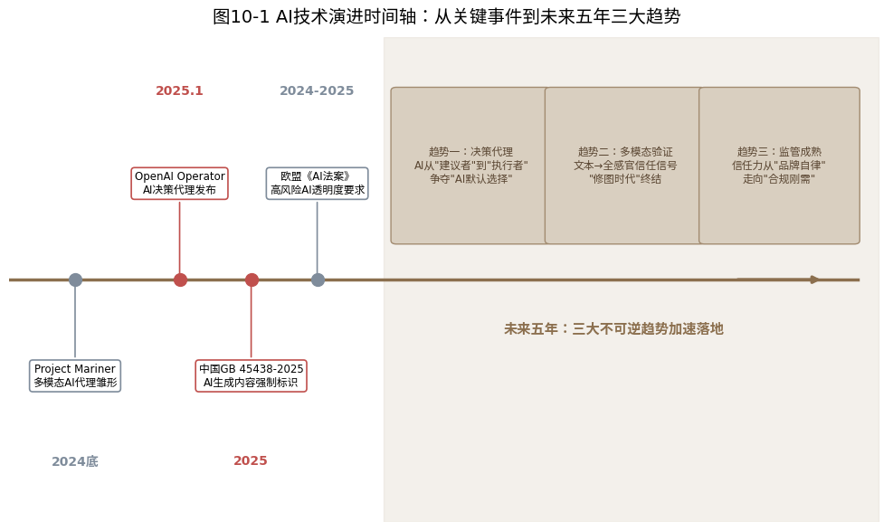
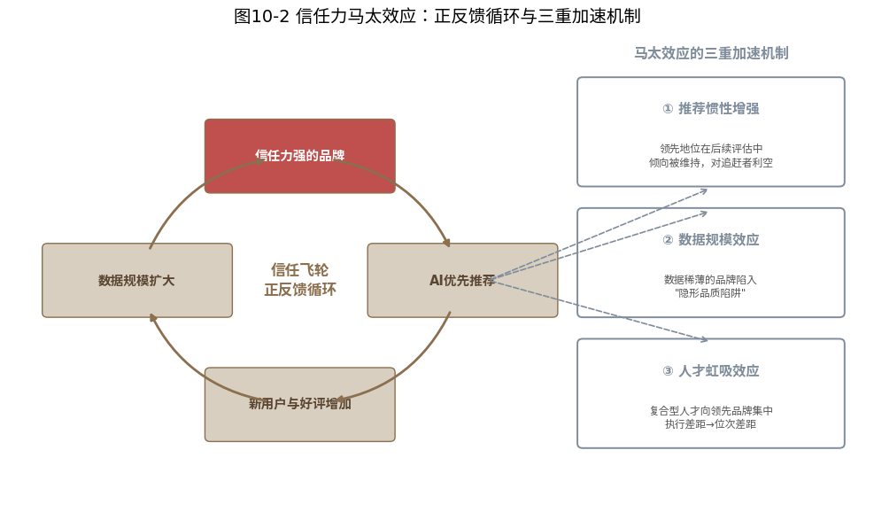
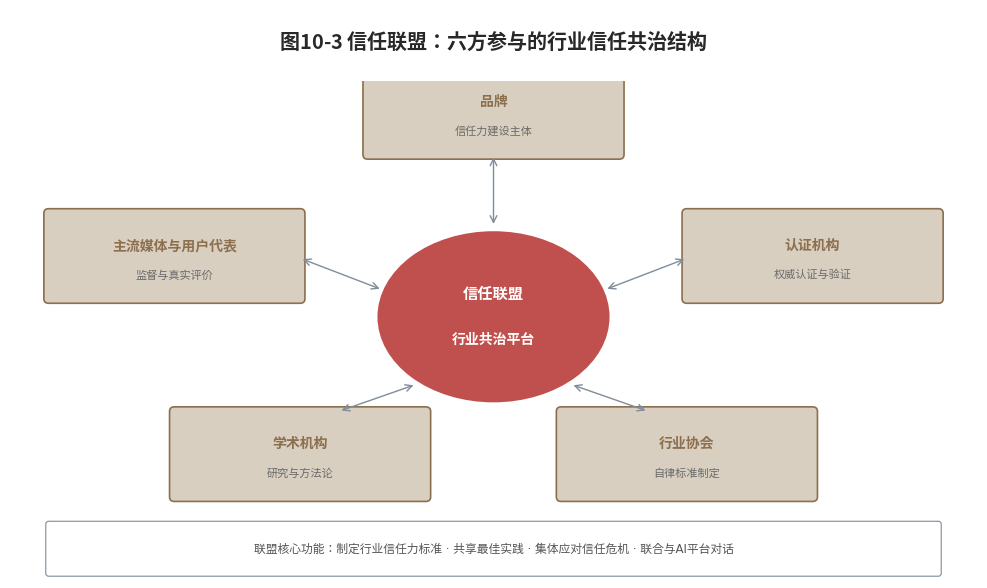

#  未来已来

## ------AI技术演进与信任力竞争的下一个五年

**【本章导读】**

前九章完成了信任力从理论到方法再到落地的全链路构建。但一本书如果只告诉你"现在该做什么"，价值是有限的。一本真正有战略价值的书，必须回答"未来会怎样，以及现在该为未来准备什么"。

本章是全书的"前瞻章节"。它不是预测，在AI技术以月为单位迭代的今天，任何超过一年的技术预测都可能是徒劳的。它是战略情景推演，基于三条不变的底层逻辑：用户将决策权外包给AI的趋势不可逆\[1\]，AI评估品牌可信度的机制只会越来越精密，信任力将成为品牌最稀缺的战略资产。由此推演未来三到五年的竞争格局变化，并给出品牌现在就该启动的五项战略储备。

第一节以情景推演方式分析AI技术的三个演进方向，从"回答者"到"决策代理"、多模态信任评估、AI监管框架成熟，及其对信任力建设的深远影响。第二节推演信任力竞争格局的三个变化，AI信任赤字、马太效应加速、信任联盟。第三节给出品牌现在就该做的五件事。第四节以三个可能的终局情景收尾，为结语铺垫。

  --------------------------------------------------------------------------------------------------------------------------------------------------------------------------------
  读完本章，你不仅将理解"现在的信任力建设该怎么做"（前九章的价值），更将看到"未来的信任力竞争将如何展开"（本章的价值）。两者相加，就是你在AI时代构建品牌认知主权的完整战略地图。

  --------------------------------------------------------------------------------------------------------------------------------------------------------------------------------

## 三大趋势：决策代理、多模态验证与监管框架成熟

在展望AI驱动下的品牌信任力新格局之前，我们需要首先厘清一个关键问题：哪些技术浪潮仅是转瞬即逝的"时尚"，哪些才是足以重塑产业格局的"趋势"？前者往往喧嚣一时，却不足以撼动企业的长期战略；后者则具有不可逆性、加速度以及结构性影响。

{width="4.330555555555556in"
height="2.442361111111111in"}

图10-1 AI技术演进时间轴：从关键事件到未来五年三大趋势

基于当前技术演进的轨迹与商业落地的实证，我们判断以下三大方向属于后者（如图10-1所示）。它们不仅是技术的迭代，更是品牌与消费者交互逻辑的根本性重构。

### 趋势一：决策代理：从"建议者"到"执行者"的范式跃迁

第一个不可逆的趋势是：AI正从被动的"问答工具"进化为主动的"决策代理"（Agent）。

目前，主流的人机交互仍停留在"提问---回答"模式。用户询问"哪款产品值得买"，AI提供推荐列表，最终决策权掌握在用户手中。然而，随着大模型推理能力与工具调用能力的突破，AI的角色正在发生质变：从提供信息的"顾问"转变为直接执行任务的"代理人"。

这一趋势在2025年至2026年上半年已进入规模化应用阶段。2026年初，OpenAI的Operator持续升级，多步推理与反悔修正能力显著增强，能够在复杂场景下自主完成从网页浏览、表单填写到在线支付的闭环。与此同时，Anthropic的Claude系列凭借长上下文窗口与工具使用（Tool
Use）上的卓越表现，成为高端商务代理的重要底座；Google DeepMind的Project
Mariner，则在多模态理解与浏览器自动化操作上树立了新标杆。当用户发出指令："帮我预订一家适合带父母度假的酒店，预算1500元以内，需有山景和温泉，且距机场车程不超过40分钟"，AI不再仅仅罗列选项，而是直接调用预订接口，完成筛选、比价与下单。

这种"代理模式"对品牌信任力建设提出了前所未有的挑战。在传统的"建议者"模式下，品牌尚有机会通过搜索引擎优化或广告投放，让用户"绕开"AI的推荐去发现备选方案D。但在"决策代理"模式下，AI一手包办了从信息搜集、产品比对到最终购买的全流程。品牌的命运，几乎完全取决于它是否出现在AI的"候选集"中。

这意味着，本书第三章提出的"AI-5A"框架（被提及、被偏爱、被信任、被选择、被传播）将迎来质变。"被提及"演变为"被纳入决策候选"，"被选择"则简化为"被AI默认执行"。品牌竞争的焦点，将从争夺用户的注意力与确认权，转向争夺AI的"默认选项权"。

值得注意的是，Operator与Claude
4等代理系统的决策逻辑高度依赖可验证的结构化数据（产品规格参数）、第三方权威认证、用户评价的统计分布。这正是本书倡导的"五真"体系（数据真、信源真、逻辑真、体验真、履约真）的核心价值所在。在代理模式下，AI的错误容忍度极低，它无法像"建议者"那样通过"请自行判断"来免责。因此，"五真"体系完备的品牌将在AI的决策框架中占据天然优势；反之，数据缺失或造假的品牌，将直接被AI代理"除名"。

### 趋势二：多模态验证：从文本语义到全感官信号的信任升维

第二个不可逆的趋势是：AI的信任力评估正从单一的"文本层面"向"多模态层面"全面升级。

过去，AI主要依赖文本信息（如产品描述、新闻稿、评论文本）来评估品牌可信度。然而，随着GPT-4o、Gemini
2.5及国内的通义千问2.5、混元等模型的成熟，AI已具备强大的跨模态理解与推理能力。这种能力的普及，将信任力评估推向了"全感官"时代。

多模态AI对信任评估的"降维打击"主要体现在三个维度：

视觉一致性验证：AI不再仅"阅读"品牌文案，更能"审视"视觉呈现。它能精准识别宣传图片与实物是否一致，工厂环境是否达到宣称标准，以及用户晒单是否存在批量PS或盗图痕迹。视觉信号的伪造难度远高于文本，因此成为更具价值的信任锚点。

音视频深度分析：AI能够解析品牌宣传片、用户测评视频及新闻报道中的微表情、语音语调与物理环境。CEO的访谈是否真诚？产品演示视频是否存在剪辑造假？用户投诉视频中的质量问题是否具有普遍性？这些音视频信号正被纳入信任评估的权重体系。

时空交叉验证：多模态AI擅长交叉比对信息的时间戳与地理标签。例如，验证"工厂位于某地"是否与照片的GPS信息吻合，"2025年获得某项认证"是否与官方公布时间一致。这种时空一致性验证，极大地抬高了伪造信任信息的门槛。

2025年底，Google DeepMind在Project
Mariner中展示了多模态代理的雏形，它能在浏览网页时实时理解文本、图片、视频等多种信息流。至2026年，这种能力已集成至主流AI助手。想象一个场景：当用户浏览电商详情页时，AI代理正同步比对产品图的纹理与用户晒单的一致性，核查参数表述是否存在歧义，并分析宣传视频是否有真实的用户使用佐证。这种多维度、实时并行的交叉验证，宣告了"修图营销"与"文案夸大"时代的终结。

对品牌而言，"五真"体系中的每一"真"都必须经得起多模态的检验。数据真实不仅指文字数据，更包括视觉数据的真实；体验真实不仅依赖评价文本，更依赖视频记录下的真实体验。

### 趋势三：监管成熟：从品牌自律到合规刚需的制度化转变

第三个不可逆的趋势是：全球范围内针对AI内容标识与推荐透明度的监管框架正迅速成熟，信任力建设正从"道德高地"转向"合规底线"。

2025年，中国正式实施《人工智能生成合成内容标识办法》及配套国家标准GB
45438-2025，对AI生成内容的显式与隐式标识提出了强制性要求。欧盟方面，《AI法案》（Regulation
(EU)
2024/1689）已正式生效，其合规义务正分阶段实施、逐步落地，为企业留出了合规缓冲期。美国加州、纽约州等地也相继推进了关于AI决策透明度与反深度伪造的立法工作。

监管框架的完善，将从三个层面重塑品牌信任力的竞争格局：

第一，AI可读性成为合规要件。随着监管要求AI在推荐时必须披露"推荐理由与信源依据"，品牌是否拥有可供AI抓取的结构化数据（如Schema标记、权威信源链接）已不仅是技术问题，更是合规问题。若品牌被AI推荐却无法提供充分的信源支撑，其推荐结果可能被标记为"依据不足"，这比"未被推荐"更具杀伤力。

第二，信任力透明化转向强制披露。未来三到五年，参考上市公司财务披露制度，品牌可能面临"AI信任力报告"的强制披露要求。权威认证状态、产品抽检合格率、投诉处理时效及多平台信息一致性审计报告，将从企业内部数据变为公开的市场监管指标。

第三，算法去偏袒化重构竞争规则。监管趋势明确要求AI大模型公开推荐排序逻辑，并证明不存在不合理的商业偏袒。这意味着，未来的推荐排序将更依赖"客观可验证的信任力数据"，而非单纯的广告投放量或品牌知名度。对于长期深耕"五真"体系、拥有扎实信任资产的品牌而言，这是巨大的政策利好；而对于依赖营销声量、缺乏实质品质的品牌，监管将成为其在AI时代加速"隐形"的催化剂。

基于上述技术趋势，未来三到五年的品牌竞争格局将发生三个结构性变化。

## 三大推演：信任力竞争格局的结构性变化

本节推演信任力竞争格局正在发生的三个结构性变化：\"AI信任赤字\"将取代\"品牌知名度低\"成为最致命的竞争弱点；信任力马太效应将加速拉大品牌差距；品牌的竞争单元将从\"个体品牌\"升级为\"信任力生态联盟\"。

### 信任赤字：比知名度低更致命的AI时代竞争弱点

在传统品牌竞争中，\"知名度低\"是最大的弱势，用户不知道你，就不会选择你。而在AI时代，\"AI信任赤字\"将取代\"知名度低\"，成为最致命的竞争弱点。

什么是\"AI信任赤字\"？
它是品牌的\"用户知名度\"与\"AI可信度\"之间的落差：用户知道你（甚至非常熟悉你），但AI在评估你的可信度时给出低分，因而不愿意推荐你。这个落差的杀伤力在于：品牌数十年建立的知名度优势，可能被一个\"信任力建设出色但知名度较低\"的竞品一举超越。这一判断与AI时代品牌传播的实践相吻合，品牌竞争的重点正转向\"可信认知\"的长期较量，能否被AI采信、被优先采信，已成为竞争力的关键变量。

**【一个典型的竞争场景】**用户看到某知名品牌的广告后产生兴趣，随即在AI助手中询问\"这个品牌真的好吗？\"AI的回答是：\"该品牌知名度很高，但多个第三方平台的用户评价显示，其产品投诉率高于行业平均水平，且过去三年发生过若干起质量事故；相比之下，同品类的另一品牌知名度虽低，但产品通过了某国际权威认证，用户满意度明显更高。\"数十年积累的知名度，在AI几秒钟的交叉验证中即被重新评估。这正是\"认知溢价\"与\"认知隐形\"并存格局的微观缩影：部分线下市场份额可观的品牌，在AI推荐中近乎\"隐形\"；而一批在权威信源建设和结构化内容供给上持续投入的品牌，则获得了超出其市场份额的\"认知溢价\"。

\"AI信任赤字\"最可能出现在三类品牌身上：其一，高知名度但缺少权威认证的品牌，知名度主要来自广告投放而非品质壁垒；其二，高曝光但评价分布异常的品牌，可能存在评价操纵的嫌疑；其三，高增长但供应链管理薄弱的品牌，扩张中忽视了信息一致性与品质管控。这三类情形在当前消费市场中均有迹可循：一些以高强度营销见长、重营销轻品控的新锐品牌，常因变质、异物、过期等问题积累大量投诉，形成\"高声量、弱信任\"的典型画像；部分高知名度品牌则因足银抽检不合格、\"一口价\"销售模式引发集中投诉等事件，暴露出合规经营与品控管理的系统性短板。它们共同说明：知名度可以靠广告快速堆高，信任力却只能靠真实的产品、规范的管理与可验证的第三方背书一砖一瓦地积累。

### 马太效应：推荐惯性、数据规模与人才虹吸的三重加速 {#马太效应推荐惯性数据规模与人才虹吸的三重加速-1}

信任力的竞争天然具有\"马太效应\"：信任力越强的品牌，AI越会优先推荐；越获得AI优先推荐，越能吸引新用户和好评；越积累新用户和好评，信任力越强。这个正反馈循环在第六章\"信任飞轮\"中已有详述。

{width="4.330555555555556in"
height="2.1951388888888888in"}

图10-2 信任力马太效应：正反馈循环与三重加速机制

信任力领先→AI优先推荐→新用户与好评增加→信任力增强→进一步巩固AI优先推荐的闭环；外加\"推荐惯性增强\"\"数据规模拉大差距\"\"人才虹吸加剧失衡\"三重加速回路。未来三到五年，马太效应将进一步加速。（如图10-2所示）

第一，AI的\"推荐惯性\"将增强。

当前AI的推荐排序已显示出一定程度的\"惯性\"：一旦某个品牌在AI的信任力评估中建立了领先地位，后续评估倾向于维持这一领先，除非市场数据出现显著的负面信号。稳定性与一致性是推荐系统的重要质量指标，这是其内在特征。随着\"决策代理\"场景普及，稳定性权重将进一步上升，频繁更换推荐品牌会损害用户对AI决策的信任，这对领先者是利好，对追赶者则是利空。值得补充的是，这一\"惯性\"并非品牌不可撼动：AI品牌记忆（AI
Brand
Memory）建立在反复出现的一致信号之上，品牌记忆会因持续的正面信号而强化，也会因信号中断或负面信息积累而消退。换言之，领先者须持续维护信任信号的一致性，追赶者则可通过系统性补全权威信源与结构化证据来逐步扭转认知劣势。

第二，数据的\"规模效应\"将拉大差距。

品牌积累的用户评价越多、权威认证越多、可验证的数据越多，AI就越能精准地评估其信任力。反之，数据稀薄的品牌，即使实际品质不逊于领先者，AI的评估也缺乏统计显著性，这就是\"数据规模效应\"导致的\"隐形品质陷阱\"：品质好但数据不够多的品牌，其信任力可能被AI低估。行业实践印证了这一点：AI引擎在决定推荐哪些品牌时，会综合权衡权威性、多源印证、信息一致性、可溯源性等因子，其中\"同一事实被3个以上独立权威源提及\"会显著提升可信度。因此，\"被提及\"不等于\"被信任\"，真正起作用的往往是可验证、可交叉印证的结构化信任信号。

第三，人才的\"虹吸效应\"将加剧失衡。

信任力建设是一项高度专业化的工作，需要同时理解品牌战略、AI技术、数据分析、用户体验和供应链管理，这类复合型人才极度稀缺。领先品牌有资源吸引和留住这类人才，追赶者则容易陷入\"有意愿、缺人才、没人做\"的困境。人才差距将直接转化为信任力建设的执行差距，进而扩大品牌在AI推荐中的位次差距。

###  信任联盟：生态化竞争走向国际维度

这是本节最具前瞻性的竞争概念。\"认知主权\"已在第二章提出并贯穿全书。\"信任联盟\"（Trust
Alliance）是认知主权在竞争格局层面的延伸：当AI成为消费者决策的基础设施，品牌竞争将不再是\"个体对个体\"的单打独斗，而越来越呈现\"联盟对联盟\"的生态化竞合格局，这一趋势在全球市场同样适用。\"AI认知主权\"作为继数据主权、算力主权之后数字主权体系的最高形态，其核心正是主体在AI认知世界中的定义权、解释权和推荐权。

\"信任联盟\"有三层含义。

第一层：品类的\"AI认知版图\"将重新划分。

在传统市场中，各品类的市场份额分布相对稳定，头部、腰部、尾部品牌的格局可能需要数年才会发生显著变化。但在AI认知体系中，品类的\"AI认知版图\"可能在一到两年内发生剧变。信任力建设出色的新锐品牌，可能在AI推荐中快速超越传统龙头；建设懈怠的龙头，则可能被迅速边缘化。如前所述，品牌在AI答案中的可见度排名与传统市场占有率之间存在显著偏差，\"认知溢价\"与\"认知隐形\"并存已成为现实趋势。

第二层：\"信任力生态联盟\"将成为竞争新单元。

单个品牌的信任力建设存在天花板。企业不能自己认证自己，不能自己给自己写评价，也不可能在所有维度上都做到极致。而一个由核心品牌、认证机构、行业协会、学术机构、主流媒体、用户社区共同组成的\"信任力生态联盟\"，其壁垒远超任何单个品牌的努力。未来的品牌竞争，将越来越多地从\"品牌vs品牌\"演变为\"联盟vs联盟\"。

这一判断已有现实雏形：2025年第四届生态品牌认证由新华社品牌工作办公室、新华出版社、《哈佛商业评论》中国、凯度集团等联合发起，通过3大视角、7个核心维度、23项评估细则对企业转型成果进行科学评估，35家获认证品牌收入总计超过13.3万亿元，链接了超过69个行业和22万家生态伙伴；淘天集团商品治理联盟则由电商平台、科研院所、国家质量监督检验中心、第三方检验检测机构、行业协会、品牌商、经销商、制造商等共同组成，以标准共建、认证采信推动品质升级（据主办方公开信息）。联盟之所以难以被单品牌复制，原因在于信任的\"机器可读性\"依赖权威认证、用户评测、结构化数据、检测数据与专家背书的协同供给，单靠企业自证难以建立。

第三层：\"信任力标准\"将成为行业话语权的终极形态。

谁定义了\"什么是可信任的品牌\"，谁就拥有该行业的终极话语权。当前，这一\"标准定义权\"分散在政府监管部门、国际标准组织、行业媒体、消费者评测平台等多个主体手中。而在AI时代，AI大模型将可能把这些分散的标准整合为一个统一的\"品牌可信度评估框架\"。框架的权重如何分配，政府认证占多少、用户评价占多少、学术引用占多少，本质上就是\"信任力标准\"的定义。能够影响乃至参与定义这个框架的品牌，将占据未来信任力竞争的战略制高点。

实践层面，AI大模型对品牌可信度的评估已呈现出明确且可观察的权重结构：来源权威性极高（央媒＞政府官网＞权威媒体＞垂直媒体＞企业官网＞自媒体），多源印证度极高（同一事实被3个以上独立权威源提及时可信度陡增），并兼顾信息一致性、内容时效性、细节完备度与可溯源性。这意味着\"信任力标准\"并非抽象的哲学讨论，而正在被具体化为一套可衡量、可验证、可争议的权重体系------谁能参与这套体系的共建，谁就掌握了行业信任叙事的主导权。

  ----------------------------------------------------------------------------------------------------------------------------------------------------------------------------------------------------------------------------------------------------------------------------------------------------------------------------------------------------------------------------------------------------------
  AI时代的信任力竞争，正在从\"知名度之争\"转向\"可信度之争\"，从\"单品牌之争\"转向\"生态联盟之争\"。对品牌而言，当务之急有三：一是正视并主动消弭自身的\"AI信任赤字\"，以权威认证、可验证数据与真实用户评价夯实信任底座；二是理解并善用信任力的正反馈循环，同时警惕\"隐形品质陷阱\"；三是从\"独善其身\"走向\"联盟共建\"，主动参与信任力生态联盟与行业信任标准的塑造，在AI认知版图中抢占不可替代的认知位置。

  ----------------------------------------------------------------------------------------------------------------------------------------------------------------------------------------------------------------------------------------------------------------------------------------------------------------------------------------------------------------------------------------------------------

## 五项储备：数据银行、护城河、弹性、人才与联盟

前两节厘清了技术演进的逻辑与竞争格局的剧变。趋势已定，变局已至。对于品牌而言，当下的最优解并非"等待未来发生后再做反应"，而是即刻启动面向AI时代的战略储备。启动以下五项战略储备，是赢得AI时代信任力竞争的最优策略。

### 数据银行：持续积累结构化信任力数据资产

信任力竞争的本质，是数据的竞争，谁拥有更多、更好、更有结构的可验证数据，谁就在AI的信任力评估中占据优势。品牌需要从现在开始，系统性地建设一个"信任力数据银行"，一个持续积累、持续更新、持续结构化的品牌信任力数据资产库。

"信任力数据银行"的核心资产类别如下。一是产品与品质数据：所有产品的技术参数、检测报告、品质监控数据，全部以结构化格式存储并持续更新。二是认证与合规数据：所有权威认证的证书信息、有效期、认证范围，建立自动到期预警。三是用户评价数据：全平台用户评价的聚合数据库，包含评价内容、评分、日期、来源平台、品牌回应记录。四是供应链可追溯数据：从原材料到成品到消费者的全链溯源数据。五是公开承诺与兑现记录：品牌的每一次公开承诺及对应的兑现证据。

"信任力数据银行"不是"大数据项目"，不需要动辄千万级的IT投资。起点可以非常简陋：一个Excel表格，记录品牌所有认证信息、产品参数来源、核心平台的评价数据链接。关键是"从现在开始积累"，信任力数据是时间的朋友，越早开始，数据的厚度与广度越强，竞品追赶的难度越大。

### 护城河体系：认证、溯源、评价与生态的四维壁垒

传统品牌的护城河是品牌知名度、渠道网络、供应链规模。AI时代品牌的信任护城河，则是以下四个维度的不可替代性。

权威认证的不可替代性。
追求"话语权级别"的信源真，不只是认证的接受方，更是标准的制定者。这个护城河建设周期长（1～3年甚至更久），但一旦建成，竞品极难短期追赶。

全链溯源的不可替代性。
从"最终产品可追溯"升级为"全链过程可追溯"，不只告诉AI"我们的产品合格"，而是让AI可以验证"从原材料到消费者的每个环节都受控"。壁垒在于：它要求品牌对供应链拥有足够深的管理与数据化能力。

用户评价资产的不可替代性。
积累一个"数量足够大、质量足够高、分布足够自然"的用户评价池。这个护城河的特点是具有极强的"时间壁垒"，竞品不可能在短期内"制造"出海量真实评价（刷评价，AI会识别并降权）。

信任力生态的不可替代性。
建立由供应商、经销商、认证机构、行业组织、用户社区共同构成的信任力生态网络。这个护城河极难复制、极难超越，因为它不是品牌自己"建"出来的，而是与生态伙伴"共生"出来的。

### 危机弹性：危机的常态化预案与修复的肌肉记忆

未来的品牌竞争环境中，"信任冲击"的频率和强度都将上升，AI让信息传播的速度更快、范围更广，任何品牌的信任漏洞，都可能在AI的交叉验证下于数小时内曝光并扩散。品牌需要的不是"不出事"（那不现实），而是"出事之后能快速恢复"的"信任弹性"。

培育信任弹性组织，有三个关键要素：

信任危机预案的常态化。
不是"等危机来了再开会"，而是"在没有危机的时候，就模拟过最坏的危机"。品牌应建立定期的"信任力压力测试"，模拟质量事故、高管不当言论、供应链丑闻、数据泄露等不同类型的信任危机，检验组织的响应速度与恢复能力。

信任力修复的"肌肉记忆"。
第六章论述了"危机中的飞轮韧性"，危机应对得当，信任力不仅不降，反而可能上升。要做到这一点，组织的修复能力必须成为"肌肉记忆"，不在危机中临时"想"对策，而是有一整套预案、流程、授权、话术，危机发生时直接启动。这需要反复演练，如同消防演习，没人希望火灾发生，但所有人都知道火灾来了该做什么。

透明文化的内化。
信任弹性组织的核心文化是"透明"，出事不怕，怕的是瞒着不说。危机发生后第一时间公开承认、承担责任、公布整改计划、跟踪公开结果的组织，在AI眼中是"履约真"的高分品牌。沉默、推诿、遮掩的组织，在AI眼中是"不可信任"的低分品牌。透明不是道德选择，而是AI时代的理性竞争策略。

### 人才战略：超前培养复合型信任力建设人才

信任力建设是一个新兴的专业领域，目前几乎没有高校开设相关课程，成熟的专业人才极度稀缺。品牌若等到"市场上出现成熟的AI信任力人才"再招聘，将永远处于被动。

超前布局信任力人才战略，有三个方向。

内部培养，从现有团队中选拔和培养信任力专才。

品牌现有团队中，品牌管理人员懂战略与营销（但缺乏AI技术理解），IT/数据人员懂技术（但缺乏品牌与用户视角），质量/合规人员懂认证与标准（但缺乏营销与传播意识）。信任力建设的"复合型人才"，需要从这三个方向分别选拔有潜力者，通过项目制实战和跨部门轮岗加以培养。

外部引进，从跨界领域吸引信任力相关经验者。

GEO\[4\]/SEO领域的资深从业者（理解AI搜索与推荐机制）、用户体验研究领域的专业人士（理解评价与体验管理）、企业合规与ESG领域的从业者（理解认证、标准与透明度建设）。这些人才具备信任力建设的"组件技能"，可通过快速培训补齐其他组件。

**组织能力建设，将个人能力转化为组织能力。**

人才战略的终极目标不是"找到几个牛人"，而是"把牛人的做事方法变成组织的做事方法"。品牌应将信任力建设的知识与经验沉淀为内部方法论、工具包、培训体系和SOP（标准操作流程），让信任力建设不依赖个别"懂行的人"，每个人经过培训，都能按标准流程执行。

### 生态共治：从品牌独建到行业联盟共治的升级

第九章论述了信任力生态化的必要性，品牌的信任力边界不等于品牌的法律边界。基于此，品牌应当在行业层面推动建立"信任联盟"，由品牌、认证机构、行业协会、学术机构、主流媒体和用户代表共同参与的信任力共治平台。（如图10-3所示）

{width="4.330555555555556in"
height="2.3194444444444446in"}

图10-3 信任联盟：六方参与的行业信任共治结构

信任联盟的核心功能如下。制定行业信任力标准：不是政府强制标准，而是行业自律标准，为品类树立AI信任力评估的"最佳实践基线"。共享信任力建设最佳实践：联盟成员定期交流信任力建设的方法论、工具和经验，降低每个品牌的试错成本。集体应对信任危机：当行业内出现"坏苹果"（如某品牌的丑闻拖累整个品类的AI信任度），联盟可以集体发声、集体行动，保护品类的整体信任力生态。联合与AI平台对话：单一品牌很难影响AI大模型的推荐逻辑，行业联盟的集体声音则具有更大的对话权重。

信任联盟的治理原则：开放而非封闭（任何达到行业信任力基线的品牌都可以加入，联盟不排斥竞争者）、自治而非管控（联盟是"品牌共治"，不是"政府管控"或"巨头垄断"）、透明而非黑箱（联盟的信任力标准、成员信任力评级、联盟决策过程全部公开透明）。

## 终局情景推演：巨头时代、平权时代与分化时代的博弈

五项战略储备解决的是"现在该做什么"。但作为全书的收束之章，我们还应把目光放得更远。在结束本书的方法论建设之前，让我们做一个战略情景推演，未来五到十年，AI时代的品牌信任力竞争，可能走向以下三种终局中的哪一种？

### 巨头时代：少数超级信任品牌垄断AI推荐位

在这个情景中，信任力的马太效应发挥到极致，少数几个在每个品类中把"五真"体系做到极致的品牌，垄断了AI的推荐位。它们不是在和竞品竞争，它们已经是AI知识库中的"默认选项"。这些"超级信任品牌"的特征是：不投广告、不买流量、不讨好算法，它们的存在本身，就是AI最信任的信号。

这个情景的好处是：消费者决策成本极低，市场效率极高，你不需要"货比三家"，AI已替你筛选出品类中最值得信任的品牌。风险是：品牌集中度过高，可能导致创新动力不足与消费者选择空间缩小。

### 平权时代：小而可信的品牌获得公平竞争机会

在这个情景中，AI的信任力评估足够公平和精细，它不看品牌的知名度和规模，只看品牌的"可信度证据"。一个只有三万用户但评价分布极其健康、认证极其权威的"小而美"品牌，在AI推荐中的位次可以超过一个拥有三千万用户但信任证据薄弱的"大而不美"品牌。

这个情景的好处是：市场竞争更加公平，"品质好"比"名气大"更重要。风险是：竞争极度碎片化，消费者面临"选择过载"，当AI推荐了三个"小而可信"的品牌，用户仍要花时间去了解这些"从未听说过的品牌"。

### 分化时代：品牌阶级固化与AI信任鸿沟的加深

在这个情景中，信任力竞争导致品牌"阶级固化"，头部品牌凭信任力优势牢牢占据AI推荐位，长尾品牌边缘化为"AI隐形品牌"，腰部品牌则陷入"上不去下不来"的困境，投入大量资源建设信任力，却始终无法突破头部品牌的壁垒。

这个情景的危险在于：市场失去了活力。新品牌即使产品品质出众，也因为"信任力起步太晚"而无法在AI时代获得公平的竞争机会。AI的信任力评估体系，将从"品质的筛选器"异化为"先发者的保护伞"。

### 共同启示：无论哪种未来，信任力都是生存资格

无论哪种情景成为现实，有一个判断是确定的：信任力将成为AI时代品牌竞争最核心的战略资产。情景一中，你必须是信任力巨头才能生存；情景二中，信任力是品牌让AI"看见"的唯一门票；情景三中，你必须现在就启动信任力建设，才能避免未来固化为"AI隐形品牌"阶层。

这就是为什么本书用十章篇幅系统构建信任力的理论、方法与实践，不是为了"让品牌变得更好"（那是营销话术），而是为了让品牌"在AI时代拥有生存和竞争的权利"（这是战略必要性）。

## 本章小结 {#本章小结-10}

本章是全书的"前瞻之章"，在完成信任力从定义到建设到落地的全链路构建之后，将视野投向未来三到五年，分析AI技术演进将如何进一步重塑信任力竞争格局。

第一节分析了三个不可逆的AI技术趋势，AI从"回答者"到"决策代理"（品牌竞争的终极战场从"争夺用户选择"变为"争夺AI默认选择"）、多模态信任评估（信任力从"文本验证"升级为"全感官验证"）、AI监管框架成熟（信任力从"品牌自律"走向"合规刚需"）。

第二节推演了信任力竞争格局的三个结构性变化，"AI信任赤字"将取代"品牌知名度低"成为最致命的竞争弱点、信任力马太效应将加速拉大品牌差距、品牌的竞争单元将从"个体品牌"升级为"信任力生态联盟"。

第三节给出了品牌现在就应该启动的五项战略储备，建立信任力数据银行、构建信任护城河、培育信任弹性组织、布局信任力人才战略、建立信任联盟。

第四节以三种可能的终局情景，信任力巨头时代、信任力平权时代、信任力分化时代，收束全书，指出无论哪种情景成为现实，信任力都是AI时代品牌最核心的战略资产。

读完本章，全书的方法论建设至此完成。接下来，结语部分将回归本书的初心，超越营销术，抵达品牌在AI时代的生存哲学。

+:---------------------------------------------------------------------------------------------------------------------+
| AI不是在优化品牌营销，AI是在重写品牌生存的规则。适应新规则的人，将获得新世界的第一批船票。                           |
|                                                                                                                      |
| 信任力的马太效应不是在"未来"加速，它已经在加速。你现在不建的信任力数据，一年后竞品已经靠它抢走了你在AI推荐中的位次。 |
|                                                                                                                      |
| 信任力不只是品牌在这个时代的竞争优势，它是品牌在这个时代的竞争资格**。**                                             |
+----------------------------------------------------------------------------------------------------------------------+

### 参考文献

\[1\] 中国互联网络信息中心. 生成式人工智能应用发展报告（2025）\[R/OL\].
(2025-10-18)\[2026-08-03\]. https://www.cnnic.net.cn.

\[2\] 国家市场监督管理总局, 国家标准化管理委员会. 网络安全技术
人工智能生成合成内容标识方法: GB 45438-2025\[S\]. 北京: 中国标准出版社,
2025.

\[3\] European Parliament and Council. Regulation (EU) 2024/1689 Laying
down Harmonised Rules on Artificial Intelligence (EU AI Act)\[EB/OL\].
(2024-07-12)\[2026-08-03\].
https://eur-lex.europa.eu/eli/reg/2024/1689/oj.

\[4\] Aggarwal P, Murahari V, Rajpurohit T, et al. GEO: Generative
Engine Optimization\[EB/OL\]. (2023-11-16)\[2026-08-03\].
<https://arxiv.org/abs/2311.09735.>
